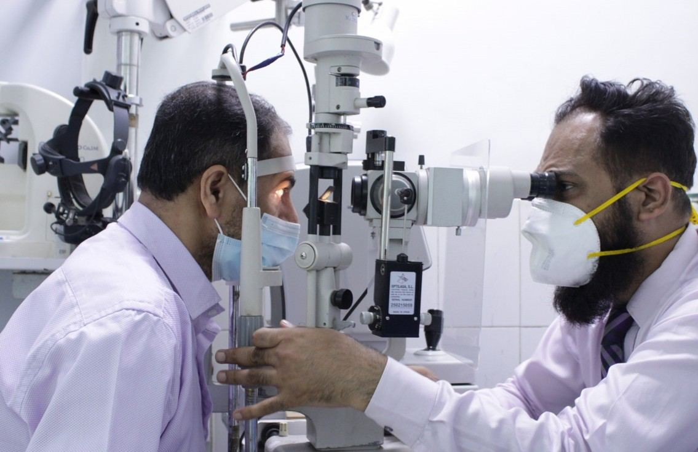
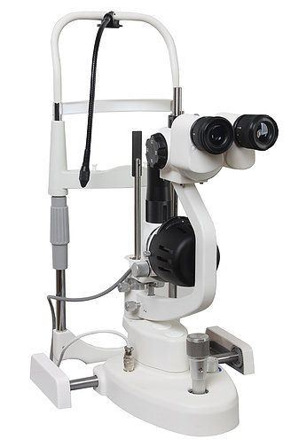

# Slit Lamp Examination

Source: `Eye Diseases & Conditions-compressed.pdf`, pages 294-300.

## Images

## Extracted text

<!-- Page 294 -->
A Slit Lamp Examination is a critical diagnostic tool used by eye care specialists, such as
ophthalmologists and optometrists, to evaluate the health of the eye's front structures, including

<!-- Page 295 -->
the cornea, iris, lens, and anterior chamber. This examination involves a specialized microscope
(called a slit lamp) that provides a detailed, magnified view of the eye. It allows eye care
professionals to detect abnormalities, diagnose conditions, and monitor the progression of eye
diseases.
The slit lamp consists of a high-intensity light that can be focused in a narrow beam (hence the
name "slit") and a microscope that enables a 3D view of the eye's structures. The slit lamp is
particularly useful for diagnosing conditions like cataracts, corneal ulcers, glaucoma, and retinal
diseases.
Symptoms and Causes
While a slit lamp examination is used primarily for diagnostic purposes, certain symptoms may
prompt an eye care specialist to recommend the test. These symptoms include:
Eye pain or discomfort
Redness or irritation in the eye
Vision changes (e.g., blurred or distorted vision)
Eye floaters (small specks or strings floating in your field of vision)
Sensitivity to light (photophobia)
Increased tearing or dryness
Foreign body sensation or scratchiness in the eye
The causes of these symptoms can vary, and the slit lamp examination helps identify underlying
conditions such as:
Cataracts: Clouding of the lens, leading to blurry or cloudy vision.
Corneal diseases: Conditions such as corneal ulcers or keratitis that affect the cornea.
Conjunctivitis: Inflammation of the conjunctiva, often due to infection or allergies.
Glaucoma: Increased intraocular pressure that can damage the optic nerve.
Uveitis: Inflammation of the middle layer of the eye (uvea), often causing redness and
pain.
Macular degeneration: Deterioration of the macula, leading to central vision loss.
Diagnosis and Tests
A slit lamp examination is typically performed after a detailed history and basic eye exam.
During the procedure, the eye care specialist will use the slit lamp to inspect different parts of the
eye.
Key steps of the examination:
1. Positioning: The patient sits in front of the slit lamp, placing their chin on a chin rest and
their forehead against a bar to stabilize the head.

<!-- Page 296 -->
2. Light Adjustment: The slit lamp’s light is directed onto the eye, usually in a thin beam,
to examine different layers of the eye. The angle of the light can be changed to get a
better view of the cornea, iris, and lens.
3. Examination of the Eye: The doctor will carefully inspect the cornea, iris, pupil, anterior
chamber (the space between the iris and cornea), and lens. They may also use fluorescent
dye (fluorescein stain) to detect any abrasions or ulcers on the cornea.
4. Tonometry (if necessary): In some cases, a tonometer is attached to the slit lamp to
measure intraocular pressure, a test that helps detect glaucoma.
Other tests that may accompany the slit lamp examination include:
Fluorescein Dye Test: This is used to detect corneal injuries, infections, or abrasions.
The dye is applied to the eye and highlights any damage.
Tonometry: A test to check for high intraocular pressure, which is a risk factor for
glaucoma.
Anterior Segment Photography: High-resolution photos of the eye structures may be
taken to document and monitor any changes over time.
Management and Treatment
While the slit lamp examination itself does not involve treatment, it plays a key role in
diagnosing conditions that require intervention. Once a diagnosis is made, the eye care specialist
will recommend an appropriate treatment plan, which could include:
Medications:
o
Antibiotic or antiviral eye drops for infections like conjunctivitis or keratitis.
o
Steroid drops for inflammation, such as in uveitis.
o
Glaucoma medications to reduce intraocular pressure.
Surgical Interventions: In cases where conditions like cataracts, glaucoma, or retinal
issues are identified, surgery might be necessary:
o
Cataract Surgery: Removal of the clouded lens and replacement with an
artificial lens.
o
Trabeculectomy or Shunt Surgery: For patients with glaucoma to reduce
intraocular pressure.
o
Corneal Transplant: For patients with severe corneal damage.
Laser Therapy: Used for conditions like diabetic retinopathy or glaucoma (laser
iridotomy or laser trabeculoplasty).
Lifestyle Adjustments: For certain conditions like dry eye syndrome or allergies,
lifestyle changes such as using artificial tears, wearing protective eyewear, and avoiding
allergens might be suggested.
Slit Lamp Examination in Adults
In adults, a slit lamp examination is typically performed as part of a routine eye check-up or
when symptoms such as eye pain, visual disturbances, or redness arise. This exam is essential for
detecting early signs of conditions such as cataracts, macular degeneration, or glaucoma, which

<!-- Page 297 -->
can progressively impair vision if left untreated. The test is also used to monitor ongoing
conditions like uveitis or corneal diseases.
Slit lamp exams are commonly part of the management protocol for adults with conditions that
require close monitoring, including:
Diabetic Retinopathy: Checking for changes in the retina due to diabetes.
Glaucoma: Detecting damage to the optic nerve caused by high intraocular pressure.
Keratoconus: An eye disorder where the cornea becomes thin and cone-shaped.
Slit Lamp Examination in Children
Slit lamp examinations in children are crucial, particularly in those who are experiencing vision
problems or have a history of eye conditions. In pediatric cases, the exam is usually performed
under a careful and gentle approach to keep the child comfortable and still.
The slit lamp is used to:
Detect congenital cataracts, which can cause vision impairment at birth.
Evaluate amblyopia (lazy eye), especially if one eye appears weaker than the other.
Assess for strabismus (misaligned eyes) or refractive errors in young children.
Check for eye trauma or infections like conjunctivitis or corneal abrasions.
In children, the examination can also help assess the overall development of the eye and visual
system, ensuring early detection of any issues that may hinder normal vision development.
Prevention
The slit lamp examination itself is a diagnostic tool rather than a preventive measure. However,
regular eye exams, including slit lamp tests, can help in early detection and prevention of
vision-threatening conditions. Preventive tips for maintaining eye health include:
Routine Eye Exams: Having an eye exam every 1-2 years (or more frequently if
recommended by your doctor).
Protective Eyewear: Wearing sunglasses with UV protection to prevent sun damage to
the eyes and safety glasses during activities that could pose a risk to the eyes.
Healthy Diet: Eating foods rich in vitamins A, C, E, and omega-3 fatty acids can support
eye health and reduce the risk of age-related eye conditions.
Quit Smoking: Smoking increases the risk of cataracts and macular degeneration.
Manage Health Conditions: Keeping diabetes, hypertension, and other chronic diseases
under control to prevent eye-related complications.

<!-- Page 298 -->
Outlook / Prognosis
The prognosis following a slit lamp examination depends on the underlying condition diagnosed.
If the slit lamp reveals a mild issue, such as dry eyes or early cataract development, the outlook
is generally good with proper treatment and management.
For conditions like glaucoma, early diagnosis and treatment can slow or stop the progression of
the disease, preserving vision. Similarly, corneal diseases may be managed successfully with
medications or surgery.
However, conditions like macular degeneration or advanced glaucoma may require long-term
management, but the prognosis can improve with appropriate treatment and lifestyle
adjustments. Early detection is key to managing and preventing further vision loss.
Living With Eye Conditions
Living with an eye condition often means adhering to a treatment plan, which may involve
medications, lifestyle changes, and regular follow-up exams. For conditions like cataracts,
glaucoma, or dry eye syndrome, ongoing management can significantly reduce symptoms and
preserve vision. In some cases, surgery or laser treatment may offer a permanent solution.
For individuals with chronic eye conditions, such as glaucoma or macular degeneration, it is
important to:
Stay in regular contact with an eye care professional.
Follow prescribed treatments, including eye drops or oral medications.
Monitor any changes in vision and report them promptly to your doctor.

<!-- Page 299 -->
Additional Common Questions (FAQs)
Q: How often should I get a slit lamp examination?
A: Adults should have a comprehensive eye exam, including a slit lamp examination, every 1-2 years.
People with existing eye conditions, those over 60, or those with a family history of eye disease may need
more frequent exams.
Q: Is the slit lamp examination painful?
A: No, the slit lamp examination is completely painless. It involves shining a light into your eye, which
might feel slightly uncomfortable, but it does not cause pain.
Q: Can the slit lamp detect all types of eye conditions?
A: While the slit lamp is a powerful tool for diagnosing many eye conditions, it primarily focuses on the
front structures of the eye. For more in-depth evaluations of the retina or optic nerve, additional tests like
fundus photography or OCT may be required.

<!-- Page 300 -->
Q: Do I need to prepare for a slit lamp examination?
A: There is no special preparation required for a slit lamp exam. However, you may be asked to avoid
wearing makeup or contact lenses for the exam, and it helps to bring any relevant medical history or
medications to your appointment.
Q: Can a slit lamp examination detect eye cancer?
A: A slit lamp can detect abnormal growths or changes in the eye that could indicate potential
malignancy. However, further tests such as imaging or biopsy may be necessary for a definitive diagnosis
of eye cancer.
