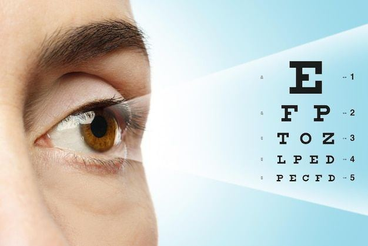
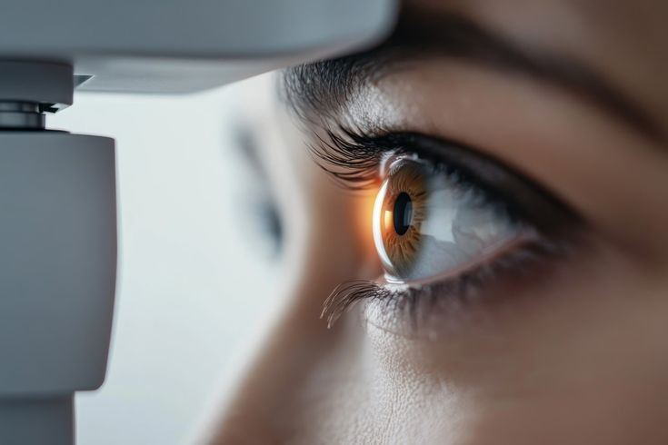

# Visual Acuity Test

Source: `Eye Diseases & Conditions-compressed.pdf`, pages 300-306.

## Images

## Extracted text

<!-- Page 300 -->
Visual Acuity Test
A Visual Acuity Test is a standardized exam used to measure the sharpness and clarity of a
person’s vision. It evaluates how well you can see at specific distances, usually using an eye
chart with letters or symbols. This test is essential for detecting refractive errors like
nearsightedness (myopia), farsightedness (hyperopia), and astigmatism, as well as identifying

<!-- Page 301 -->
other vision issues. A visual acuity test is one of the most common components of a
comprehensive eye exam and is typically used to assess overall eye health and diagnose
conditions that affect the clarity of vision.
The test involves reading letters or symbols from an eye chart, with the smallest line of letters
representing the best possible visual acuity. Depending on the results, the eye care professional
may recommend corrective measures like glasses, contact lenses, or other treatments.
Symptoms and Causes
The symptoms that may prompt a visual acuity test include:
Blurry vision: Objects may appear out of focus, whether at a distance or close up.
Difficulty reading: Struggling to read small text or signs, especially in low light.
Eye strain: Experiencing discomfort or fatigue after reading, working at a computer, or
driving.
Headaches: Frequent headaches, particularly after activities that involve visual
concentration.
Double vision: Seeing two images of a single object.
Squinting: Involuntary squinting or narrowing of the eyes to improve focus.
Sensitivity to light: Excessive discomfort in bright light, sometimes accompanied by
blurry vision.
The causes of these symptoms can be related to:
Refractive errors: These occur when the shape of the eye prevents light from focusing
correctly on the retina. Common refractive errors include:
o
Myopia (Nearsightedness): Difficulty seeing distant objects clearly.
o
Hyperopia (Farsightedness): Difficulty seeing close objects clearly.
o
Astigmatism: Blurry or distorted vision due to an irregular shape of the cornea or
lens.
o
Presbyopia: Age-related difficulty focusing on close objects, typically occurring
after the age of 40.
Eye diseases: Conditions like cataracts, macular degeneration, glaucoma, or diabetic
retinopathy can affect visual acuity.
Injuries: Trauma to the eye, such as scratches on the cornea or retinal damage, can lead
to impaired vision.
Neurological conditions: Disorders like optic neuritis or brain injuries may affect the
optic nerve and vision.
Diagnosis and Tests
A visual acuity test is typically the first step in diagnosing visual problems. It’s conducted by an
eye care professional using one or more of the following methods:

<!-- Page 302 -->
1. Snellen Chart: The classic eye chart with rows of letters, usually displayed at 20 feet.
The person is asked to read the smallest line of letters they can clearly see. The results are
recorded as a fraction, such as 20/20 (normal vision) or 20/40 (the person can see at 20
feet what a person with normal vision can see at 40 feet).
2. LogMAR Chart: A more precise version of the Snellen chart that uses a logarithmic
scale to measure visual acuity more accurately.
3. Near Vision Test: A card with small text that is held at a reading distance (typically 14–
16 inches) to evaluate close-up vision. This is particularly useful for assessing
presbyopia.
4. Pinhole Test: If visual acuity is reduced, a pinhole test may be used. The patient looks
through a small hole in a card to see if vision improves. If it does, the issue is likely
related to a refractive error.
5. Amsler Grid Test: Used to check for central vision problems, often related to macular
degeneration. The person looks at a grid and reports any distortions or missing areas in
the lines.
Management and Treatment
Depending on the results of the visual acuity test, treatment options may include:
Corrective Lenses: The most common treatment for refractive errors. Glasses or contact
lenses are prescribed to correct the specific vision issue, whether it's nearsightedness,
farsightedness, astigmatism, or presbyopia.
Refractive Surgery: Procedures like LASIK, PRK, or SMILE can be performed to
reshape the cornea and reduce dependence on glasses or contacts.
Eyeglasses for Near Vision: In cases of presbyopia, reading glasses may be prescribed
to help with close-up tasks.
Medications and Eye Drops: For conditions like glaucoma or dry eyes, medications
may be used to manage symptoms and preserve vision.
Surgery for Cataracts: If the test reveals cataracts, surgical removal of the cloudy lens
and replacement with an artificial lens may be necessary.
Regular Monitoring: In cases where visual acuity changes slowly over time, regular
monitoring may be needed to track the progression of refractive errors or other
conditions.
Visual Acuity Test Types
Several types of visual acuity tests are commonly used, depending on the specific symptoms and
the individual's needs:
1. Distance Visual Acuity Test: The most common form, where the individual is asked to
read a Snellen chart or similar test at a set distance (usually 20 feet).
2. Near Visual Acuity Test: Measures the ability to read small print up close, used to
diagnose presbyopia or other issues with near vision.

<!-- Page 303 -->
3. Color Vision Test: While not strictly part of a standard visual acuity test, color vision
can sometimes be assessed during a visual exam to detect color blindness or color-related
vision deficiencies.
4. Contrast Sensitivity Test: This test measures how well a person can distinguish objects
from the background at various levels of contrast, often used to evaluate conditions like
cataracts or macular degeneration.
Complicated Visual Acuity Tests
For individuals with complex or unusual vision problems, additional testing might be required:
Visual Field Testing: This assesses the full range of vision, detecting peripheral vision
loss, which can indicate conditions like glaucoma or brain injuries.
OCT (Optical Coherence Tomography): A non-invasive imaging test that provides
high-resolution cross-sectional images of the retina, used to evaluate macular
degeneration, diabetic retinopathy, and other retinal conditions.
Fundus Photography: In some cases, photographs of the back of the eye are taken to
document and monitor changes in the retina, particularly in patients with conditions like
diabetic retinopathy or macular degeneration.
Visual Acuity Test in Adults
For adults, the visual acuity test is an essential part of annual eye exams, especially as people
age and the risk of eye conditions increases. Vision typically starts to decline gradually around
the age of 40, so adults should have regular visual acuity tests to monitor for early signs of
presbyopia, cataracts, glaucoma, and macular degeneration.
In older adults, changes in vision may require more frequent testing and treatment adjustments,
including the use of reading glasses or consideration of surgical options like LASIK or cataract
surgery.
Visual Acuity Test in Children
Children should have their visual acuity tested regularly, starting from an early age. Early
detection of vision problems is crucial because untreated vision impairments can affect a child's
development, learning abilities, and overall quality of life.
Newborns and Infants: Pediatricians typically assess general eye health, but a formal
visual acuity test is not usually done until the child is old enough to recognize symbols or
letters (around age 3 or 4).
School-Aged Children: Regular screening for refractive errors, amblyopia (lazy eye),
and strabismus (crossed eyes) should be conducted, as these conditions can interfere with
a child’s ability to learn and engage with their environment.

<!-- Page 304 -->
Prevention
While refractive errors like myopia, hyperopia, and astigmatism can often be inherited, there are
steps you can take to promote eye health and prevent vision problems:
Regular Eye Exams: Routine visual acuity tests, particularly after age 40, can help
detect conditions early.
Eye Protection: Wear sunglasses with UV protection to shield against harmful sunlight,
and safety glasses to protect eyes during sports or manual activities.
Healthy Lifestyle: A nutritious diet rich in vitamins A, C, and E, as well as omega-3
fatty acids, can support eye health. Regular physical activity also promotes good
circulation to the eyes.
Eye Care Habits: Practice the 20-20-20 rule (every 20 minutes, take a 20-second break
and look at something 20 feet away) to reduce digital eye strain.
Quit Smoking: Smoking increases the risk of cataracts and macular degeneration.
Outlook / Prognosis
The outlook following a visual acuity test depends on the underlying condition identified. In
many cases, refractive errors can be corrected with glasses, contact lenses, or surgery, leading to
a positive prognosis.
For refractive errors, corrective lenses can restore normal vision, and refractive surgery
like LASIK may eliminate the need for glasses altogether.
For age-related conditions such as cataracts or macular degeneration, early diagnosis
and treatment (including surgery or injections) can help manage symptoms and preserve
vision.
However, some conditions, like advanced glaucoma or macular degeneration, may result in
permanent vision loss, especially if left untreated. Regular monitoring and treatment can
significantly slow progression and improve quality of life.
Living with Vision Issues
Living with vision issues, whether due to refractive errors or age-related eye conditions, can be
manageable with the right interventions. People with refractive errors can maintain normal life
with corrective lenses or surgery. For those dealing with conditions like macular degeneration or
glaucoma, treatment may focus on slowing progression and managing symptoms.
Adjustments to daily routines, such as using magnifying devices for reading, employing brighter
lighting for tasks, or wearing protective eyewear, can also help improve quality of life.

<!-- Page 305 -->
Additional Common Questions (FAQs)
Q: What does 20/20 vision mean?
A: 20/20 vision is considered normal visual acuity. It means you can see at 20 feet what the
average person can see at that distance. A 20/40 vision means you can only see at 20 feet what
others can see at 40 feet.
Q: How often should I take a visual acuity test?
A: Adults should have their visual acuity checked every 1-2 years, or more frequently if
experiencing changes in vision. Children should undergo routine screenings as part of their
regular health check-ups.
Q: Can a visual acuity test detect diseases like glaucoma or cataracts?
A: A visual acuity test can indicate if vision has been affected, but it cannot directly diagnose
conditions like glaucoma or cataracts. Additional tests, such as tonometry for glaucoma or slit-
lamp exams for cataracts, may be necessary.

<!-- Page 306 -->
Q: Are visual acuity tests the same for children and adults?
A: The basic concept of the visual acuity test is the same, but children often use different charts
with symbols or pictures instead of letters. Regular screenings for children help detect early
vision problems that can affect development.
Q: Can visual acuity worsen over time?
A: Yes, visual acuity can change with age or due to health conditions. Regular eye exams help
monitor changes and adjust treatments as needed.
