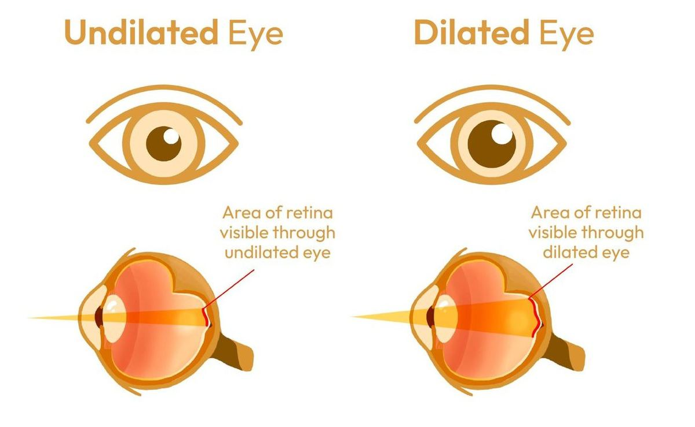
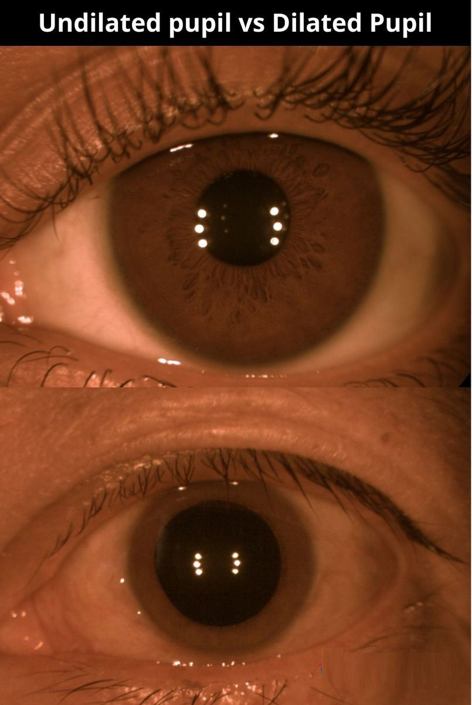

# Pupil Dilation

Source: `Eye Diseases & Conditions-compressed.pdf`, pages 306-312.

## Images

## Extracted text

<!-- Page 306 -->
Pupil Dilation
Pupil dilation refers to the enlargement of the pupil (the black circular opening in the center of
the eye that controls the amount of light entering the eye). Under normal circumstances, the pupil
adjusts in size in response to light conditions, becoming smaller in bright light (constriction) and
larger in dim light (dilation). However, pupil dilation can also occur artificially through the use

<!-- Page 307 -->
of certain medications or due to various medical conditions. The process of dilation allows eye
care professionals to get a clearer, more comprehensive view of the inner structures of the eye,
particularly the retina and optic nerve, during an eye exam.
For routine eye exams, ophthalmologists or optometrists may use dilating eye drops to widen
the pupils, giving them a better view of the back of the eye. This allows for the early detection of
eye conditions like macular degeneration, glaucoma, diabetic retinopathy, and retinal tears.
Symptoms and Causes
While pupil dilation can be intentionally induced by an eye care professional, in some cases, it
can also occur due to various symptoms or underlying causes, both physiological and
pathological. Understanding the causes is important for determining whether the dilation is a
normal response or a sign of a more serious issue.
Symptoms of Abnormal Pupil Dilation:
Persistent dilated pupils: Pupils remain dilated even in normal lighting conditions.
Vision issues: Blurred vision, difficulty focusing, or sensitivity to light.
Eye pain: Discomfort or pain in one or both eyes.
Double vision: Seeing two images of a single object.
Headaches: Intense headaches, particularly if accompanied by abnormal pupil reactions.
Lack of responsiveness: The pupil does not constrict when exposed to bright light.
Causes of Pupil Dilation:
1. Medications: Eye drops used during eye exams are designed to dilate the pupil
temporarily. Other medications, such as anticholinergics, antidepressants, or
antihistamines, can also cause dilation as a side effect.
2. Autonomic Nervous System Response: The autonomic nervous system regulates pupil
size. Fight-or-flight responses triggered by stress or emotional reactions can lead to
temporary pupil dilation.
3. Trauma or Injury: Eye injuries or trauma to the head can result in changes to the pupil’s
size, including dilation.
4. Brain Conditions: Serious medical conditions, including brain injury, stroke, tumors,
or increased intracranial pressure, can affect the nerves that control the pupils and
cause dilation.
5. Drugs and Alcohol: Certain substances, such as recreational drugs (e.g., cocaine, LSD,
or marijuana) or alcohol, can lead to pupil dilation.
6. Eye Conditions: Some eye diseases like glaucoma, uveitis, or optic neuropathy may
also cause abnormal pupil dilation.
Diagnosis and Tests
Diagnosing the cause of pupil dilation typically involves a comprehensive eye exam and, in
some cases, further neurological testing. Key diagnostic steps include:

<!-- Page 308 -->
1. Pupil Reaction Test: The doctor will shine a light into the eye to observe how the pupil
responds. A normal pupil constricts in response to light, but an abnormal response may
indicate neurological issues or eye disease.
2. Slit-Lamp Exam: This instrument helps to examine the eye’s structures, including the
cornea, iris, and lens, to check for signs of trauma or disease that could be affecting pupil
size.
3. Tonometry: Used to measure the intraocular pressure of the eye, this test can help
diagnose conditions like glaucoma that might cause abnormal pupil dilation.
4. Visual Field Test: This test measures the scope of your peripheral vision. It may be used
to detect damage to the optic nerve or areas of the brain associated with vision.
5. MRI/CT Scan: If the cause of pupil dilation is suspected to be related to a brain injury,
stroke, or tumor, imaging tests such as an MRI or CT scan may be necessary to evaluate
the brain and surrounding structures.
6. Neurological Exam: A detailed neurological exam may be performed to check for
underlying conditions affecting the brain or nervous system.
Management and Treatment
The management of pupil dilation depends on its cause:
1. Medication-Induced Pupil Dilation: If pupil dilation is caused by eye drops or
medications, it is usually temporary, and the pupil returns to normal once the medication
wears off. In some cases, antidotes or treatments may be used to reverse the effects of
certain drugs, such as atropine or scopolamine.
2. Eye Trauma: If pupil dilation is the result of an eye injury, treatment may involve
addressing the underlying injury, such as using cold compresses, medications for pain
relief, or surgery in severe cases.
3. Neurological Conditions: If pupil dilation is due to brain trauma, increased intracranial
pressure, or a neurological disorder, the treatment will focus on the specific condition.
This may involve:
o
Surgical intervention for brain injuries or tumors.
o
Medication management to reduce intracranial pressure or treat underlying
neurological conditions.
o
Emergency care if the dilation is associated with a life-threatening event like a
stroke.
4. Glaucoma: If pupil dilation is linked to glaucoma, medications to lower intraocular
pressure (IOP), such as eye drops, laser therapy, or surgery, may be recommended.
5. Uveitis or Infections: Inflammation of the eye (uveitis) or infections may require
corticosteroid eye drops or oral antibiotics to treat the underlying condition.
Pupil Dilation in Adults
In adults, pupil dilation is commonly induced for routine eye exams or when there’s suspicion of
a serious eye condition. After the dilation procedure, the patient may experience blurred vision,
light sensitivity, and difficulty focusing for a few hours as the effect wears off. Adults who have

<!-- Page 309 -->
conditions like glaucoma, diabetic retinopathy, or macular degeneration may require more
frequent pupil dilation tests to monitor changes in the eye’s health.
In adults, abnormal pupil dilation can also indicate more severe conditions such as brain
injuries or neurological disorders. Therefore, if the pupil dilation is accompanied by symptoms
like severe headaches, nausea, or vision loss, urgent medical attention is required.
Pupil Dilation in Children
For children, pupil dilation is commonly used during eye exams to help assess the health of the
retina, optic nerve, and other structures of the eye. Pediatricians and ophthalmologists use eye
drops to dilate the pupils and ensure a thorough examination of the child’s eye health.
In children, abnormal pupil dilation is often associated with:
Eye injuries (e.g., from trauma or foreign objects).
Congenital eye conditions like strabismus (crossed eyes) or amblyopia (lazy eye).
Neurological conditions affecting the brain or nervous system.
Parents should seek immediate medical attention if they notice that their child has one dilated
pupil, especially if it is accompanied by pain, vision changes, or behavioral changes.
Prevention
While pupil dilation cannot always be prevented, several actions can help minimize the risk of
complications:
Protecting the Eyes from Injury: Wearing protective eyewear during activities like
sports or work can prevent eye trauma that might lead to pupil dilation.
Regular Eye Exams: Routine eye exams help detect conditions like glaucoma, cataracts,
and diabetic retinopathy that can cause abnormal pupil responses.
Safe Use of Medications: Be cautious when using medications known to affect the
pupils (e.g., anticholinergics or recreational drugs) and always follow the prescribed
dosages.
Stress Management: Since stress and emotional triggers can cause temporary pupil
dilation due to the autonomic nervous system’s response, practicing stress-relief
techniques like deep breathing, yoga, or meditation may help control this effect.
Healthy Lifestyle: Maintaining overall health through a balanced diet, regular physical
activity, and avoiding smoking can prevent conditions like high blood pressure, diabetes,
and neurological issues that may affect pupil function.
Outlook / Prognosis
The outlook for pupil dilation largely depends on the cause:

<!-- Page 310 -->
Medication-induced dilation: Typically resolves within a few hours as the effects of the
medication wear off.
Trauma-induced dilation: If caused by minor eye injury, it may resolve with treatment.
Severe cases might require surgery or other interventions.
Neurological causes: If the dilation is caused by a serious neurological issue like a brain
injury, stroke, or tumor, the prognosis depends on the underlying condition. Early
diagnosis and treatment can significantly improve the chances of a positive outcome.
If glaucoma or another serious eye disease is the cause of abnormal pupil dilation, the prognosis
is better with early intervention and regular monitoring.
Living With Pupil Dilation
For most people, temporary pupil dilation caused by eye drops for exams or stress is not an
ongoing issue. However, if dilation is due to an underlying condition, managing that condition is
crucial.
Living with abnormal pupil dilation caused by a medical condition may require lifestyle
adjustments, including:
Using corrective eyewear or medications to treat the underlying cause.
Monitoring vision regularly to catch any changes early.
Seeking ongoing medical care to address any underlying neurological issues or eye
diseases.

<!-- Page 312 -->
Additional Common Questions (FAQs)
Q: How long does pupil dilation last after an eye exam?
A: After an
eye exam, pupil dilation usually lasts for 4 to 6 hours, though it can be longer in some cases,
particularly for people with lighter-colored eyes.
Q: Can stress cause pupil dilation?
A: Yes, stress can trigger the body’s fight-or-flight response, which can lead to temporary pupil
dilation.
Q: Is it safe to drive after pupil dilation?
A: It is not advisable to drive immediately after pupil dilation, as it causes blurred vision and
light sensitivity. It’s best to have someone accompany you or wait until the effects wear off.
Q: Can drugs like marijuana or cocaine cause pupil dilation?
A: Yes, drugs like marijuana, cocaine, and other stimulants can cause the pupils to dilate. This is
often a temporary effect but may be a sign of substance use.
Q: Can pupil dilation be a sign of a serious condition?
A: Yes, abnormal or persistent pupil dilation can indicate a neurological issue, eye disease, or
trauma, and it should be evaluated by a healthcare professional if it occurs suddenly or without
explanation.
