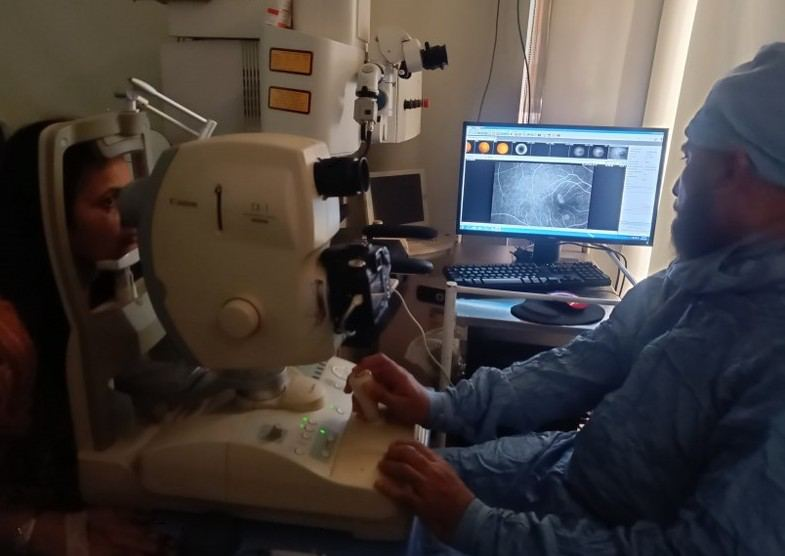
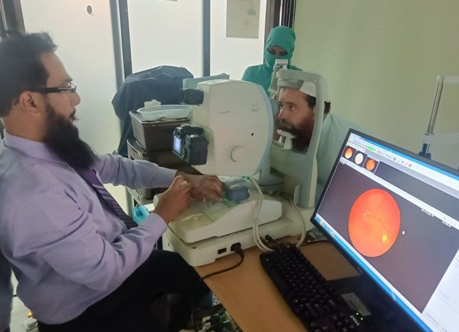

# Fundus Fluorescein Angiography (FFA)

Source: `Eye Diseases & Conditions-compressed.pdf`, pages 312-319.

## Images

## Extracted text

<!-- Page 312 -->
Fundus Fluorescein Angiography (FFA)

<!-- Page 313 -->
Fundus Fluorescein Angiography (FFA) is a specialized imaging technique used by eye care
professionals to examine the blood vessels of the retina. It involves injecting a fluorescent dye
(fluorescein) into the bloodstream, which then travels to the eye. A special camera captures the
passage of the dye through the retinal blood vessels, allowing detailed visualization of the retina
and any abnormalities, such as leakage, blockage, or abnormal blood vessel growth.
FFA is particularly useful in diagnosing and monitoring various eye conditions, including
diabetic retinopathy, macular degeneration, retinal vein occlusion, and diabetic macular edema.
The test provides real-time, high-resolution images of the retina's blood flow, helping clinicians
assess the extent of retinal diseases and plan appropriate treatment strategies.
Symptoms and Causes
While Fundus Fluorescein Angiography (FFA) is primarily a diagnostic tool, it is often used
when patients experience symptoms related to retinal or vascular eye diseases. These symptoms
can include:
Blurry vision: Difficulty seeing clearly, particularly in central vision.
Dark spots or floaters: Sudden onset of floaters or dark spots in vision, which may
indicate retinal problems.
Vision loss: Gradual or sudden loss of vision, especially in the central field.

<!-- Page 314 -->
Distorted vision: Straight lines may appear wavy or bent, often a sign of macular issues
like macular edema.
Difficulty seeing at night: A condition known as night blindness, often related to retinal
diseases.
The causes of these symptoms may include:
Diabetic Retinopathy: A complication of diabetes where high blood sugar levels
damage the blood vessels of the retina.
Macular Degeneration: Age-related changes in the retina, leading to central vision loss.
Retinal Vein Occlusion: Blockage of the retinal veins, leading to swelling and leakage in
the retina.
Macular Edema: Accumulation of fluid in the macula, often caused by conditions like
diabetic retinopathy or retinal vein occlusion.
Choroidal Neovascularization (CNV): Growth of abnormal blood vessels under the
retina, commonly associated with wet age-related macular degeneration (AMD).
FFA helps identify and document the specific causes of retinal issues, allowing for more accurate
diagnosis and management.
Diagnosis and Tests
Fundus Fluorescein Angiography (FFA) is conducted in a clinical setting and typically
involves the following steps:
1. Initial Assessment: The eye care professional will perform a routine eye exam, including
checking the visual acuity and evaluating the retina with a slit-lamp or direct
ophthalmoscope.
2. Fluorescein Dye Injection: A small amount of fluorescein dye is injected into a vein,
usually in the arm. The dye is then carried by the bloodstream to the retinal blood vessels.
3. Retinal Imaging: Using a special camera, the retina is photographed in quick succession
as the dye passes through the retinal blood vessels. The camera detects the fluorescence
emitted by the dye and captures high-resolution images of the retina.
4. Analysis: The images are analyzed to assess blood flow, identify areas of leakage,
blockage, or abnormal blood vessel growth, and evaluate the overall condition of the
retina.
5. Additional Tests: Depending on the findings, additional tests like Optical Coherence
Tomography (OCT) may be performed to get cross-sectional images of the retina for
further evaluation of conditions such as macular edema or retinal thinning.
Management and Treatment
The results of FFA are crucial in determining the appropriate course of action for managing
retinal conditions. Based on the findings, the following management and treatment options may
be considered:

<!-- Page 315 -->
Laser Treatment: For conditions like diabetic retinopathy and retinal vein occlusion,
laser photocoagulation may be used to seal leaking blood vessels or to destroy abnormal
blood vessels.
Anti-VEGF Injections: In cases of wet macular degeneration or diabetic macular
edema, injections of anti-VEGF (vascular endothelial growth factor) medications can
help reduce abnormal blood vessel growth and fluid leakage.
Steroid Injections: In some cases, corticosteroid injections into the eye can help reduce
inflammation and swelling associated with retinal conditions.
Surgical Intervention: In rare cases, if retinal detachment or advanced retinal disease is
diagnosed, surgery may be needed to repair the retina or remove abnormal blood vessels.
Regular Monitoring: FFA is often repeated at regular intervals to monitor the
progression of retinal diseases and evaluate the effectiveness of treatments.
Fundus Fluorescein Angiography (FFA) Types & Surgery
1. Standard Fundus Fluorescein Angiography: The traditional technique, where
fluorescein dye is injected into the bloodstream, and a series of retinal images are
captured to visualize blood flow in the retina.
2. Indocyanine Green Angiography (ICGA): A variation of FFA that uses a different dye,
indocyanine green, to visualize the choroidal blood vessels beneath the retina. ICGA is
particularly useful for diagnosing conditions like choroidal neovascularization.
3. Wide-Field Fluorescein Angiography: This advanced version of FFA provides a wider
view of the retina, allowing the imaging of peripheral retinal areas, which is especially
helpful for conditions like retinal detachment or diabetic retinopathy that affect the entire
retina.
4. Surgical Applications: While FFA is not typically a surgical procedure, it is often used
during or after retinal surgeries (like vitrectomy) to evaluate the success of the surgery
and monitor any postoperative complications.
Complicated Fundus Fluorescein Angiography (FFA)
While FFA is generally a safe and well-tolerated procedure, there can be complications in rare
cases:
1. Allergic Reactions: Some individuals may experience mild allergic reactions to the
fluorescein dye, such as skin rashes, itching, or nausea. Severe reactions are extremely
rare but can occur.
2. Nausea and Vomiting: The injection of fluorescein dye can cause mild nausea in some
patients. In most cases, this resolves within a few minutes, but anti-nausea medications
can be administered if necessary.
3. Anaphylactic Reactions: Although rare, a severe allergic reaction (anaphylaxis) to the
dye can occur, causing difficulty breathing, swelling, and shock. Immediate medical
intervention is required if this happens.
4. Phlebitis: In rare cases, the injection site may become inflamed, leading to a condition
called phlebitis.

<!-- Page 316 -->
5. Kidney Function: Fluorescein is excreted by the kidneys, and people with kidney
disease may need special consideration or alternative imaging methods.
Fundus Fluorescein Angiography (FFA) in Adults
In adults, FFA is commonly used to diagnose and monitor chronic retinal conditions such as:
Diabetic Retinopathy: A condition where diabetes causes damage to the blood vessels of
the retina, leading to leakage and bleeding.
Age-Related Macular Degeneration (AMD): A condition affecting the macula, leading
to central vision loss. FFA helps determine the presence of abnormal blood vessels (wet
AMD).
Retinal Vein Occlusion: A blockage in the retinal veins that can cause fluid leakage and
swelling in the retina.
Macular Edema: Swelling of the macula due to fluid buildup, which can be caused by
various conditions such as diabetes or retinal vein occlusion.
Fundus Fluorescein Angiography (FFA) in Children
In children, FFA may be performed in cases of:
Congenital Retinal Conditions: Certain retinal conditions are present from birth and
may require early intervention, such as retinopathy of prematurity (ROP), which
affects premature infants.
Inherited Retinal Diseases: Conditions like Leber congenital amaurosis or retinitis
pigmentosa, which affect the retina and cause progressive vision loss, may require
monitoring with FFA.
Trauma: In cases where the child has suffered an eye injury, FFA may be used to assess
the damage to the retina and blood vessels.
Prevention
While Fundus Fluorescein Angiography (FFA) is a diagnostic tool, the conditions it helps to
detect can often be managed or prevented through early intervention:
1. Regular Eye Exams: Routine eye exams are essential for individuals with risk factors
like diabetes, hypertension, or a family history of retinal diseases.
2. Blood Sugar Control: For diabetic patients, keeping blood sugar levels within the target
range can help prevent or slow the progression of diabetic retinopathy.
3. Lifestyle Modifications: Maintaining a healthy diet, exercising regularly, and avoiding
smoking can reduce the risk of retinal conditions like macular degeneration and diabetic
retinopathy.
4. Management of Hypertension: Properly managing high blood pressure is crucial for
preventing retinal vein occlusion and other vascular conditions.

<!-- Page 317 -->
Outlook / Prognosis
The outlook for individuals undergoing FFA largely depends on the underlying condition
identified. Early detection and treatment are key in improving the prognosis for conditions like
diabetic retinopathy and macular degeneration:
Diabetic Retinopathy: With early diagnosis and treatment (e.g., laser therapy, anti-
VEGF injections), the progression of diabetic retinopathy can be slowed, and vision loss
can often be prevented.
Age-Related Macular Degeneration:
Early intervention in wet AMD with anti-VEGF therapy can prevent significant vision loss,
although the disease is often progressive.
Retinal Vein Occlusion: With appropriate treatment (e.g., laser therapy, steroids, anti-
VEGF injections), vision can often be preserved or improved, although some individuals
may experience permanent vision impairment.
Living With Fundus Fluorescein Angiography (FFA)
Undergoing FFA is typically not a recurring necessity for most patients. However, for
individuals with chronic eye conditions, periodic FFA exams may be required to monitor the
progress of disease and assess the effectiveness of treatments.
Living with the knowledge of retinal disease may require lifestyle adjustments such as:
Regular monitoring and follow-up appointments.
Managing diabetes, hypertension, or other systemic conditions that affect the retina.
Using corrective lenses or other aids to manage vision impairments.

<!-- Page 318 -->
Additional Common Questions (FAQs)
Q: Is Fundus Fluorescein Angiography painful?
A: FFA is not painful, but the injection of the dye may cause a brief discomfort, and some people
experience mild nausea during the procedure. The actual retinal imaging is non-invasive and
painless.
Q: How long does the Fundus Fluorescein Angiography procedure take?
A: The procedure usually takes 15-30 minutes, including the time it takes for the dye to circulate
and for the retinal images to be captured.
Q: Are there any risks associated with fluorescein dye?
A: The risks are minimal, but some people may experience mild allergic reactions or nausea.
Severe reactions are rare but can occur in individuals who are allergic to the dye.

<!-- Page 319 -->
Q: How long do the results of an FFA last?
A: FFA images are typically used to assess the current state of the retina. The results are
immediate and are used to guide treatment decisions. Follow-up FFAs are often scheduled based
on the severity of the condition.
Q: Can FFA be used to diagnose all eye diseases?
A: While FFA is a powerful diagnostic tool for many retinal diseases, it cannot diagnose all eye
conditions. Other tests like Optical Coherence Tomography (OCT) or retinal ultrasound may
be used in conjunction with FFA for a comprehensive diagnosis.
