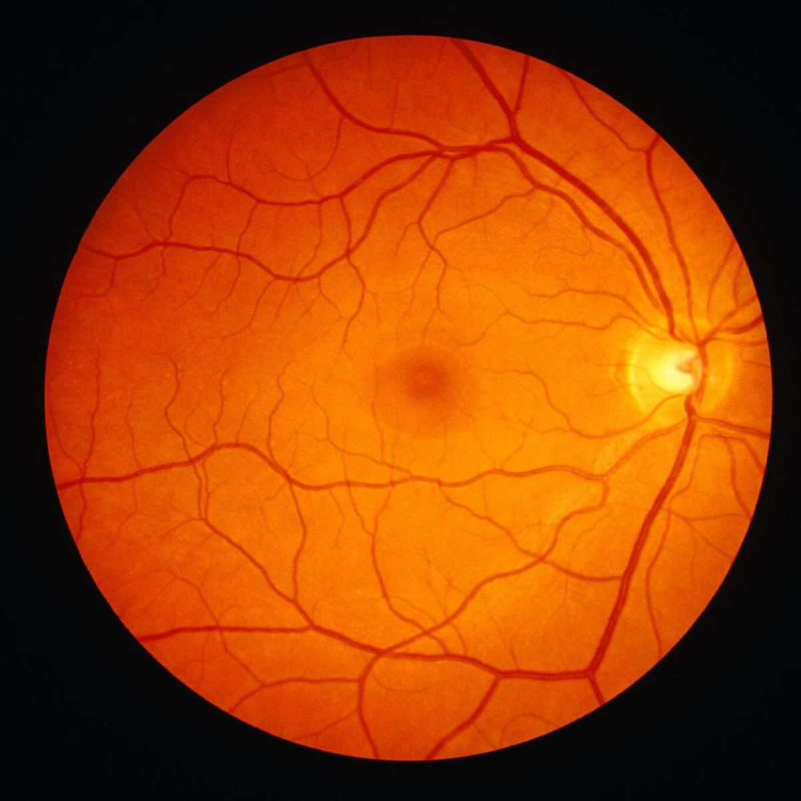
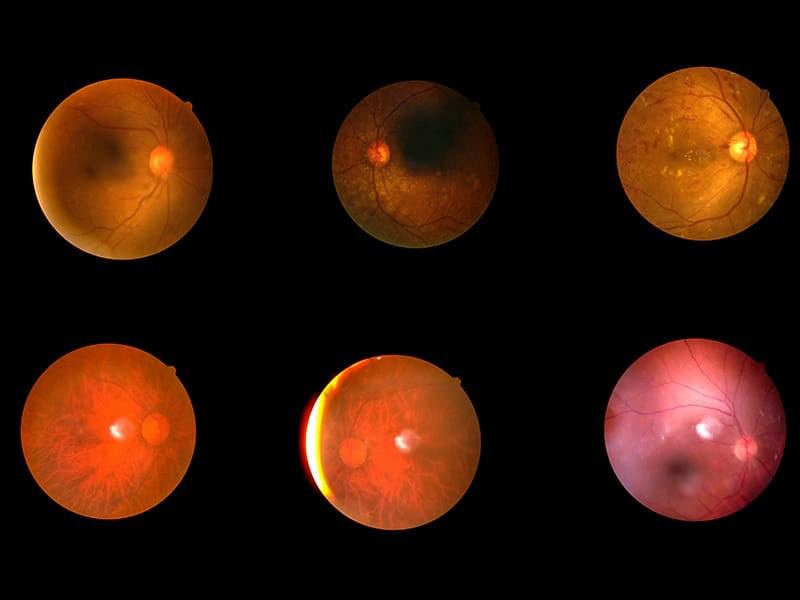
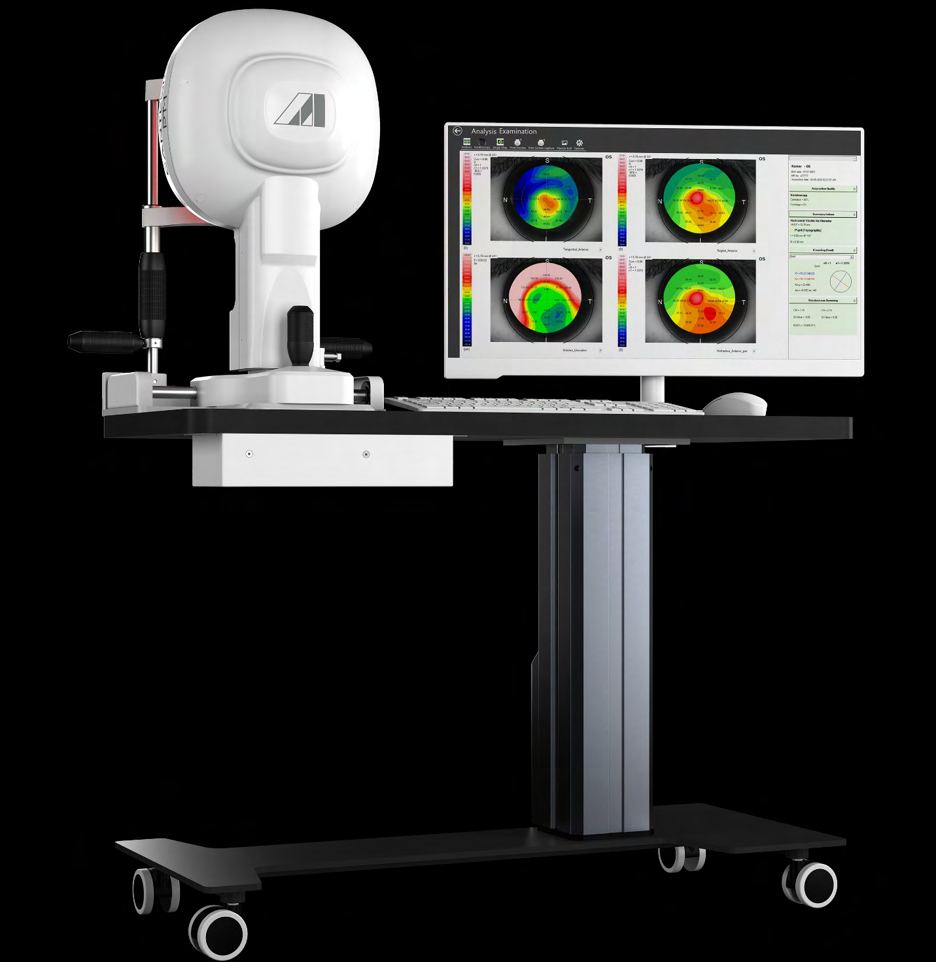
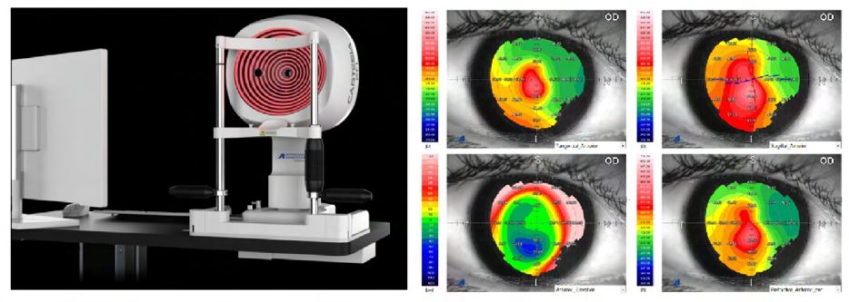

# Retinal Imaging

Source: `Eye Diseases & Conditions-compressed.pdf`, pages 319-333.

## Images

## Extracted text

<!-- Page 319 -->
Retinal Imaging

<!-- Page 320 -->
Retinal imaging is a critical diagnostic tool used to capture detailed images of the retina, the
light-sensitive tissue at the back of the eye. This technology allows healthcare professionals to
evaluate the health of the retina, diagnose eye diseases, and monitor changes over time. Retinal
imaging is commonly used to assess conditions like macular degeneration, diabetic
retinopathy, glaucoma, and other retinal disorders.
Through non-invasive procedures, retinal imaging offers a detailed, clear view of the eye’s
internal structures, making it a valuable tool for both diagnostic and preventive eye care.

<!-- Page 321 -->
Symptoms and Causes
Retinal imaging is not performed due to symptoms of discomfort but rather to evaluate potential
eye conditions, particularly when patients may not yet experience noticeable symptoms.
Common conditions that retinal imaging can help diagnose include:
Diabetic Retinopathy: A leading cause of blindness in people with diabetes, it occurs
when high blood sugar damages the blood vessels in the retina.
Age-Related Macular Degeneration (AMD): A progressive disease that affects the
macula, the central part of the retina responsible for sharp vision.
Glaucoma: A group of diseases that damage the optic nerve and can lead to vision loss,
often without early symptoms.
Retinal Vein or Artery Occlusion: Blockage of blood vessels in the retina that can lead
to sudden vision loss.
Retinal Detachment: A serious condition where the retina separates from the underlying
tissue, leading to potential vision loss if untreated.
Diagnosis and Tests
Retinal imaging is often part of a comprehensive eye exam and can be used alongside other
diagnostic tests. The test is simple, quick, and non-invasive, allowing for clear and detailed
visualization of the retina and the blood vessels within the eye. Several types of retinal imaging
are commonly used, each serving a specific purpose:
Types of Retinal Imaging:
1. Fundus Photography:
o
Captures color photographs of the retina, macula, and optic nerve.
o
Primarily used for documenting retinal conditions and providing a baseline for
comparison in future exams.
2. Fluorescein Angiography:
o
Involves injecting a fluorescent dye into the bloodstream, which highlights blood
vessels in the retina.
o
Used to assess blood flow, detect leaks, or identify blocked or damaged vessels,
which is particularly helpful for conditions like diabetic retinopathy or macular
degeneration.
3. Optical Coherence Tomography (OCT):
o
Utilizes light waves to create cross-sectional images of the retina, offering
detailed views of the layers of the retina.
o
Particularly effective for diagnosing macular diseases, retinal edema, and
glaucoma.
4. Wide-Angle Retinal Imaging:
o
Provides a wide-field view of the retina, allowing for a more comprehensive
assessment of the peripheral retina, which is essential for detecting conditions that
affect the entire retina, such as diabetic retinopathy.
5. Indocyanine Green Angiography (ICG):

<!-- Page 322 -->
o
Similar to fluorescein angiography, but uses a different dye to visualize the deeper
layers of the retina and choroid.
o
Particularly useful for diagnosing conditions affecting the choroidal circulation,
such as age-related macular degeneration.
6. Fundus Autofluorescence:
o
Uses the natural autofluorescence of the retina to detect retinal changes,
particularly for conditions that involve the macula or retinal pigment epithelium.
Other Complementary Tests:
Visual Field Testing: Measures the range of vision to detect loss of peripheral vision or
central vision associated with retinal conditions.
Tonometry: Measures intraocular pressure (IOP) to check for glaucoma or other
conditions affecting the optic nerve.
Management and Treatment
The role of retinal imaging is primarily diagnostic, helping doctors identify conditions early so
they can be managed before significant damage occurs. The treatment depends on the underlying
condition detected by retinal imaging.
Diabetic Retinopathy: If detected early, blood sugar control, laser treatment, or
injections of anti-VEGF medications may be used to prevent further retinal damage.
Age-Related Macular Degeneration (AMD): Treatment often includes lifestyle changes
(e.g., smoking cessation, dietary modifications), along with medications like anti-VEGF
injections, or laser therapy to slow the progression of the disease.
Glaucoma: Medications (eye drops) to lower intraocular pressure, laser treatments, or
surgery may be used to prevent optic nerve damage.
Retinal Detachment: Surgery is often required to reattach the retina, and retinal imaging
is essential in planning these procedures.
Retinal Vein Occlusion: Treatments may include laser therapy or injections of steroids
or anti-VEGF agents to reduce swelling and improve vision.
Macular Edema: Anti-inflammatory medications or injections can help reduce fluid
accumulation in the macula.
Retinal Imaging Types & Surgery
Surgical intervention may be required depending on the retinal condition being treated, and
imaging plays a critical role in guiding these procedures.
1. Laser Surgery: For diabetic retinopathy, glaucoma, or retinal vein occlusion, laser
surgery can be used to seal leaking blood vessels or reduce retinal swelling.
2. Vitrectomy: A surgical procedure to remove the vitreous gel from the eye, often
performed in cases of retinal detachment or severe diabetic retinopathy.
3. Retinal Implant: In advanced cases of macular degeneration, retinal implants may be
considered to help restore vision.

<!-- Page 323 -->
4. Cryotherapy: Cold treatment to treat retinal tears or detachments.
Complicated Retinal Imaging
While retinal imaging is generally safe and non-invasive, complications can arise, especially in
certain situations:
Allergic Reactions: Some individuals may have an allergic reaction to the dyes used in
fluorescein or indocyanine green angiography.
Nausea or Vomiting: The fluorescein dye, while generally safe, can cause nausea in
some patients.
Infection: Although rare, infection can occur if the eye is not properly protected during
the imaging process.
Misinterpretation of Results: In certain cases, factors like pupil dilation or inaccurate
calibration of imaging equipment may lead to misinterpretation of the results.
Retinal Imaging in Adults
In adults, retinal imaging plays a key role in detecting age-related conditions and managing
chronic diseases that can affect the eyes. Adults over 40, especially those with risk factors such
as diabetes, high blood pressure, or a family history of eye diseases, should undergo routine
retinal imaging as part of their eye exams. For patients with conditions such as glaucoma or
macular degeneration, frequent retinal imaging may be necessary to monitor disease progression
and treatment effectiveness.
Diabetes: Regular retinal exams are crucial for individuals with diabetes to detect early
signs of diabetic retinopathy before significant vision loss occurs.
Age-Related Macular Degeneration: Retinal imaging helps track changes in the macula
and guide treatment decisions.
Glaucoma: Imaging helps monitor changes in the optic nerve and assess the
effectiveness of IOP-lowering treatments.
Retinal Imaging in Children
In children, retinal imaging is typically performed if there is a concern regarding their eye
health. Conditions like retinopathy of prematurity (ROP) in premature infants require early
and frequent monitoring with retinal imaging.
Other instances where retinal imaging may be used in children include:
Congenital Retinal Conditions: Such as familial retinal diseases or congenital cataracts
that can affect the retina.
Trauma: Retinal imaging may be used to detect retinal damage following eye injuries.
Systemic Conditions: Diseases like sickle cell anemia, neurofibromatosis, and other
conditions can lead to retinal complications, making regular retinal imaging important.

<!-- Page 324 -->
Prevention
Prevention of retinal diseases largely depends on early detection and management. Key
prevention strategies include:
Regular Eye Exams: Routine eye exams with retinal imaging help detect conditions like
glaucoma, macular degeneration, or diabetic retinopathy before they cause significant
vision loss.
Controlling Systemic Conditions: Managing diabetes, hypertension, and high
cholesterol can help reduce the risk of retinal diseases.
Healthy Lifestyle: A balanced diet rich in antioxidants (such as vitamin A, C, and E)
can support eye health, while smoking cessation can reduce the risk of age-related
macular degeneration (AMD).
UV Protection: Wearing sunglasses with UV protection can protect the retina from sun
damage.
Outlook / Prognosis
The prognosis for individuals with retinal conditions depends largely on the specific disease and
the stage at which it is diagnosed. Early intervention with treatments like laser therapy, anti-
VEGF injections, or surgery can significantly improve the outlook for many retinal conditions.
Diabetic Retinopathy: With good blood sugar control and regular monitoring, the
progression of retinopathy can often be slowed or halted.
Age-Related Macular Degeneration: Early detection of AMD allows for treatments that
may slow disease progression and preserve central vision.
Glaucoma: With effective treatment to lower intraocular pressure, individuals can
maintain functional vision and prevent blindness.
Living With Retinal Eye Conditions
Living with a retinal condition often involves regular check-ups, including retinal imaging, to
monitor the progression of the disease. Patients may need to manage chronic conditions like
diabetes, follow treatment regimens prescribed by their doctors, and adapt their lifestyle to
support eye health.

<!-- Page 325 -->
Additional Common Questions (FAQs)
Q: Is retinal imaging painful?
A: No, retinal imaging is typically painless. It may involve brief discomfort from pupil dilation
or mild irritation from the imaging device.
Q: How often should retinal imaging be done?
A: The frequency depends on individual risk factors. Adults with diabetes or a family history of
retinal diseases should have it done annually, while those without risk factors can have it every
1-2 years.
Q: What conditions can retinal imaging detect?
A: Retinal imaging can detect a wide range of conditions including diabetic retinopathy, macular
degeneration, glaucoma, retinal vein occlusion, and retinal detachment.

<!-- Page 326 -->
Q: Are there any risks associated with retinal imaging?
A: Risks are minimal, but there can be mild side effects such as eye irritation or allergic reactions
to dyes used in fluorescein or indocyanine green angiography.
Q: How long does a retinal imaging test take?
A: The entire process usually takes 20-30 minutes, including the time needed for pupil dilation
and image capture.
Q: Can retinal imaging replace other eye exams?
A: While retinal imaging is an important diagnostic tool, it is typically used alongside other tests,
such as visual field testing and tonometry, for a comprehensive eye health evaluation.
XXXXXXXXXXXXXXXXXXXXXXXXXXXXXXXXXXx
Corneal Topography

<!-- Page 327 -->
Corneal topography is a diagnostic technique that maps the surface of the cornea, the
transparent front part of the eye. This non-invasive procedure provides a detailed, three-
dimensional map of the cornea's shape, curvature, and thickness. Corneal topography is an
essential tool in the diagnosis and management of various eye conditions, particularly those
related to the cornea, such as astigmatism, keratoconus, and post-surgical evaluations like
LASIK.
By providing detailed information about the cornea, this test helps ophthalmologists assess its
health, plan surgical procedures, and monitor changes in corneal structure over time.

<!-- Page 328 -->
Symptoms and Causes
While corneal topography itself does not cause symptoms, it is used to identify and manage
conditions that may produce noticeable symptoms. The main symptoms that may prompt a
corneal topography examination include:
Blurred or distorted vision, especially with uncorrected astigmatism.
Frequent changes in prescription for glasses or contact lenses.
Sensitivity to light or glare, especially in cases of keratoconus or irregular corneal
surfaces.
Eye strain or difficulty seeing at night, which can be associated with irregularities in the
corneal shape.
Redness, swelling, or pain in the eyes following certain surgeries like LASIK.
Common Causes of Abnormal Corneal Shape:
1. Keratoconus: A progressive condition where the cornea becomes thin and bulges
outward into a cone shape, distorting vision.
2. Astigmatism: An irregular curvature of the cornea, causing blurred or distorted vision.
3. Corneal scarring: From trauma, infections, or previous surgeries that result in uneven
corneal surfaces.
4. Post-surgical changes: After surgeries like LASIK or cataract surgery, corneal
topography helps track healing and detect complications.
5. Corneal dystrophies: A group of genetic conditions that cause changes to the corneal
tissue, often affecting its clarity and shape.
Diagnosis and Tests
Corneal topography is often used as part of a comprehensive eye examination, especially if a
patient experiences symptoms of visual distortion or if there's a need to assess the cornea for
potential surgery. This test can provide detailed information about the shape and curvature of the
cornea, helping identify conditions like astigmatism, keratoconus, or post-surgical corneal
changes.
Types of Corneal Topography:
1. Placido Disc Topography:
o
A series of concentric rings projected onto the cornea, and the distortion of these
rings is measured to map the corneal surface.
o
This method is most commonly used for diagnosing astigmatism and early signs
of keratoconus.
2. Scheimpflug Imaging:
o
This technique captures detailed images of the cornea's front and back surfaces,
and the results are used to calculate its thickness and curvature.
o
It's often used for more detailed corneal measurements in pre-surgical evaluations
and managing keratoconus.

<!-- Page 329 -->
3. Optical Coherence Tomography (OCT):
o
A non-invasive imaging test that uses light to capture high-resolution, cross-
sectional images of the cornea.
o
OCT is useful for detecting changes in the corneal structure over time, especially
after surgery or injury.
4. Tomey Topography:
o
A modern form of corneal topography that uses infrared light to create a detailed
map of the cornea’s curvature and shape.
o
It’s widely used for refractive surgery planning, particularly LASIK and other
vision correction surgeries.
Additional Diagnostic Tests:
Pachymetry: Measures corneal thickness, which is crucial for detecting corneal diseases
like keratoconus.
Slit-lamp examination: A microscope used to examine the eye in detail, including the
cornea, for signs of scarring or disease.
Management and Treatment
The management of conditions identified by corneal topography depends on the underlying
issue, the severity of the condition, and the patient’s specific needs.
1. Astigmatism:
o
Glasses or contact lenses: Prescribed to correct the refractive errors caused by
the irregular corneal shape.
o
Astigmatic keratotomy or LASIK: Surgical procedures used to reshape the
cornea and correct the curvature, especially in cases that do not respond well to
lenses.
2. Keratoconus:
o
Specialty contact lenses: Rigid gas-permeable lenses can help improve vision by
compensating for the irregular shape of the cornea.
o
Corneal cross-linking: A procedure where ultraviolet light is used in
combination with riboflavin to strengthen the corneal tissue, preventing further
thinning and bulging.
o
Corneal transplant: In advanced cases, where cross-linking and lenses are
ineffective, a corneal transplant may be needed to restore vision.
3. Corneal Scarring:
o
Topical treatments: Steroid eye drops or other medications may be prescribed to
reduce inflammation and promote healing.
o
Corneal transplant: In cases of severe scarring, a full or partial corneal
transplant may be necessary.
4. Post-Surgical Management:
o
Corneal topography is used to monitor healing after surgeries like LASIK,
cataract surgery, or corneal transplant. Regular check-ups ensure the cornea is
healing properly and that no complications are arising.

<!-- Page 330 -->
Corneal Topography Types & Surgery
Corneal topography is especially valuable when planning or monitoring eye surgery. Some
common surgeries that rely on corneal topography include:
1. LASIK (Laser-Assisted in Situ Keratomileusis):
o
A refractive surgery that uses a laser to reshape the cornea and correct vision
problems like nearsightedness, farsightedness, and astigmatism.
o
Corneal topography is essential for evaluating the shape of the cornea before
surgery to ensure the cornea is healthy and suitable for the procedure.
2. Corneal Cross-Linking:
o
This procedure is often used to treat keratoconus. Corneal topography helps
assess the condition of the cornea before and after the procedure to determine if
the cornea is sufficiently strengthened.
3. Corneal Transplant:
o
In cases where the cornea is severely damaged or diseased, a corneal transplant
may be necessary.
o
Corneal topography helps assess the cornea’s shape before surgery, and post-
surgery, it’s used to ensure proper healing and the absence of complications.
4. Astigmatic Keratotomy:
o
A surgical procedure that corrects astigmatism by making small incisions in the
cornea.
o
Corneal topography helps guide the surgeon in determining the appropriate
location and depth for the incisions.
Complicated Corneal Topography
While corneal topography is a safe and non-invasive procedure, there are potential complications
associated with the conditions it diagnoses:
Keratoconus progression: In some cases, keratoconus may progress despite treatment,
leading to further irregularities in the corneal surface.
Post-surgical complications: After surgeries like LASIK or corneal transplants,
complications such as corneal haze, glare, or refractive errors may arise, which are
detected using corneal topography.
Inaccurate measurements: Factors such as dry eye, pupil dilation, or corneal edema
can sometimes affect the accuracy of corneal topography readings.
Corneal Topography in Adults
In adults, corneal topography is commonly used to diagnose and manage refractive errors like
astigmatism, monitor the progression of keratoconus, and assess the cornea before refractive
surgeries such as LASIK. Adults with a family history of corneal diseases, eye trauma, or
previous surgeries are advised to undergo regular topography exams to ensure proper eye health.

<!-- Page 331 -->
For individuals planning LASIK or other vision correction surgeries, corneal topography helps
determine whether their cornea is sufficiently thick and regular for surgery.
Corneal Topography in Children
In children, corneal topography is generally used when there's a concern about visual
development or when an eye condition, like keratoconus or astigmatism, is suspected. Early
detection of these conditions is essential to avoid long-term vision issues.
1. Keratoconus: In children, keratoconus can be especially progressive. Early diagnosis
using corneal topography allows for timely treatment, including the possibility of corneal
cross-linking to slow disease progression.
2. Irregular Astigmatism: If a child has significant astigmatism that affects vision
correction with glasses or contact lenses, corneal topography helps identify the degree of
curvature irregularity.
Prevention
Preventing corneal disorders primarily involves early detection and appropriate management.
While genetic conditions like keratoconus cannot be prevented, early diagnosis through routine
eye exams and corneal topography can help slow progression and minimize vision loss.
1. Protecting the Eyes: Wearing protective eyewear during sports or activities that might
lead to eye injury can prevent trauma-related corneal scarring or damage.
2. Regular Eye Exams: Especially for individuals at higher risk of corneal diseases (e.g.,
those with a family history of keratoconus, astigmatism, or previous eye surgeries),
regular eye exams, including corneal topography, are essential for early detection.
3. Healthy Lifestyle: Managing underlying
health conditions like diabetes and maintaining overall eye health can prevent some conditions
from worsening.
Outlook / Prognosis
The outlook for individuals with corneal conditions depends on the type and severity of the
condition, as well as the timeliness of treatment. Conditions like astigmatism and post-surgical
corneal changes often have excellent prognoses with appropriate treatment. Keratoconus, while
progressive, can be managed with contact lenses, corneal cross-linking, or even corneal
transplants in severe cases.
With early detection through corneal topography, many conditions can be managed effectively,
preserving or improving vision.

<!-- Page 332 -->
Living With Corneal Conditions
Living with a corneal condition may require regular follow-ups with an eye care professional,
especially if the condition is progressive, like keratoconus. Many people manage corneal
conditions successfully with specialized contact lenses, lifestyle adjustments, and possibly
surgical interventions.
Additional Common Questions (FAQs)
Q: Is corneal topography safe?
A: Yes, corneal topography is a non-invasive, safe procedure that involves no direct contact with
the eye.
Q: How long does a corneal topography test take?
A: The test usually takes 10-15 minutes, depending on the method used and the complexity of
the case.
Q: Can corneal topography detect early signs of keratoconus?
A: Yes, corneal topography is highly effective in detecting early stages of keratoconus, even
before symptoms like blurry vision become apparent.
Q: Can I wear contacts or glasses during corneal topography?
A: It is advisable to avoid wearing rigid gas permeable contact lenses for at least 24 hours
before the test, as they can temporarily alter the shape of the cornea. Glasses are fine to wear.
Q: How often should I have corneal topography if I have keratoconus?
A: Individuals with keratoconus typically require regular monitoring every 6-12 months to track
the progression of the disease and adjust treatment plans accordingly.
