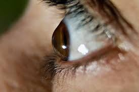
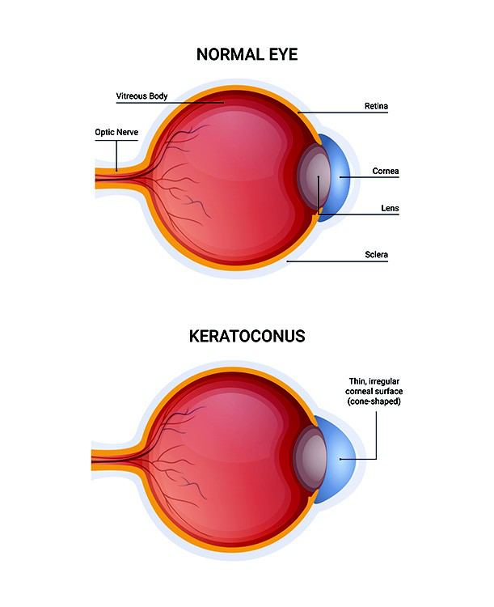

# Keratoconus

Source: `Eye Diseases & Conditions-compressed.pdf`, pages 333-339.

## Images

## Extracted text

<!-- Page 333 -->
Keratoconus
Keratoconus is a progressive eye disease where the normally round cornea (the clear, dome-
shaped surface of the eye) becomes thin and begins to bulge outward into a cone-like shape. This
abnormal shape distorts light entering the eye, leading to blurred or distorted vision. The
condition usually affects both eyes, although one eye may be more severely affected than the
other.
The exact cause of keratoconus remains unclear, though it is thought to be influenced by a
combination of genetic and environmental factors. It typically begins in the teenage years or
early twenties and tends to progress over time, especially if left untreated.

<!-- Page 334 -->
Symptoms and Causes
Symptoms:
Blurred or distorted vision: As the cornea becomes irregularly shaped, the light
entering the eye is refracted in unpredictable ways, leading to poor vision even with
corrective lenses.
Increased sensitivity to light: People with keratoconus may find bright lights or glare to
be especially bothersome.
Frequent changes in glasses or contact lenses: The condition can cause rapid changes
in vision, requiring constant updates to prescriptions.
Double vision: This occurs when the cornea’s irregular shape distorts the image seen by
the eye.
Eye strain and discomfort: As the cornea continues to thin and bulge, visual acuity
worsens, causing discomfort, particularly during prolonged visual tasks.
Causes:
Genetic factors: A family history of keratoconus increases the likelihood of developing
the condition. Certain inherited genetic mutations may predispose individuals to the
disorder.
Environmental factors: Chronic eye rubbing, due to irritation or allergies, is a known
risk factor for keratoconus. The mechanical stress from repeated rubbing can damage the
cornea over time.
Hormonal changes: Keratoconus often begins in adolescence, suggesting a link with
hormonal changes during puberty.
Other conditions: Keratoconus is often associated with other systemic diseases, such as
Down syndrome, Ehlers-Danlos syndrome, Marfan syndrome, and Osteogenesis
imperfecta.
Diagnosis and Tests
The diagnosis of keratoconus is typically made through a combination of comprehensive eye
exams, and specialized tests that provide detailed information about the shape and thickness of
the cornea.
Common Tests:
Corneal topography: This is the most common test for keratoconus. It maps the surface
of the cornea and detects irregularities that suggest keratoconus. The test uses a camera
that projects a series of rings onto the cornea, capturing any distortions caused by the
condition.
Pachymetry: This test measures the thickness of the cornea, which is important for
identifying the thinning characteristic of keratoconus.
Slit-lamp examination: A slit-lamp is a microscope used to examine the eye’s structures,
including the cornea. In keratoconus, the cornea may appear conical, and the doctor may
notice scarring.

<!-- Page 335 -->
Keratometry: This test measures the curvature of the cornea. In keratoconus, the cornea
will appear steeper and more irregular.
Optical coherence tomography (OCT): OCT is used to create detailed images of the
cornea and assess the extent of thinning and irregularities.
Management and Treatment
The treatment for keratoconus depends on the severity of the condition. While the disease can be
managed effectively in its early stages, more advanced cases may require surgical intervention.
Non-Surgical Treatments:
Eyeglasses and contact lenses: In the early stages of keratoconus, vision may be
corrected with glasses or soft contact lenses. As the condition progresses, specially
designed contact lenses, such as rigid gas permeable (RGP) lenses, may be used to
correct irregularities in the cornea’s shape.
Scleral lenses: These are larger, rigid lenses that cover the entire cornea and rest on the
white part of the eye (sclera). They are particularly useful in advanced keratoconus when
other contact lenses no longer provide adequate correction.
Collagen cross-linking: A procedure where riboflavin (vitamin B2) drops are applied to
the cornea, followed by exposure to ultraviolet (UV) light. This strengthens the corneal
tissue and can halt the progression of keratoconus.
Surgical Treatments:
Corneal transplant (keratoplasty): In severe cases where other treatments do not
provide adequate results, a corneal transplant may be necessary. This involves replacing
the diseased cornea with a donor cornea.
Intacs: Small, ring-shaped inserts are surgically placed in the cornea to flatten its shape
and improve vision. This procedure is sometimes used in combination with collagen
cross-linking.
Keratoconus Types & Surgery
There are different variations and surgical options for keratoconus, depending on the individual
case and the severity of the disease:
Types:
Early-stage keratoconus: Often asymptomatic and can be managed with glasses or soft
contact lenses.
Moderate-stage keratoconus: Vision may become more distorted, requiring specialty
contact lenses, such as RGP or scleral lenses.
Advanced-stage keratoconus: Severe distortion and thinning of the cornea that may
require surgical intervention, such as corneal transplant or Intacs.

<!-- Page 336 -->
Surgical Options:
Corneal collagen cross-linking: Often the first-line treatment for moderate to advanced
keratoconus, especially in individuals under 25 years of age.
Corneal transplant: Typically performed when keratoconus leads to significant corneal
scarring or when other treatments fail to manage the disease.
Intacs corneal inserts: A less invasive option that is particularly useful for patients with
early or moderate keratoconus.
Complicated Keratoconus
In some cases, keratoconus can progress to a complicated stage, where the cornea becomes
severely deformed and leads to significant vision loss. Complications may include:
Corneal scarring: The cornea can develop scars as the condition progresses, which may
require a corneal transplant to restore vision.
Glare and halos: Advanced keratoconus can cause glare and halos, especially at night,
making it difficult for individuals to see clearly in low-light conditions.
Ruptured cornea: In rare cases, the cornea may rupture due to extreme thinning, leading
to vision loss and the need for emergency treatment, including a corneal transplant.
Acute hydrops: This occurs when the cornea suddenly swells, causing pain and rapid
vision loss. This can be triggered by trauma or infection and may require surgical
intervention.
Keratoconus in Adults
In adults, keratoconus typically begins in adolescence but can progress into adulthood. If caught
early, it can often be managed with contact lenses, glasses, or cross-linking treatments. Adults
diagnosed with keratoconus may experience vision deterioration over time, requiring regular
monitoring and treatment adjustments.
For individuals with advanced keratoconus, surgical options such as corneal transplant or
Intacs may be needed to restore vision.
Keratoconus in Children
Keratoconus often begins to show symptoms during adolescence, but it can sometimes affect
children as well. Early detection is critical in children, as keratoconus can progress rapidly
during the teenage years.
Treatment for Children:
Collagen cross-linking: This procedure is often performed on children with progressive
keratoconus to halt its progression and prevent the need for a corneal transplant later in
life.

<!-- Page 337 -->
Specialty contact lenses: In some cases, children may require rigid gas-permeable
lenses or scleral lenses to improve vision as the cornea changes shape.
Regular monitoring: Children with keratoconus need to be closely monitored with
regular eye exams to track any changes in the condition.
Prevention
At present, there is no known way to prevent keratoconus, particularly since genetic factors play
a significant role in its development. However, certain lifestyle modifications may help minimize
risk factors and slow progression:
Avoiding excessive eye rubbing: Repeated eye rubbing can exacerbate the condition, so
individuals with keratoconus or those at risk should avoid rubbing their eyes.
Managing allergies: Treating allergic conditions and reducing eye irritation can help
minimize the urge to rub the eyes.
Early detection: Regular eye exams, especially for those with a family history of
keratoconus, can help catch the condition in its early stages, allowing for more effective
treatment.
Outlook / Prognosis
The prognosis for individuals with keratoconus depends on the severity of the condition and the
effectiveness of treatment. If treated early, many people with keratoconus can maintain good
vision through the use of contact lenses, glasses, or collagen cross-linking. For those with
advanced keratoconus, corneal transplants may be necessary but can restore vision with
appropriate postoperative care.
With early diagnosis and modern treatments, individuals with keratoconus can lead a normal life.
However, it’s important to have regular follow-ups to monitor disease progression.
Living With Keratoconus
Living with keratoconus often involves ongoing treatment and adjustments to one’s lifestyle.
People with the condition may need to wear specialty contact lenses or glasses, undergo regular
eye exams, and, in some cases, take preventive measures such as avoiding eye rubbing.
Although keratoconus can cause vision issues, advancements in treatment, including cross-
linking and corneal transplants, have significantly improved the quality of life for many
individuals.

<!-- Page 339 -->
Additional Common Questions (FAQ’s)
Q: Can keratoconus go away on its own?
A: No, keratoconus is a progressive condition that does not resolve without intervention.
Treatment can help slow its progression and improve vision, but the condition usually requires
ongoing management.
Q: How do I know if I have keratoconus?
A: Symptoms of keratoconus include blurred or distorted vision, increased sensitivity to light,
frequent prescription changes, and double vision. A comprehensive eye exam, including corneal
topography, can confirm the diagnosis.
Q: What are the risk factors for keratoconus?
A: Risk factors include a family history of keratoconus, excessive eye rubbing, and certain
genetic conditions such as Down syndrome, Marfan syndrome, and Ehlers-Danlos syndrome.
Q: Can keratoconus be cured?
A: There is no cure for keratoconus, but it can be effectively managed with treatments like
glasses, contact lenses, collagen cross-linking, and corneal transplants.
Q: Is keratoconus hereditary?
A: Yes, keratoconus often runs in families, suggesting a genetic predisposition to the condition.
People with a family history of keratoconus are at higher risk of developing it.
Q: Can I still wear contact lenses if I have keratoconus?
A: Yes, many individuals with keratoconus can wear specialized contact lenses, such as rigid
gas-permeable or scleral lenses, to improve vision. However, the need for these lenses depends
on the severity of the condition.
