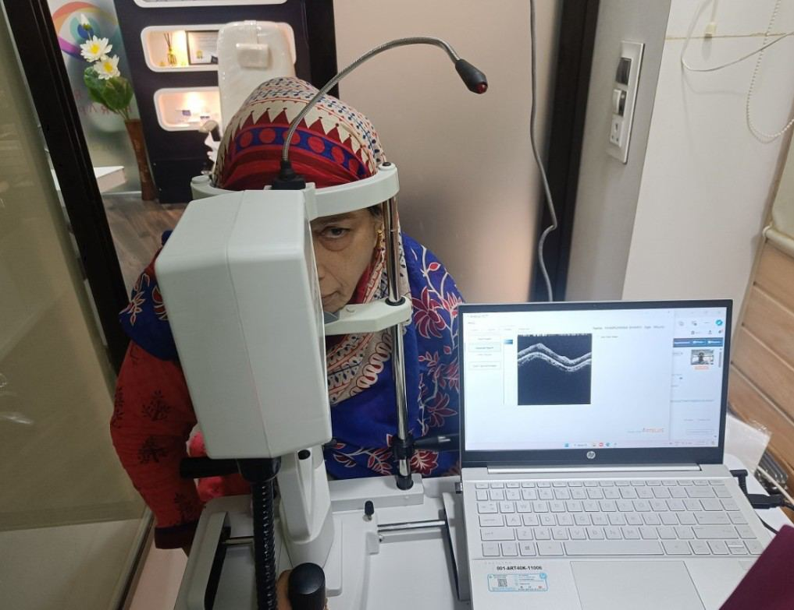
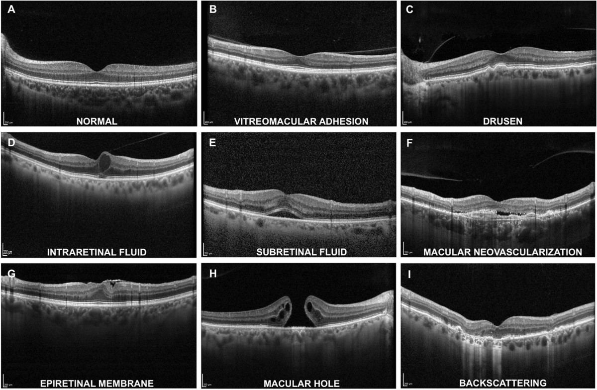

# Optical Coherence Tomography (OCT)

Source: `Eye Diseases & Conditions-compressed.pdf`, pages 339-346.

## Images

## Extracted text

<!-- Page 339 -->
Optical Coherence Tomography (OCT)

<!-- Page 340 -->
Optical Coherence Tomography (OCT) is a non-invasive imaging technique used to capture
high-resolution, cross-sectional images of the retina, optic nerve, and other parts of the eye.
Often referred to as a "non-invasive biopsy," OCT uses light waves to scan and create detailed
images, which can reveal subtle changes in the eye’s structure. This imaging tool is commonly
used in diagnosing and monitoring a variety of eye conditions, particularly those related to the
retina, macula, and optic nerve, such as glaucoma, age-related macular degeneration (AMD),
diabetic retinopathy, and retinal diseases.
OCT provides a highly detailed view of the eye’s internal structures, allowing eye specialists to
assess the condition of the retina and optic nerve with exceptional precision, which is vital for
early diagnosis and ongoing management of eye conditions.
Symptoms and Causes
OCT itself is a diagnostic tool and does not cause any symptoms. However, it is used to detect
conditions that may cause symptoms such as:

<!-- Page 341 -->
Symptoms Indicative of Conditions OCT Detects:
Blurred vision: Often caused by macular edema, retinal diseases, or optic nerve
conditions.
Vision loss: Progressive or sudden loss of vision that may be associated with retinal
diseases like diabetic retinopathy or macular degeneration.
Eye discomfort or pain: Conditions like glaucoma or retinal conditions may cause eye
discomfort.
Distorted vision: Commonly linked to macular degeneration, where the central vision
may become distorted.
Color vision changes: Disorders like diabetic retinopathy or optic neuropathies can
cause changes in how color is perceived.
Causes of Eye Conditions Detected by OCT:
Age-related macular degeneration (AMD): A leading cause of vision loss in older
adults, affecting the central part of the retina.
Diabetic retinopathy: Diabetes can damage the blood vessels in the retina, leading to
vision problems.
Glaucoma: A condition characterized by optic nerve damage, often due to increased
intraocular pressure.
Retinal vascular diseases: Including diabetic macular edema, retinal vein occlusion, or
retinal artery occlusion.
Macular holes or cysts: These can occur due to retinal aging or injury.
Optic neuropathies: Damage to the optic nerve, which may be detected with OCT,
particularly in conditions like optic neuritis.
Diagnosis and Tests
OCT is a critical tool in diagnosing and monitoring eye conditions. It allows for early detection
of structural changes in the retina and optic nerve, which can help prevent vision loss if treated
early.
How OCT Works:
OCT uses light waves to scan the retina and create images of its layers. The process is similar to
an ultrasound, but it uses light rather than sound. The device sends out light beams, which are
reflected back by the eye’s tissues. A computer then processes the reflected light and creates a
cross-sectional image of the retina, providing detailed images of its layers.
Tests and Procedures:
Fundus Photography: Often used in conjunction with OCT, it provides a wider image of
the retina but lacks the cross-sectional detail provided by OCT.

<!-- Page 342 -->
Fluorescein Angiography: Used to assess blood flow in the retina and identify leaks or
blockages, which can be combined with OCT images to provide a more complete view of
retinal health.
Visual Field Test: Used to measure the extent of peripheral vision loss, often in
conjunction with OCT in glaucoma patients to monitor optic nerve damage.
Management and Treatment
While OCT is primarily used for diagnostic purposes, it also plays an essential role in the
management and monitoring of various eye diseases. Early detection and regular monitoring
using OCT can help track disease progression, adjust treatment plans, and prevent or slow vision
loss.
Treatment Based on OCT Findings:
Age-related macular degeneration (AMD): OCT can be used to detect early changes in
the macula, such as fluid accumulation. Treatment options like anti-VEGF (vascular
endothelial growth factor) injections can be initiated based on OCT findings.
Diabetic retinopathy: OCT helps detect diabetic macular edema (DME), allowing for
timely interventions like laser treatment or anti-VEGF injections to reduce swelling and
preserve vision.
Glaucoma: OCT is used to assess the optic nerve and detect early changes in its
structure. Treatment often includes pressure-lowering medications or surgical procedures
to reduce intraocular pressure.
Retinal vascular conditions: OCT is invaluable in diagnosing retinal vein or artery
occlusion, guiding treatment choices such as laser therapy or injections.
Macular hole: OCT can detect macular holes early, and treatment may involve
vitrectomy surgery to repair the hole.
Optical Coherence Tomography (OCT) Types & Surgery
Types of OCT:
Time-domain OCT: Older and slower technology, offering lower resolution but still
useful for assessing retinal structure.
Spectral-domain OCT (SD-OCT): A more advanced and faster technology that
provides higher resolution images, enabling better detection of retinal abnormalities.
Swept-source OCT (SS-OCT): The most advanced type, offering even deeper
penetration into the retina and enhanced imaging of the optic nerve.
OCT Angiography (OCTA): A variant that visualizes blood vessels in the retina without
the need for contrast dye, making it useful for detecting microvascular changes in retinal
diseases.

<!-- Page 343 -->
OCT in Surgery:
OCT is increasingly used during eye surgeries, such as vitrectomy for macular hole repair or
retina surgeries, to provide real-time imaging that helps surgeons make more accurate decisions
during the procedure.
Complicated Optical Coherence Tomography (OCT)
While OCT is a non-invasive and highly effective diagnostic tool, it does have its limitations,
and certain factors can complicate its use:
Poor image quality: Conditions like cataracts or corneal scarring can sometimes distort
OCT images.
Patient movement: Since the test requires the patient to remain still, any eye or body
movement can interfere with the quality of the images.
Limited depth penetration: In cases of very advanced retinal or optic nerve disease,
OCT may not provide the depth of information needed for certain diagnoses.
Technological limitations: Not all OCT devices can detect very small or early changes
in retinal or optic nerve tissue.
Optical Coherence Tomography (OCT) in Adults
OCT is commonly used in adults to monitor and manage a wide range of eye conditions,
particularly in those over 50, when age-related changes such as AMD or diabetic retinopathy
become more prevalent. In adults, OCT is instrumental in:
Detecting early-stage diabetic retinopathy and monitoring its progression.
Assessing macular degeneration and its response to treatment.
Monitoring glaucoma patients for changes in the optic nerve.
Evaluating retinal conditions such as macular edema and cystoid macular degeneration.
Optical Coherence Tomography (OCT) in Children
While less common, OCT is also used to diagnose and monitor retinal and optic nerve conditions
in children. Pediatric OCT is especially useful for diagnosing congenital retinal diseases,
detecting early signs of retinopathy of prematurity (ROP) in premature infants, and monitoring
the progression of conditions like juvenile glaucoma or inherited retinal dystrophies.
Prevention
OCT itself is not a method of prevention but plays a crucial role in the early detection of eye
diseases. Preventive measures for the conditions commonly diagnosed with OCT include:
Regular eye exams: Routine eye checks, especially for individuals at risk of retinal
conditions (e.g., those with diabetes or a family history of eye diseases), can detect early
changes that may be picked up on OCT.

<!-- Page 344 -->
Managing systemic health: Conditions like diabetes, hypertension, and high cholesterol
should be controlled to reduce the risk of retinal disease.
Protecting the eyes: Wearing sunglasses to protect against UV damage and avoiding
smoking, which is a risk factor for AMD, can help preserve eye health.
Outlook / Prognosis
The outlook for individuals with conditions detected by OCT depends largely on the early
detection and appropriate treatment. For example:
Macular degeneration: Early detection via OCT can lead to timely interventions with
anti-VEGF treatments, significantly slowing disease progression and preserving vision.
Diabetic retinopathy: Regular OCT monitoring can guide timely treatments, such as
laser therapy or injections, reducing the risk of severe vision loss.
Glaucoma: OCT allows for detailed monitoring of the optic nerve, aiding in early
detection of damage and helping to manage intraocular pressure and prevent further
damage.
For most retinal and optic nerve conditions, the earlier they are diagnosed and treated, the better
the long-term prognosis.
Living With Optical Coherence Tomography (OCT)
OCT is a diagnostic tool, not a condition that affects a person’s life directly. However, living
with conditions detected and monitored by OCT, such as AMD, glaucoma, or diabetic
retinopathy, requires ongoing care. Patients may need to make lifestyle changes, such as
controlling blood sugar, monitoring eye pressure, and attending regular eye exams to track the
progression of their condition.

<!-- Page 345 -->
Additional Common Questions (FAQ’s)
Q: Is Optical Coherence Tomography (OCT) safe?
A: Yes, OCT is completely non-invasive and does not require any radiation or dyes. The
procedure is safe and has no known side effects.
Q: How long does an OCT test take?
A: An OCT test typically takes 10-15 minutes, depending on the complexity of the images
required.
Q: Do I need to prepare for an OCT test?
A: No special preparation is needed. You may be asked to remove your contact lenses or glasses
during the test, but there is no need for fasting or other preparations.
Q: Can OCT detect all eye diseases?
A: While OCT is highly effective for diagnosing many retinal and optic nerve conditions, it may
not detect all eye diseases. It is often used in conjunction with other tests, such as fluorescein
angiography or visual field tests.

<!-- Page 346 -->
Q: How often should I have an OCT test?
A: The frequency of OCT testing depends on your eye condition. For individuals with chronic
conditions like glaucoma or diabetic retinopathy, OCT may be used for regular monitoring. Your
eye doctor will recommend how often you should have the test based on your specific needs.
Q: Can OCT detect early-stage glaucoma?
A: Yes, OCT is highly effective in detecting early structural changes in the optic nerve that are
indicative of glaucoma, even before vision loss occurs.
