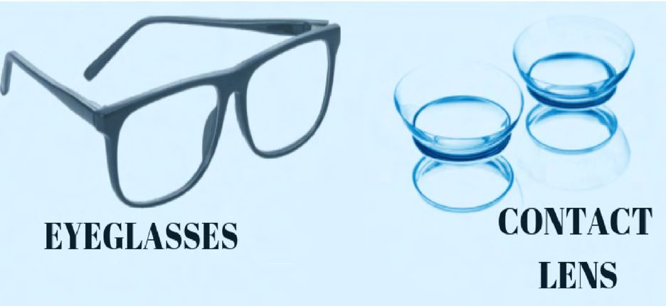
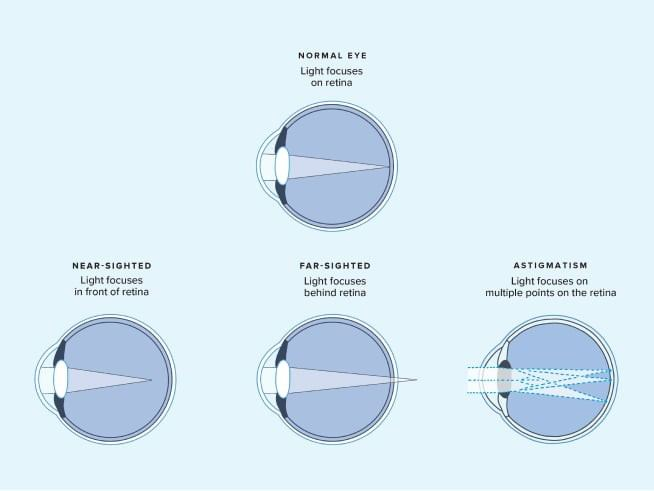

# Eye Glasses/Contact Lenses

Source: `Eye Diseases & Conditions-compressed.pdf`, pages 346-352.

## Images

## Extracted text

<!-- Page 346 -->
Eye Glasses/Contact Lenses
Eyeglasses and contact lenses are two of the most common and effective methods used to
correct vision problems. They are designed to help people who have refractive errors such as
nearsightedness (myopia), farsightedness (hyperopia), astigmatism, and presbyopia (age-related
farsightedness). These corrective devices improve the clarity of vision by altering the way light
enters the eye.
While eyeglasses have been in use for centuries, contact lenses have become a popular
alternative, offering the advantage of being worn directly on the eye for a more natural look and

<!-- Page 347 -->
feel. Both options come with specific benefits and challenges depending on the individual's
needs, lifestyle, and the nature of their vision problem.
Symptoms and Causes
Symptoms Requiring Eyeglasses or Contact Lenses:
Blurred vision: Difficulty seeing objects clearly at different distances.
Eye strain or discomfort: This can occur when the eyes are constantly working hard to
focus, leading to fatigue.
Headaches: Persistent headaches can be a sign of uncorrected vision problems.
Double vision: Seeing two images of a single object may indicate an issue with eye
alignment or refractive errors.
Squinting: People often squint in an attempt to improve vision clarity, especially when
reading or looking at distant objects.
Difficulty seeing at night: Poor night vision or halos around lights can be caused by
refractive errors.
Causes of Vision Problems:
Refractive errors: The most common cause of vision problems, including myopia,
hyperopia, astigmatism, and presbyopia.
Genetics: Many vision problems are hereditary. If parents or close relatives have
refractive errors, the likelihood of developing similar issues is higher.
Age: As people age, the eye's ability to focus declines, leading to conditions like
presbyopia.
Eye injury or disease: Trauma or certain diseases can cause vision problems that might
require corrective lenses.
Environmental factors: Excessive screen time, poor lighting, and other environmental
factors can strain the eyes and contribute to vision issues.
Diagnosis and Tests
To determine whether eyeglasses or contact lenses are needed, an eye care professional will
perform a comprehensive eye examination. This may include:
Tests for Diagnosing Refractive Errors:
Visual Acuity Test: Measures the sharpness or clarity of vision using an eye chart
(Snellen chart).
Retinoscopy: Involves shining a light into the eye to observe how light reflects off the
retina. This helps determine the degree of refractive error.
Refraction Test: Determines the exact prescription needed for glasses or contact lenses
by having the patient look through different lenses to identify the clearest vision.
Keratometry: Measures the curvature of the cornea, which is important for fitting
contact lenses.

<!-- Page 348 -->
Topography: Maps the surface of the cornea to help fit contact lenses, especially for
conditions like astigmatism or keratoconus.
Slit Lamp Exam: Checks the health of the eyes and looks for signs of other conditions,
such as cataracts or corneal issues, that may affect contact lens wear.
Management and Treatment
The primary treatment for refractive errors is the use of corrective eyewear, which can include
eyeglasses or contact lenses. These devices work by adjusting the focus of light entering the
eye, helping the individual see more clearly.
Eyeglasses:
Eyeglasses have a frame that holds lenses in front of the eyes. Depending on the refractive error,
lenses are customized to correct vision. They are available in various styles, materials, and lens
types, such as:
Single vision lenses: Correct one type of refractive error, such as myopia or hyperopia.
Bifocal lenses: Have two prescriptions, one for distance vision and one for reading.
Progressive lenses: Provide a smooth transition between distance, intermediate, and near
vision, eliminating the need for multiple pairs of glasses.
Blue light blocking lenses: Help reduce eye strain caused by prolonged exposure to
digital screens.
Contact Lenses:
Contact lenses are thin lenses that sit directly on the eye, offering a more natural field of vision
without the obstruction of frames. They are available in different types, such as:
Soft lenses: The most common type, offering comfort and a wide range of prescriptions.
Rigid gas permeable (RGP) lenses: Provide clearer vision and durability but may take
longer to adjust to.
Toric lenses: Designed for astigmatism, correcting for irregular corneal shapes.
Multifocal lenses: Used to correct presbyopia, allowing for clear vision at different
distances.
Hybrid lenses: Combine the benefits of soft and rigid lenses, providing comfort and
sharp vision.
In some cases, corrective surgery, such as LASIK or PRK (photorefractive keratectomy), can
be an alternative for individuals who want to reduce or eliminate the need for glasses or contacts.
Eye Glasses/Contact Lens Types & Surgery
Types of Eyeglasses:
Fashion Eyewear: Designed for those who want to make a statement or enhance their
style while correcting their vision.

<!-- Page 349 -->
Sports Eyewear: Specially designed for athletes, these glasses are durable, lightweight,
and provide protection during physical activities.
Reading Glasses: Used to correct presbyopia or other near-vision issues.
Types of Contact Lenses:
Disposable lenses: Daily, bi-weekly, or monthly lenses that are replaced frequently.
Extended-wear lenses: Can be worn for longer periods, even overnight, depending on
the type.
Specialty lenses: Designed for specific conditions like keratoconus, or for people with
high refractive errors.
Surgical Options:
LASIK: A laser eye surgery that reshapes the cornea to correct refractive errors.
PRK: Similar to LASIK, but with a different method of reshaping the cornea. It’s often
used for patients who have thin corneas.
SMILE: A minimally invasive laser procedure that reshapes the cornea to treat myopia.
Lens implants: Used in certain cases to replace or augment the natural lens of the eye.
Complicated Eyeglasses/Contact Lenses
There are some potential complications associated with eyeglasses and contact lenses, including:
For Eyeglasses:
Discomfort or irritation: Poorly fitting frames can cause headaches or discomfort
behind the ears or on the nose.
Lens scratches: Eyeglasses lenses can scratch easily, reducing clarity of vision.
Fogging: Eyeglasses may fog up in humid or cold conditions, which can be inconvenient.
Social or lifestyle considerations: Some individuals may find glasses inconvenient or
distracting during physical activities or social events.
For Contact Lenses:
Dry eyes: Wearing contact lenses, especially for extended periods, can lead to dry eyes
and discomfort.
Infection risk: Improper care or prolonged wear can increase the risk of eye infections
such as keratitis or conjunctivitis.
Lens-related complications: Poorly fitted or damaged lenses can lead to corneal
abrasions or other complications.
Allergic reactions: Some individuals may have allergies to the materials or solutions
used in contact lenses.

<!-- Page 350 -->
Eyeglasses/Contact Lenses in Adults
For adults, eyeglasses and contact lenses are common methods of vision correction. The need for
glasses or contacts often arises in childhood or early adulthood, with many adults experiencing a
decline in near vision around age 40 due to presbyopia. Adults also use these corrective devices
to address refractive errors like myopia, hyperopia, or astigmatism.
In addition, refractive surgery options like LASIK and PRK have become popular for adults
who want to reduce their dependency on glasses or contacts.
Eyeglasses/Contact Lenses in Children
Children can also benefit from eyeglasses and contact lenses. Common reasons for children to
require corrective lenses include:
Nearsightedness (Myopia): The most common refractive error in children, making it
difficult to see distant objects clearly.
Farsightedness (Hyperopia): A condition that can cause difficulty focusing on near
objects.
Astigmatism: An irregular shape of the cornea or lens, leading to blurry or distorted
vision.
Contact lenses may be an option for children who are mature enough to handle the responsibility
of proper lens care and hygiene. Specialized contact lenses, such as orthokeratology (Ortho-K),
can help control the progression of myopia in children.
Prevention
While refractive errors are primarily genetic or age-related, there are measures that can help
reduce the risk or delay the onset of vision problems:
Regular eye exams: Ensuring that vision problems are detected early can help prevent
worsening of conditions.
Limit screen time: Reducing eye strain caused by prolonged exposure to digital devices
can help prevent the development of myopia.
Protective eyewear: Wearing sunglasses to protect eyes from UV damage can help
prevent conditions like cataracts.
Healthy diet: Consuming foods rich in vitamins and minerals (e.g., vitamins A, C, and
E) can help maintain eye health.
Outlook / Prognosis
The outlook for individuals with eyeglasses or contact lenses is generally very positive. With the
right corrective lenses, most people can achieve normal or near-normal vision. However, the
prognosis depends on the underlying cause of the vision impairment. For instance:

<!-- Page 351 -->
Refractive errors: If corrected early, there is minimal risk of long-term vision damage.
Presbyopia: This age-related condition can be managed effectively with reading glasses
or multifocal contact lenses.
Advanced conditions: More severe conditions like keratoconus or macular degeneration
may require additional treatment options like specialized contact lenses or surgery.
Living With Eyeglasses/Contact Lenses
For most people, living with eyeglasses or contact lenses is a routine part of daily life.
Eyeglasses are often easier to manage but can be less convenient during physical activities or in
inclement weather. Contact lenses provide a more natural field of vision and can be more
comfortable for active individuals. However, they require proper hygiene and care to avoid
complications such as eye infections.
Some individuals may choose to explore surgical options like LASIK to reduce or eliminate their
dependence on corrective eyewear.

<!-- Page 352 -->
Additional Common Questions (FAQ's)
Q: Can I wear contact lenses if I have dry eyes?
A: It depends on the severity of your dry eyes. Some contact lenses are designed for individuals
with dry eyes, but it's important to consult with your eye doctor to find the right option.
Q: Can children wear contact lenses?
A: Yes, children can wear contact lenses, but they need to be responsible for proper lens care.
Your eye doctor will determine if contact lenses are suitable for your child.
Q: Are there alternatives to glasses or contact lenses?
A: Yes, LASIK and other refractive surgeries offer alternatives for those who wish to reduce or
eliminate their need for corrective lenses.
Q: How often should I replace my contact lenses?
A: It depends on the type of contact lenses you wear. Some are designed for daily use, while
others are replaced every two weeks or monthly. Always follow the guidelines provided by your
eye doctor.
Q: Can eyeglasses cause headaches?
A: Poorly fitted eyeglasses or an incorrect prescription can lead to headaches. If you experience
headaches frequently while wearing glasses, it's important to see your eye doctor for an
adjustment.
