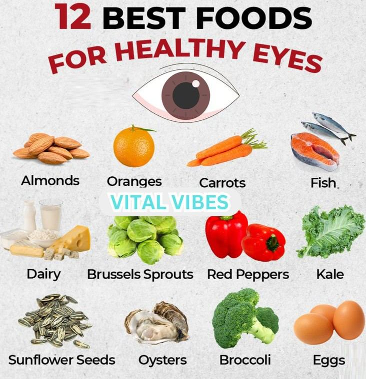

# Maintain Eye Health

Source: `Eye Diseases & Conditions-compressed.pdf`, pages 352-358.

## Images

## Extracted text

<!-- Page 352 -->
Maintain Eye Health

<!-- Page 353 -->
Maintaining eye health is essential to preserve vision and protect the eyes from a range of
conditions that can affect visual function. Just as we care for other parts of our body, regular
attention to eye health helps in preventing issues such as dry eyes, glaucoma, cataracts, macular
degeneration, and diabetic retinopathy. Eye health is influenced by lifestyle choices,
environmental factors, and genetics, but regular eye care can significantly reduce the risk of eye
diseases and help in early detection of potential vision problems.
This guide focuses on strategies to maintain healthy eyes, including symptoms to watch for,
preventive measures, and treatment options for common eye conditions.
Symptoms and Causes
Symptoms That Indicate a Potential Eye Problem:
Blurred or distorted vision: Difficulty in seeing clearly, whether at a distance or up
close.
Eye discomfort or pain: A feeling of irritation, dryness, or pain in or around the eye.
Excessive tearing or dryness: Both can indicate problems with tear production or an eye
infection.
Headaches: Frequent or persistent headaches, especially after focusing on tasks like
reading or using a computer.
Red or swollen eyes: This could be a sign of an infection, inflammation, or other serious
eye issues.

<!-- Page 354 -->
Sensitivity to light: Known as photophobia, it can result from an eye condition or an
underlying disease.
Seeing halos or glare around lights: Often a symptom of cataracts or other vision
problems.
Common Causes of Eye Problems:
Refractive errors: Such as myopia (nearsightedness), hyperopia (farsightedness),
astigmatism, and presbyopia (age-related farsightedness).
Age-related changes: Many eye conditions become more prevalent with age, including
cataracts and macular degeneration.
Environmental factors: Prolonged exposure to digital screens, UV light, pollutants, and
allergens can affect eye health.
Genetic predisposition: A family history of eye diseases like glaucoma, macular
degeneration, or diabetic retinopathy can increase the risk of developing these conditions.
Poor nutrition: Lack of essential nutrients like vitamin A, C, E, and omega-3 fatty acids
can contribute to poor eye health.
Lifestyle habits: Smoking and excessive alcohol consumption can contribute to
conditions such as cataracts and macular degeneration.
Chronic health conditions: Diabetes, hypertension, and autoimmune diseases can affect
the health of the eyes.
Diagnosis and Tests
Maintaining eye health often involves regular eye exams to detect any underlying issues. Key
diagnostic tests include:
Visual Acuity Test: Measures the sharpness of vision using an eye chart.
Slit Lamp Examination: A microscope with a bright light that allows the eye doctor to
examine the front of the eye, including the cornea, iris, and lens.
Tonometry: Measures the pressure inside the eye to check for signs of glaucoma.
Dilated Eye Exam: Eye drops are used to widen the pupil so the doctor can see the retina
and optic nerve more clearly.
Fundus Photography: A method of capturing detailed images of the retina to monitor
for eye diseases such as diabetic retinopathy and macular degeneration.
Optical Coherence Tomography (OCT): Uses light waves to take cross-section pictures
of the retina and optic nerve, helping diagnose conditions like glaucoma and age-related
macular degeneration.
Blood Tests: Can help detect underlying health conditions, such as diabetes or high
cholesterol, that may affect eye health.
Management and Treatment
Maintaining eye health involves a combination of prevention, lifestyle choices, and, when
necessary, medical treatment.

<!-- Page 355 -->
Lifestyle and Home Management:
Balanced Diet: A diet rich in vitamins A, C, E, lutein, zeaxanthin, and omega-3 fatty
acids can support eye health. Foods like leafy greens, carrots, citrus fruits, nuts, and fish
are excellent choices.
Proper Eye Protection: Wearing sunglasses that block 100% of UV rays can protect the
eyes from harmful sunlight. For those who work with chemicals or in hazardous
environments, wearing protective eyewear is essential.
Regular Breaks: Follow the 20-20-20 rule when using screens: Every 20 minutes, look
at something 20 feet away for 20 seconds to reduce eye strain.
Smoking Cessation: Avoid smoking, which is associated with an increased risk of
cataracts, macular degeneration, and optic nerve damage.
Medical Management and Treatment:
Prescription Eyewear: Eyeglasses or contact lenses are commonly prescribed to correct
refractive errors.
Eye Drops: For dry eyes or eye inflammation, lubricating drops may be recommended.
For conditions like glaucoma, prescription eye drops can reduce intraocular pressure.
Surgical Interventions: For more severe conditions, surgery may be needed, such as:
o
Cataract Surgery: Removal of a cloudy lens and replacement with an artificial
one.
o
LASIK Surgery: A refractive surgery that corrects vision by reshaping the
cornea.
o
Glaucoma Surgery: Procedures like trabeculectomy or laser therapy to reduce
intraocular pressure in the eye.
o
Retinal Surgery: To treat retinal detachment or macular degeneration.
Maintain Eye Health Types & Surgery
There are various methods and surgical procedures designed to maintain and improve eye health:
Cataract Surgery: Common for individuals over 60, where the clouded lens is replaced
with a clear intraocular lens (IOL).
Refractive Surgery (LASIK): Corrects common refractive errors like myopia,
hyperopia, and astigmatism by reshaping the cornea.
Glaucoma Surgery: Procedures that help lower intraocular pressure, preventing damage
to the optic nerve.
Corneal Transplant: If the cornea becomes severely damaged, a transplant can restore
vision.
Retinal Laser Treatment: Used to treat conditions like diabetic retinopathy or retinal
tears.

<!-- Page 356 -->
Complicated Maintain Eye Health
In some cases, maintaining eye health can be more complex due to underlying medical
conditions or the development of serious eye diseases. Complications that can arise include:
Glaucoma: High intraocular pressure can damage the optic nerve, leading to vision loss.
It’s often asymptomatic in its early stages, so regular eye exams are crucial.
Macular Degeneration: This age-related condition causes progressive loss of central
vision. While it cannot be reversed, treatments can slow its progression.
Diabetic Retinopathy: Diabetes can damage the blood vessels in the retina, leading to
vision problems. Early detection and management of blood sugar levels are key.
Cataracts: The clouding of the lens is common in older adults and requires surgery for
treatment.
Maintain Eye Health in Adults
For adults, maintaining eye health becomes especially important as age increases. Adults over 40
may begin experiencing presbyopia, the age-related inability to focus on close objects. Regular
eye exams are essential to detect conditions like cataracts, glaucoma, and macular degeneration
early. Additionally, lifestyle factors such as diet, exercise, and avoiding smoking are important
for long-term eye health.
Maintain Eye Health in Children
In children, early detection of vision problems is crucial for healthy development. Children
should have their first eye exam at around 6 months of age, with follow-up exams at 3 years old
and before kindergarten. Common eye problems in children include refractive errors (myopia,
hyperopia, and astigmatism), amblyopia (lazy eye), and strabismus (crossed eyes). Eye care
professionals can provide appropriate treatments, such as corrective glasses or patches for
amblyopia.
Prevention
Preventing eye problems is often more effective than treating them. Here are some preventive
measures to maintain eye health:
Wear protective eyewear: This can prevent injury from foreign objects or harmful UV
rays.
Eat a healthy diet: A diet rich in vitamins, antioxidants, and healthy fats can protect the
eyes from damage.
Control health conditions: Managing diabetes, hypertension, and high cholesterol can
prevent eye complications like diabetic retinopathy or retinal vein occlusion.
Avoid smoking: Smoking accelerates the development of cataracts, macular
degeneration, and other eye diseases.

<!-- Page 357 -->
Outlook / Prognosis
The outlook for maintaining eye health is largely positive, particularly with early detection and
proper management. Many eye conditions, such as refractive errors, can be corrected easily with
glasses or contact lenses. Surgery for conditions like cataracts and glaucoma can prevent
significant vision loss. However, chronic conditions such as macular degeneration and diabetic
retinopathy require long-term management and monitoring to preserve vision.
Living With Healthy Eyes
Living with healthy eyes involves maintaining regular eye exams, managing any underlying
health conditions, and taking protective measures. Most people can enjoy a good quality of life
with the right eye care regimen. However, it is essential to stay proactive, especially as we age or
experience changes in our vision.

<!-- Page 358 -->
Additional Common Questions (FAQ’s)
Q: How often should I have an eye exam?
A: Adults should have a comprehensive eye exam every two years, or more frequently if they
have a history of eye problems or chronic health conditions. Children should be examined at
least once before school and periodically thereafter.
Q: Can I reverse myopia or other refractive errors?
A: Refractive errors cannot be reversed without surgical intervention, but they can be corrected
with glasses, contact lenses, or refractive surgery.
Q: Are there any natural remedies for eye health?
A: While there are no natural remedies to cure eye conditions, maintaining a nutrient-rich diet,
staying hydrated, and practicing eye exercises can support overall eye health.
Q: Is eye strain a serious concern?
A: Eye strain can cause discomfort and fatigue but is generally not serious. It can be alleviated
by taking breaks from screens, ensuring proper lighting, and using corrective lenses if necessary.
Q: Can children wear contact lenses?
A: Yes, children can wear contact lenses if they are responsible enough to follow the hygiene
guidelines and care instructions. An eye care professional will help determine the right type of
lens for a child.
