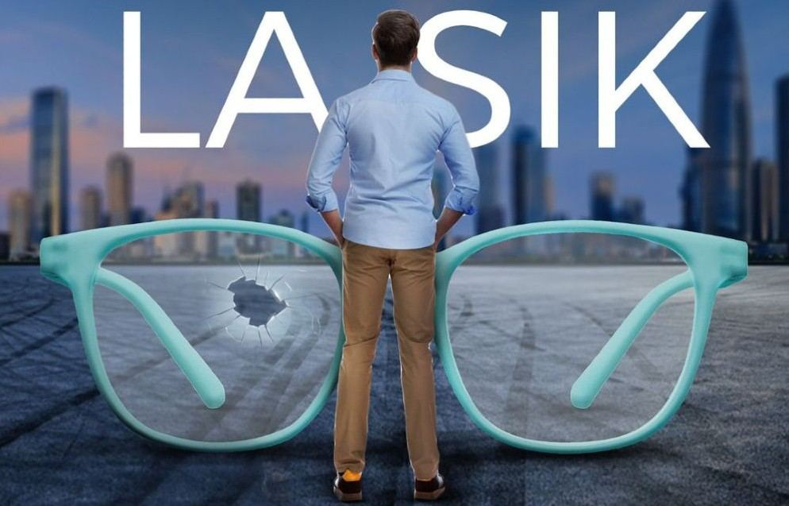
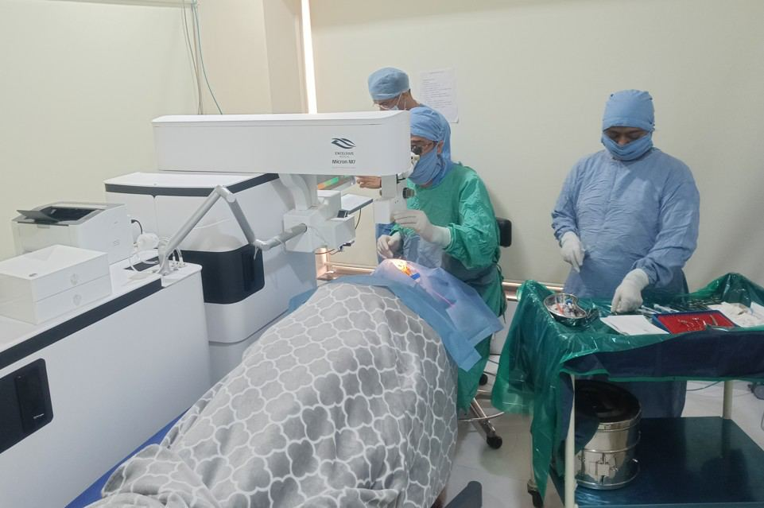

# Laser Eye Surgery (LASIK, Trans PRK, ASA)

Source: `Eye Diseases & Conditions-compressed.pdf`, pages 358-364.

## Images

## Extracted text

<!-- Page 358 -->
Laser Eye Surgery (LASIK, Trans PRK, ASA)
Laser eye surgery encompasses a variety of techniques used to correct refractive vision problems
such as nearsightedness (myopia), farsightedness (hyperopia), and astigmatism. The most
common forms of laser eye surgery are LASIK (Laser-Assisted in Situ Keratomileusis), Trans
PRK (Trans-Epithelial Photorefractive Keratectomy), and ASA (Advanced Surface Ablation).
These procedures use precise laser technology to reshape the cornea, improving how light enters
the eye and focusing on the retina for clearer vision.

<!-- Page 359 -->
The main benefit of laser eye surgery is the ability to reduce or eliminate dependence on
corrective eyewear (glasses and contact lenses). The choice between LASIK, Trans PRK, and
ASA depends on factors such as the patient’s corneal thickness, eye health, and individual visual
needs.
Symptoms and Causes
Symptoms Indicating the Need for Laser Eye Surgery:
Blurry or distorted vision: Difficulty focusing on objects near or far, depending on the
type of refractive error.
Frequent changes in prescription: Needing to update your glasses or contact lenses
frequently as your vision worsens.
Dependency on corrective eyewear: Constant reliance on glasses or contacts for daily
tasks, including driving, reading, or using digital devices.
Eye strain or fatigue: Experiencing discomfort or tired eyes after prolonged activities
that require visual focus, such as reading or working at a computer.
Causes of Refractive Vision Problems:
Myopia (Nearsightedness): The eye is too long, or the cornea is too curved, causing
distant objects to appear blurry.
Hyperopia (Farsightedness): The eye is too short, or the cornea is too flat, resulting in
difficulty focusing on nearby objects.

<!-- Page 360 -->
Astigmatism: Irregularities in the shape of the cornea or lens, leading to distorted vision
at all distances.
Presbyopia: Age-related loss of the eye's ability to focus on close-up objects, often
requiring reading glasses.
Diagnosis and Tests
Before undergoing any type of laser eye surgery, patients undergo a thorough eye examination to
determine their eligibility. Key diagnostic tests include:
Comprehensive Eye Exam: Includes assessing visual acuity, refraction, and corneal
thickness.
Corneal Topography: Creates a detailed map of the cornea to evaluate its shape and
curvature.
Pupil Dilation: Used to examine the internal structures of the eye, including the retina
and optic nerve.
Wavefront Analysis: Measures how light travels through the eye to detect imperfections
that might affect the results of surgery.
Intraocular Pressure Test: Measures the pressure inside the eyes to rule out glaucoma.
Dry Eye Test: To assess tear production and determine if additional steps are needed
before surgery.
Management and Treatment
Laser eye surgery is an effective management option for many people with refractive vision
problems. After a thorough consultation, if a patient is found to be a suitable candidate for
surgery, the following treatments are available:
LASIK: LASIK uses a laser to create a flap in the cornea, which is then folded back to
allow the underlying tissue to be reshaped with a second laser. The flap is then replaced,
and the eye begins healing.
Trans PRK: Also known as Photorefractive Keratectomy (PRK), this procedure involves
removing the outermost layer of the cornea (epithelium) to expose the tissue beneath,
which is reshaped using a laser. Trans PRK is often used for patients who have thinner
corneas.
ASA (Advanced Surface Ablation): ASA is similar to Trans PRK but can involve
different techniques to improve surface ablation precision. It is typically considered for
those with corneal issues or other anatomical factors that prevent LASIK.
Post-surgery, patients may be given eye drops to manage dryness, prevent infection, and promote
healing. Most patients see a significant improvement in their vision within a few days, although
full recovery can take up to several weeks.

<!-- Page 361 -->
Laser Eye Surgery (LASIK, Trans PRK, ASA) Types & Surgery
LASIK: This is the most popular form of laser eye surgery. It involves creating a thin
flap on the cornea using a microkeratome or femtosecond laser, which is then lifted to
allow for the underlying tissue to be reshaped using an excimer laser.
Trans PRK (Photorefractive Keratectomy): This type of surgery does not involve
creating a flap, making it suitable for patients with thinner corneas. It uses a laser to
reshape the cornea’s surface and requires a longer recovery time than LASIK.
ASA (Advanced Surface Ablation): ASA is a variation of PRK, focusing on improved
laser accuracy and healing techniques. It’s often used for patients with irregular corneas
or those who are not candidates for LASIK.
Complicated Laser Eye Surgery (LASIK, Trans PRK, ASA)
In some cases, complications may arise, such as:
Dry Eye Syndrome: Common after LASIK or PRK, leading to temporary discomfort,
sensitivity, and difficulty with vision.
Infection: Though rare, infections can occur after surgery, requiring antibiotics and
careful monitoring.
Flap Complications (LASIK only): Although rare, complications can arise from the
corneal flap, including misalignment or dislodging.
Overcorrection or Undercorrection: Sometimes the laser may reshape the cornea too
much or too little, requiring additional procedures (enhancements).
Glare, Halos, or Starbursts: Some patients experience visual disturbances like glare or
halos around lights, especially at night.
Corneal Scarring: Rare but can occur, especially in PRK and Trans PRK patients due to
prolonged healing time.
Laser Eye Surgery (LASIK, Trans PRK, ASA) in Adults
Laser eye surgery is most commonly performed on adults aged 18 to 40, as the eyes have usually
stabilized in this age range. Adults with mild to moderate refractive errors who are in good
health and have no significant eye conditions (e.g., cataracts, glaucoma) are generally ideal
candidates. LASIK and other laser surgeries offer a reliable solution to those looking to reduce or
eliminate their reliance on corrective eyewear.
Laser Eye Surgery (LASIK, Trans PRK, ASA) in Children
Laser eye surgery is not typically recommended for children, as their eyes are still developing.
However, in rare cases, surgery may be considered for children with significant refractive errors
or visual impairments that affect their quality of life. Surgeons take great care to evaluate the
child’s vision development and general health before recommending surgery.

<!-- Page 362 -->
Prevention
Preventing vision problems involves protecting your eyes, adopting a healthy lifestyle, and
managing underlying health conditions:
Wear protective eyewear: Sunglasses with 100% UV protection can help prevent UV
damage to the eyes.
Regular eye exams: Monitoring eye health ensures early detection of potential problems.
Healthy diet: A diet rich in antioxidants, omega-3 fatty acids, and vitamins A and C can
help maintain good vision.
Avoid smoking: Smoking increases the risk of cataracts, macular degeneration, and other
eye diseases.
Outlook / Prognosis
The outlook after laser eye surgery is generally very positive, with most patients achieving 20/25
vision or better, which is sufficient for most daily activities. Recovery time is quick, especially
for LASIK, with many people returning to normal activities within a few days. Although the
majority of people experience improved vision, there may be cases of mild visual disturbances
(e.g., glare, halos) during the initial recovery period.
Long-term results are typically stable, but some patients may require an enhancement procedure
if their vision changes over time. Eye health should still be monitored with regular check-ups to
ensure ongoing eye health.
Living After Laser Eye Surgery
Living with the results of laser eye surgery can greatly improve your quality of life by reducing
or eliminating the need for glasses or contact lenses. Many patients report better visual clarity
and freedom from the constraints of corrective eyewear.
While laser surgery typically offers long-term results, it’s important to maintain eye health
through proper nutrition, eye protection, and regular check-ups. People who have undergone
laser eye surgery may still experience age-related vision changes, such as presbyopia (difficulty
focusing on near objects), but they often no longer need corrective lenses for distance vision.

<!-- Page 363 -->
Additional Common Questions (FAQs)
1: How long does it take to recover from laser eye surgery?
A: Recovery time depends on the procedure. LASIK patients generally experience minimal
downtime and may return to work within 1-2 days. Trans PRK and ASA take longer, with full
recovery typically requiring 1-2 weeks.
2: Can LASIK correct all types of vision problems?
A: LASIK is effective for myopia, hyperopia, and astigmatism, but it may not be suitable for
individuals with severe refractive errors or certain eye conditions.
3: Will I need glasses or contacts after surgery?
A: Many patients experience 20/25 vision or better after surgery, reducing or eliminating the
need for glasses or contacts. However, some people may still need reading glasses, especially as
they age.
4: Are there any risks associated with laser eye surgery?
A: While laser eye surgery is generally safe, risks include dry eyes, infection, overcorrection or
undercorrection, and visual disturbances like glare or halos, particularly in low-light conditions.

<!-- Page 364 -->
5: Can I have laser eye surgery if I have had previous eye surgery?
A: Previous eye surgery may affect eligibility for laser eye surgery. Your eye care professional
will need to assess the health of your eyes and the specific procedure you’ve had in the past
before making recommendations.
6: Is laser eye surgery permanent?
A: The effects of laser eye surgery are long-lasting, but your vision may change over time due to
factors like aging or other medical conditions. Periodic check-ups and follow-up procedures may
be necessary.
