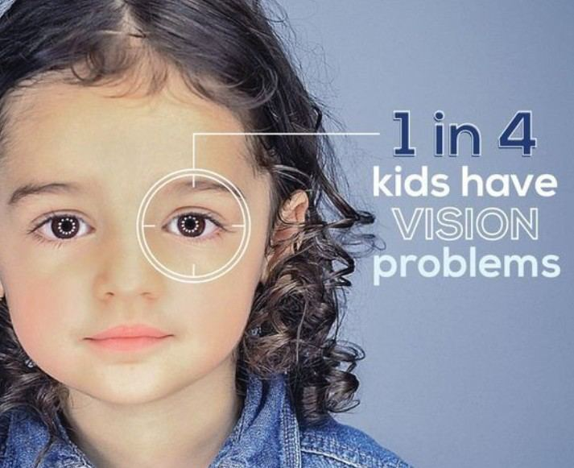
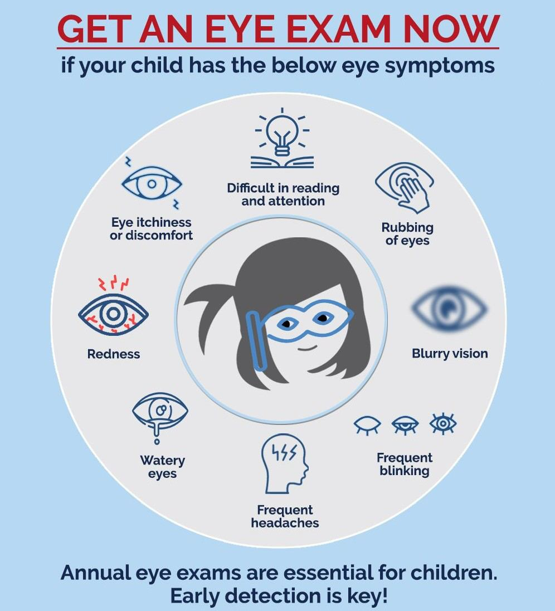

# Pediatric Eye Problems

Source: `Eye Diseases & Conditions-compressed.pdf`, pages 364-370.

## Images

## Extracted text

<!-- Page 364 -->
Pediatric Eye Problems
Pediatric eye problems refer to any vision or eye health issues that affect children. These
problems can range from mild and temporary conditions to more serious, chronic eye disorders
that require medical intervention. Early diagnosis and treatment are crucial to preventing vision
impairment and ensuring healthy visual development. Some common pediatric eye problems
include refractive errors (nearsightedness, farsightedness, and astigmatism), amblyopia (lazy
eye), strabismus (crossed eyes), and congenital cataracts. While many of these conditions can be
treated successfully, others may require lifelong management.

<!-- Page 365 -->
Symptoms and Causes
Common Symptoms of Pediatric Eye Problems:
Squinting: Children may squint to see better, which could indicate a refractive error or
strabismus.
Poor school performance: Difficulty reading, writing, or focusing on activities may
signal an underlying vision issue.
Eye rubbing: Frequent rubbing of the eyes can be a sign of discomfort, strain, or an eye
condition.
Crossed eyes (Strabismus): Eyes that do not align properly may indicate strabismus,
where one or both eyes turn inward, outward, upward, or downward.
Abnormal eye movements: Uncontrolled or jerky eye movements may suggest a
neurological issue or other eye problem.
Complaints of blurry vision: Children may verbalize blurry or unclear vision if they are
old enough to communicate effectively.

<!-- Page 366 -->
Causes of Pediatric Eye Problems:
Genetics: Many eye conditions are hereditary, such as refractive errors, amblyopia, and
strabismus.
Premature birth: Premature infants are at higher risk for conditions like retinopathy of
prematurity (ROP), a disorder that can affect vision development.
Infections: Certain infections during pregnancy or infancy, such as rubella or congenital
herpes, can affect eye development.
Environmental factors: Prolonged screen time, poor lighting, and lack of proper visual
stimulation can contribute to eye strain and discomfort in children.
Trauma: Physical injury to the eye, especially during play or sports, can result in eye
damage or vision problems.
Diagnosis and Tests
Diagnosing pediatric eye problems often requires a comprehensive eye examination, which
includes several specialized tests. Early detection is vital in treating many conditions and
preventing long-term complications.
Key Diagnostic Tests Include:
Visual acuity test: Assesses how well the child can see at various distances using an eye
chart.
Refraction test: Helps determine if the child has a refractive error (myopia, hyperopia, or
astigmatism).
Pupil examination: Evaluates how the pupil responds to light and can detect issues with
the optic nerve or retina.
Retinal examination: This involves looking at the back of the eye to check for
conditions like retinopathy of prematurity (ROP) or other retinal diseases.
Corneal light reflex test: Helps detect strabismus or misalignment of the eyes by
assessing how light reflects from the child’s cornea.
Cover test: A test to identify strabismus by observing the movement of the eyes when
one is covered and uncovered.
Management and Treatment
Treatment for pediatric eye problems depends on the specific condition diagnosed. Early
intervention can often prevent long-term vision problems.
Common Treatments Include:
Glasses or contact lenses: These are used to correct refractive errors, such as myopia,
hyperopia, and astigmatism. The child may need to wear them full-time or only for
specific activities.
Eye patches: In cases of amblyopia (lazy eye), patching the stronger eye helps improve
the weaker eye’s vision.

<!-- Page 367 -->
Vision therapy: Specialized exercises and activities designed to improve eye
coordination, focusing, and tracking, often used in cases of strabismus or amblyopia.
Surgery: Some pediatric eye problems, such as strabismus (crossed eyes) or congenital
cataracts, may require surgery to correct alignment or remove a cataract.
Medications: In some cases, eye drops or medications are prescribed to treat infections
or reduce inflammation.
Pediatric Eye Problems Types & Surgery
Types of Pediatric Eye Problems:
1. Refractive Errors: This includes myopia (nearsightedness), hyperopia (farsightedness),
and astigmatism (irregular curvature of the cornea). These conditions are treated with
corrective lenses (glasses or contacts).
2. Amblyopia (Lazy Eye): A condition where one eye does not develop normal vision,
leading to reduced sight in one eye. Treatment may include patching the stronger eye to
force the weaker eye to work harder.
3. Strabismus (Crossed Eyes): A condition where the eyes do not align properly.
Treatment may involve glasses, eye exercises, or surgery to realign the eyes.
4. Cataracts: Some infants may be born with cataracts, which is a clouding of the lens in
the eye. Surgical removal of the cataract is typically necessary for optimal visual
development.
5. Retinopathy of Prematurity (ROP): Premature infants may develop abnormal blood
vessel growth in the retina, which can lead to blindness if left untreated. ROP may be
managed with laser therapy or injections.
6. Ptosis (Drooping Eyelid): A condition where one or both eyelids droop, potentially
obstructing vision. Surgery is often required to correct the position of the eyelid.
Surgical Treatments for Pediatric Eye Problems:
Strabismus surgery: Surgical realignment of the muscles controlling eye movement.
Cataract surgery: Involves removing the cloudy lens and replacing it with an artificial
intraocular lens.
Laser surgery: Laser therapy may be used to treat conditions such as ROP or certain
types of eye tumors.
Ptosis surgery: Involves tightening or repositioning the muscles that control eyelid
movement.
Complicated Pediatric Eye Problems
While many pediatric eye problems are treatable, some may present complications that require
advanced care. These include:
Chronic amblyopia: If amblyopia is not treated in early childhood, it can lead to
permanent vision loss in one eye.
Severe strabismus: If strabismus is left untreated, it can lead to double vision and depth
perception issues.

<!-- Page 368 -->
Retinal detachment: In rare cases, conditions like ROP or trauma can cause retinal
detachment, which is a medical emergency that requires prompt surgical intervention.
Pediatric Eye Problems in Adults
Although pediatric eye problems typically affect children, some conditions may continue to
affect adults if left untreated during childhood. For example, untreated amblyopia or strabismus
can lead to lifelong vision issues, including reduced depth perception and the inability to see
clearly in one eye. Regular eye exams are important for detecting ongoing issues.
Pediatric Eye Problems in Children
Children are at a higher risk for developing eye conditions such as refractive errors, amblyopia,
and strabismus. Early detection is key, as many pediatric eye problems can be corrected with
timely intervention. It's essential for parents to monitor for signs of eye problems and ensure
their child receives regular eye exams, especially if there’s a family history of vision problems.
Prevention
While some pediatric eye problems are genetic or unavoidable, others can be prevented or
managed through early detection. Preventative measures include:
Routine eye exams: Early screenings can help detect eye issues before they become
severe. It’s recommended that children have their first eye exam at 6 months, then again
at 3 years, and before starting school.
Protective eyewear: Encourage children to wear safety glasses during sports or activities
that may pose a risk of eye injury.
Limit screen time: Excessive screen time can contribute to eye strain and discomfort.
Encourage breaks and outdoor activities to reduce the risk of eye strain.
Balanced diet: A diet rich in vitamins A, C, and E, as well as omega-3 fatty acids, can
promote healthy vision.
Outlook / Prognosis
The prognosis for pediatric eye problems is generally positive, especially with early diagnosis
and treatment. Many conditions, such as refractive errors and amblyopia, can be successfully
managed, leading to improved vision and quality of life. However, untreated or delayed
treatment of certain conditions, such as strabismus or cataracts, can lead to permanent vision loss
or developmental delays.
Living With Pediatric Eye Problems
Children with eye problems may need to adapt to a new way of seeing and interacting with the
world. For example, wearing glasses or undergoing patch therapy for amblyopia can be part of
the daily routine. It's important to provide emotional and psychological support to children who

<!-- Page 369 -->
may feel self-conscious about wearing glasses or dealing with an eye condition. Most children
with eye problems lead active, healthy lives with the right treatment and care.
Additional Common Questions (FAQs)
Q: How do I know if my child needs glasses?
A: If your child squints, complains of blurry vision, has difficulty reading the board at school, or
struggles with concentration, it’s a good idea to schedule an eye exam.

<!-- Page 370 -->
Q: Can strabismus be corrected without surgery?
A: Depending on the severity, strabismus may be treated with glasses, eye exercises, or patching.
Surgery is often recommended if these methods do not align the eyes properly.
Q: Is it possible for a child to outgrow amblyopia?
A: Amblyopia does not typically resolve on its own. Early intervention, such as patching or
vision therapy, is necessary to treat it effectively.
Q: Can children with eye problems still participate in sports?
A: Yes, but protective eyewear should be worn to prevent eye injuries. Many children with
vision problems can excel in sports with the right adjustments.
Q: At what age should my child have their first eye exam?
A: The American Optometric Association recommends that children have their first eye exam at
6 months, another at age 3, and again before starting school to ensure any problems are detected
early.
Q: Can eye problems in children affect their learning?
A: Yes, undiagnosed vision problems can significantly impact a child’s ability to learn, leading
to difficulty reading, writing, or concentrating in school. Early intervention can improve
academic performance and overall development.
