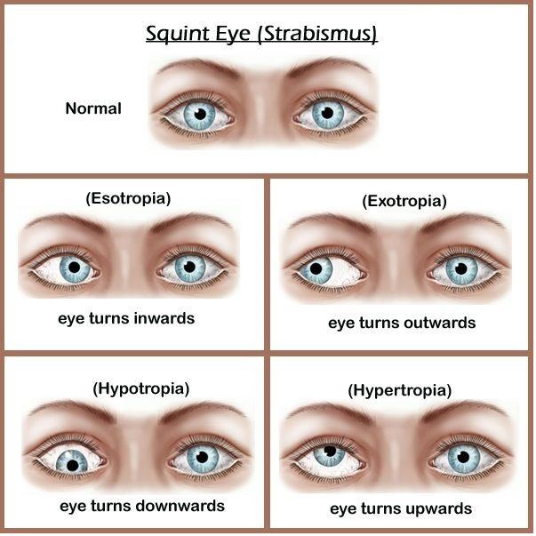
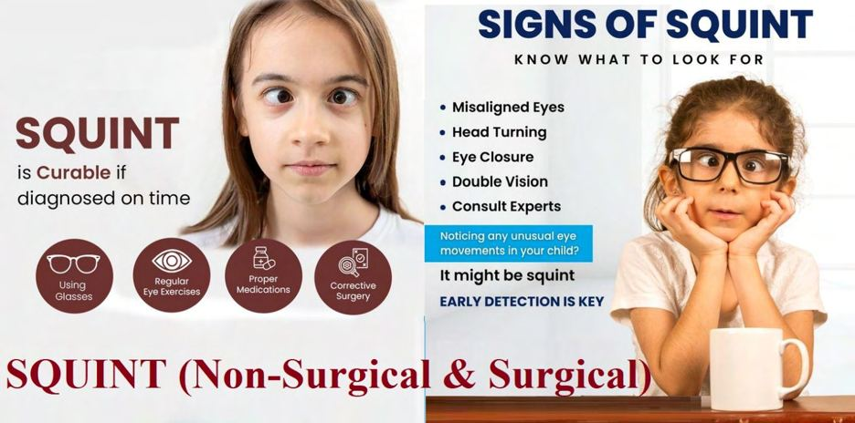

# Strabismus (Eye Misalignment)

Source: `Eye Diseases & Conditions-compressed.pdf`, pages 370-376.

## Images

## Extracted text

<!-- Page 370 -->
Strabismus (Eye Misalignment)
Strabismus, commonly referred to as "eye misalignment" or "crossed eyes," is a condition in
which the eyes do not align properly. One or both eyes may turn inward, outward, upward, or
downward, causing them to focus on different objects. Strabismus can occur at any age, but it is
most commonly diagnosed in children. If left untreated, strabismus can result in impaired depth
perception, double vision, and in some cases, amblyopia (lazy eye). Early diagnosis and
intervention are essential to correct misalignment and prevent long-term complications.

<!-- Page 371 -->
Symptoms and Causes
Symptoms of Strabismus:
Misaligned eyes: The most noticeable symptom is the visible misalignment of one or
both eyes.
Double vision (Diplopia): Individuals with strabismus may experience double vision
when both eyes are not pointing in the same direction.
Difficulty with depth perception: This can make tasks like driving or judging distances
more challenging.
Eye fatigue or discomfort: The eyes may strain as they try to focus together.
Squinting or closing one eye: To reduce the effects of double vision, a person with
strabismus may squint or keep one eye closed.
Head tilting: Sometimes, children or adults with strabismus will tilt their heads to
compensate for the misalignment.
Causes of Strabismus:

<!-- Page 372 -->
Genetics: A family history of strabismus can increase the likelihood of developing the
condition.
Neurological conditions: Problems with the brain or nerves that control eye movements
can cause strabismus.
Muscle imbalances: Strabismus may occur when the muscles controlling eye movement
are not balanced, making it difficult for the eyes to work together.
Refractive errors: Severe farsightedness (hyperopia) can sometimes lead to strabismus,
as the child may have to turn their eyes to focus properly.
Injury or trauma: Trauma to the eye or brain can affect the nerves or muscles
controlling eye alignment.
Medical conditions: Conditions such as cerebral palsy, Down syndrome, or stroke can
increase the risk of developing strabismus.
Premature birth: Premature infants are at higher risk for developing strabismus,
especially if they experience complications such as retinopathy of prematurity.
Diagnosis and Tests
To diagnose strabismus, an eye doctor (optometrist or ophthalmologist) will conduct a thorough
eye examination, which may include the following tests:
Visual acuity test: This test evaluates how well each eye can see at various distances.
Cover test: The eye doctor will cover one eye and observe how the uncovered eye moves
to determine if it is misaligned.
Hirschberg test: A light is shined into the eyes to assess the position of the reflection of
light from the cornea. Misalignment can be detected by how the light reflects in each eye.
Eye muscle function test: The doctor will test how well the muscles around the eyes
work together by asking the patient to follow an object in various directions.
Refraction test: To determine if refractive errors such as nearsightedness or
farsightedness are contributing to strabismus, a refraction test will be conducted.
Retinal and brain imaging: In some cases, imaging tests like an MRI or CT scan may
be required to rule out underlying neurological causes.
Management and Treatment
The goal of strabismus treatment is to align the eyes, improve visual function, and prevent
complications such as amblyopia. Treatment options vary depending on the severity and
underlying causes of the condition.
Common treatment options include:
Eyeglasses or corrective lenses: For patients with refractive errors such as hyperopia,
wearing glasses can help align the eyes by improving focus and reducing strain.
Eye exercises (Vision therapy): Specific exercises may be prescribed to strengthen the
eye muscles, improve coordination, and promote proper alignment.
Patching therapy: In children with amblyopia, patching the stronger eye forces the
weaker eye to work, helping improve vision in the misaligned eye.

<!-- Page 373 -->
Botulinum toxin (Botox): In some cases, botulinum toxin is injected into the eye muscle
to temporarily weaken it, helping realign the eyes.
Surgical intervention: Surgery may be required to adjust the muscles around the eyes.
The surgeon may shorten, lengthen, or reposition the muscles to correct the alignment.
Strabismus Types & Surgery
Strabismus can be classified into several types based on the direction of misalignment:
1. Esotropia: This occurs when one or both eyes turn inward toward the nose.
2. Exotropia: This is when one or both eyes turn outward, away from the nose.
3. Hypertropia: One eye is higher than the other.
4. Hypotropia: One eye is lower than the other.
Surgical Treatment for Strabismus:
Strabismus surgery: Involves adjusting the eye muscles to realign the eyes. This may be
done by strengthening or weakening specific muscles that control eye movement. The
surgery is typically performed on an outpatient basis under general or local anesthesia.
Botox injections: Botox may be used to temporarily weaken overactive eye muscles,
improving alignment without surgery. However, this is a temporary solution and may
require multiple treatments.
Complicated Strabismus (Eye Misalignment)
While many cases of strabismus are treatable, some can be complicated by factors such as:
Refractive errors: Uncorrected vision issues like nearsightedness, farsightedness, or
astigmatism can make strabismus more difficult to manage.
Amblyopia (lazy eye): If one eye becomes dominant due to strabismus, the misaligned
eye may become functionally weaker, leading to permanent vision loss in that eye.
Neurological causes: Conditions such as stroke, brain tumors, or cerebral palsy can
complicate strabismus by affecting the brain's ability to control eye movements.
In these cases, a multidisciplinary approach involving an eye doctor, neurologist, and sometimes
a surgeon may be needed to address the root causes and improve alignment.
Strabismus (Eye Misalignment) in Adults
Strabismus that develops or persists into adulthood may have different causes than childhood
strabismus. In adults, the condition may result from:
Neurological disorders: Conditions like stroke, brain injury, or multiple sclerosis can
impair the brain's control of eye movements.
Trauma or injury: An eye injury or head trauma can damage the muscles or nerves
controlling eye movements.

<!-- Page 374 -->
Muscle weakening with age: As individuals age, the muscles around the eyes may
weaken, leading to misalignment.
Adults with strabismus often experience more pronounced double vision and may need more
intensive treatments such as surgery or botulinum toxin injections to realign the eyes.
Strabismus (Eye Misalignment) in Children
Strabismus is most commonly diagnosed in children, with one in 25 children affected by some
form of eye misalignment. In children, untreated strabismus can lead to significant issues with
visual development, including:
Amblyopia: If one eye is consistently misaligned, the brain may suppress the image from
that eye, leading to lazy eye.
Developmental delays: Difficulty seeing and focusing may impair a child's ability to
develop motor skills and engage with their environment.
Early detection and intervention are crucial for the best possible outcome. Pediatric treatments
typically include corrective lenses, vision therapy, and in some cases, surgery.
Prevention
While strabismus cannot always be prevented, certain steps can reduce the risk or catch the
condition early:
Routine eye exams: Regular eye check-ups, starting in infancy, can help detect
strabismus before it causes long-term vision problems.
Protecting the eyes: Avoiding injuries to the eyes during play or sports can prevent
strabismus caused by trauma.
Early intervention: Treating strabismus in childhood can help prevent the development
of amblyopia and other visual complications.
Outlook / Prognosis
The prognosis for individuals with strabismus varies depending on the severity and timing of
treatment. Early diagnosis and intervention generally result in better outcomes, including
improved eye alignment and prevention of long-term vision issues. Strabismus that persists into
adulthood may require more extensive treatment, but many adults can achieve satisfactory results
with surgery or other interventions. With treatment, most people with strabismus can lead
normal, active lives.
Living With Strabismus
Living with strabismus requires patience, particularly for children who may struggle with social
and emotional challenges related to the condition. Wearing glasses, using patching therapy, or
undergoing surgery may help align the eyes and improve confidence. For adults, managing

<!-- Page 375 -->
strabismus may involve lifestyle adjustments, especially if double vision persists. Support from
family, friends, and vision specialists can greatly improve the quality of life for individuals living
with strabismus.
Additional Common Questions (FAQs)
Q: Can strabismus go away on its own?
A: Strabismus rarely resolves on its own. Treatment, such as glasses, patching, or surgery, is
typically required to correct the misalignment.
Q: At what age can strabismus be treated?
A: Strabismus can be treated at any age, but it is most effective when diagnosed and treated
early, especially in childhood.
Q: Can strabismus cause permanent vision loss?
A: If untreated, strabismus can lead to amblyopia (lazy eye), which may result in permanent
vision loss in the misaligned eye.
Q: Is strabismus surgery safe?
A: Yes, strabismus surgery is generally safe and effective. The procedure has a high success rate,
and most patients experience a significant improvement in eye alignment.
Q: Can strabismus affect reading or school performance?
A: Yes, strabismus can affect a child’s ability to read, write, and engage in visual tasks. Early
treatment can help improve school performance.
Q: Will strabismus affect my child’s ability to play sports?
A: Children with strabismus can participate in most sports. Corrective lenses and vision therapy
can help improve performance and reduce the risk of injury.
