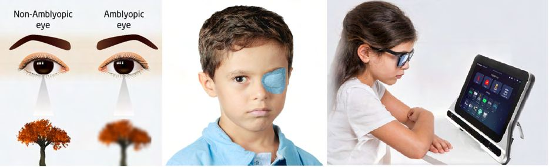
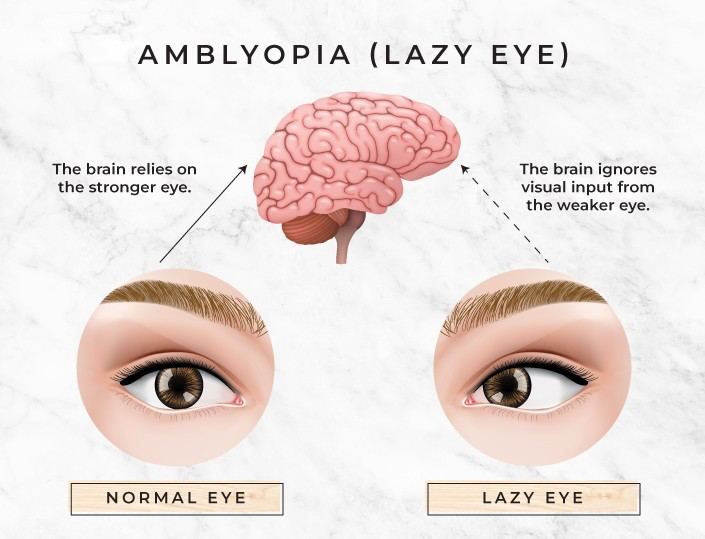

# Amblyopia (Lazy Eye)

Source: `Eye Diseases & Conditions-compressed.pdf`, pages 376-381.

## Images

## Extracted text

<!-- Page 376 -->
Amblyopia (Lazy Eye)
Amblyopia, commonly known as lazy eye, is a visual condition where one eye has reduced
vision, typically due to abnormal visual development in early childhood. The brain favors the
stronger eye, and the weaker eye does not develop the ability to see clearly, even with the use of
corrective lenses. Amblyopia can lead to permanent vision impairment in the affected eye if left
untreated. It is a common condition, affecting approximately 2-3% of the population, and is often
diagnosed in infancy or early childhood. Early intervention is critical to ensure the best possible
outcome.
Symptoms and Causes
Symptoms of Amblyopia:
Blurry or poor vision in one eye: The affected eye may have reduced clarity or
sharpness of vision.
Squinting or closing one eye: The brain may suppress the image from the weaker eye,
leading to squinting to enhance vision from the dominant eye.
Difficulty with depth perception: Since both eyes do not work together, individuals
with amblyopia may have trouble judging distances.
Head tilting: Children with amblyopia may tilt their head to compensate for vision
problems.
Crossed or wandering eyes (strabismus): Amblyopia often co-occurs with strabismus,
where the eyes are misaligned.
Laziness or avoidance of visual tasks: In children, there may be a reluctance to engage
in activities that require good vision, such as reading or drawing.

<!-- Page 377 -->
Causes of Amblyopia:
Strabismus: Misalignment of the eyes is a common cause of amblyopia. If one eye turns
inward or outward, the brain may ignore the image from that eye to avoid double vision.
Refractive errors: Conditions like nearsightedness (myopia), farsightedness (hyperopia),
or astigmatism that are not corrected with glasses can lead to amblyopia.
Deprivation: Conditions such as cataracts or ptosis (drooping eyelid) that obstruct
normal vision development in one eye during infancy or early childhood can result in
amblyopia.
Prematurity: Premature infants are at a higher risk of developing amblyopia, especially
if they experience issues like retinopathy of prematurity (ROP).
Genetics: A family history of amblyopia, strabismus, or other vision problems can
increase the risk.
Diagnosis and Tests
Early diagnosis is key to preventing long-term vision issues. A comprehensive eye exam by an
optometrist or ophthalmologist will typically include the following tests:
Visual acuity test: This is the standard "eye chart" test that measures how well each eye
can see at various distances. It helps identify differences in vision between the two eyes.
Cover-uncover test: The doctor covers one eye at a time and observes how the
uncovered eye moves to check for eye misalignment.
Refraction test: This helps determine whether refractive errors like myopia, hyperopia,
or astigmatism are contributing to amblyopia.
Pupil reaction test: The doctor checks the pupils' response to light, which can help rule
out neurological causes.
Retinal examination: A detailed look at the retina and optic nerve to rule out underlying
eye diseases that may be affecting vision development.
3D vision tests: These tests help evaluate how well the eyes work together and assess the
depth perception.
Management and Treatment
Treating amblyopia involves strengthening the weaker eye and encouraging the brain to use both
eyes equally. The specific treatment approach depends on the type and severity of amblyopia, as
well as the child's age and overall health.
Common treatments for amblyopia include:
Eyeglasses or corrective lenses: If refractive errors are contributing to amblyopia,
corrective lenses can help improve vision in the weaker eye and restore proper visual
development.
Patching therapy: The most common treatment for amblyopia involves covering the
stronger eye with an eye patch. This forces the brain to rely on the weaker eye and helps
improve its vision over time. Patching is often used in combination with other therapies.

<!-- Page 378 -->
Atropine eye drops: In some cases, atropine drops may be prescribed to blur the vision
in the stronger eye, encouraging the use of the weaker eye. This is an alternative to
patching and is generally used in children who do not tolerate wearing an eye patch.
Vision therapy: Special exercises designed to improve coordination between the eyes
and the brain may be prescribed. These exercises can help strengthen the eye muscles and
improve depth perception.
Surgery: If amblyopia is caused by a physical obstruction, such as cataracts or a
drooping eyelid (ptosis), surgery may be necessary to remove the obstruction. Surgery
can also be used to correct eye misalignment (strabismus) if necessary.
Amblyopia Types & Surgery
There are three primary types of amblyopia:
1. Strabismic amblyopia: Caused by strabismus, or eye misalignment, where the brain
suppresses the image from the misaligned eye to avoid double vision.
2. Refractive amblyopia: Results from uncorrected refractive errors like nearsightedness,
farsightedness, or astigmatism. The weaker eye develops poor vision due to the
uncorrected focus problem.
3. Deprivation amblyopia: Caused by an obstruction, such as cataracts or ptosis, that
prevents the light from entering the eye and developing normal vision.
Surgical Treatments for Amblyopia:
Strabismus surgery: In cases of strabismic amblyopia, surgery may be required to align
the eyes properly. This helps the brain receive equal input from both eyes.
Cataract surgery: If amblyopia is due to a cataract or other obstruction, surgery to
remove the cataract and restore clear vision in the affected eye may be performed.
Complicated Amblyopia (Lazy Eye)
Amblyopia can be complicated by several factors, making treatment more challenging:
Severe misalignment or strabismus: In cases where strabismus is present, especially if
it is severe, the eyes may be difficult to align, requiring more complex treatments.
Amblyopia in both eyes: Rarely, both eyes may be affected, which can significantly
reduce overall vision and make treatment more difficult.
Underlying neurological disorders: In some cases, amblyopia may be linked to
neurological issues that affect visual processing in the brain, making treatment less
predictable.
Amblyopia (Lazy Eye) in Adults
While amblyopia is primarily diagnosed in childhood, it can sometimes persist into adulthood if
left untreated. If amblyopia is not corrected during childhood, it can lead to permanent vision
impairment in the affected eye. Adults with amblyopia may still benefit from certain treatments,

<!-- Page 379 -->
such as patching therapy, vision therapy, or corrective lenses, though the success rate is generally
higher in children. In some cases, surgery to correct strabismus or remove an obstruction may be
necessary.
Amblyopia (Lazy Eye) in Children
Amblyopia is most commonly diagnosed in children, and early intervention is essential for
effective treatment. The earlier amblyopia is detected, the better the chances of restoring normal
vision. Treatment typically involves corrective lenses, patching, or eye drops to stimulate the
weaker eye and promote equal vision development. If treated early, children with amblyopia can
often achieve normal vision in both eyes.
Prevention
While amblyopia cannot always be prevented, there are ways to reduce the risk:
Early eye exams: Regular eye exams for infants and young children are important to
detect amblyopia and other vision problems early on. Pediatricians often recommend that
children have their first eye exam at 6 months of age, followed by additional exams as
they grow.
Prompt treatment of eye conditions: Addressing refractive errors or eye misalignment
early can help prevent amblyopia.
Correcting vision problems: If a child has conditions like strabismus or refractive
errors, using glasses or corrective lenses as prescribed can prevent amblyopia from
developing.
Outlook / Prognosis
The prognosis for amblyopia depends on how early it is diagnosed and treated. If detected and
treated in early childhood, most children can recover normal vision in the affected eye. However,
if left untreated, amblyopia can lead to permanent vision impairment in the weaker eye. The
earlier the treatment begins, the more likely it is that the brain and eyes will respond positively to
therapy.
Living With Amblyopia
Living with amblyopia involves managing any associated visual difficulties, especially if vision
in one eye remains reduced despite treatment. Children and adults with amblyopia may
experience challenges with depth perception, reading, and participating in activities that require
good vision. However, with appropriate corrective lenses, vision therapy, or surgery, many
individuals with amblyopia lead normal, active lives.

<!-- Page 380 -->
Additional Common Questions (FAQs)
Q: Can amblyopia be treated in adults?
A: Treatment is most effective in children, but adults may still benefit from treatments like
patching, vision therapy, or corrective lenses. The results may not be as dramatic as in children,
but improvements in visual function are possible.
Q: How long does treatment for amblyopia take?
A: Treatment duration varies depending on the severity of the condition. For children, it can take
several months to years for the weaker eye to strengthen. Patching therapy is typically done for
2-6 hours daily, depending on the severity of the amblyopia.
Q: Can amblyopia recur after treatment?
A: In most cases, amblyopia does not recur once it has been successfully treated, but it’s
important to maintain regular eye exams to ensure that vision remains stable.
Q: Is it too late to treat amblyopia if my child is older?
A: While treatment is more effective in younger children, older children and even teenagers can
still benefit from treatment. Early detection and prompt intervention are key.
Q: Can amblyopia affect both eyes?
A: Yes, although rare, both eyes can be affected by amblyopia. This is more difficult to treat than
when only one eye is affected, but treatments such as patching both eyes may be used in some
cases.

<!-- Page 381 -->
Q: How can I tell if my child has amblyopia?
A: If you notice that your child squints, tilts their head, or avoids reading or other activities that
require good vision, they may have amblyopia. A comprehensive eye exam can confirm the
diagnosis.
