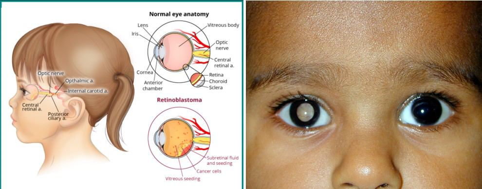
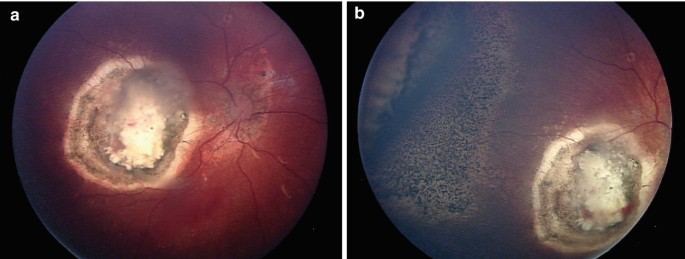

# Retinoblastoma

Source: `Eye Diseases & Conditions-compressed.pdf`, pages 381-385.

## Images

## Extracted text

<!-- Page 381 -->
Retinoblastoma
Retinoblastoma is a rare type of eye cancer that typically affects young children, often under the
age of 5. It originates in the retina, the light-sensitive tissue at the back of the eye that is
responsible for capturing visual information and sending it to the brain. This condition is caused
by mutations in the retinoblastoma gene, which normally helps control cell growth in the retina.
If this gene is damaged, abnormal cells can grow uncontrollably, leading to cancer.
Retinoblastoma can develop in one or both eyes and can be classified into two main categories:
hereditary and non-hereditary. Hereditary retinoblastoma is passed down from parents, while
non-hereditary cases occur randomly.
Symptoms and Causes
Symptoms of Retinoblastoma:
White reflex (Leukocoria): This is the most common sign of retinoblastoma. It causes
the pupil to appear white instead of the usual black when light is shined into the eye. This
may be noticed in photographs where the eye reflects white or yellow.

<!-- Page 382 -->
Strabismus (crossed eyes): The eyes may not align properly, which can lead to one eye
turning inward or outward.
Vision problems: Children with retinoblastoma may squint, cover one eye, or show signs
of poor vision.
Eye redness and swelling: There may be noticeable redness, swelling, or irritation in the
affected eye.
Pain: Although pain is not always present, in advanced stages, the eye may become
painful or swollen.
Bulging of the eye (Proptosis): The tumor may cause the eye to bulge outward, making
it look abnormal.
Causes of Retinoblastoma:
Genetic mutations: Retinoblastoma is primarily caused by mutations in the RB1 gene, a
tumor suppressor gene. This gene normally prevents uncontrolled cell growth, but when
it is damaged, it can lead to the development of cancer cells in the retina.
o
Hereditary retinoblastoma: Inherited mutations in the RB1 gene can increase
the risk of developing retinoblastoma in both eyes. A child with one parent
carrying the mutated gene has a 50% chance of inheriting it.
o
Non-hereditary retinoblastoma: In some cases, retinoblastoma arises due to
spontaneous genetic mutations in the RB1 gene, not inherited from parents.
Diagnosis and Tests
Diagnosing retinoblastoma involves a comprehensive eye exam and a series of tests to assess the
extent of the disease:
Ophthalmologic exam: A pediatric ophthalmologist will examine the eye to check for
signs of tumors, leukocoria, or other abnormalities.
Retinal imaging: Tests like ultrasonography, optical coherence tomography (OCT), or
fluorescein angiography can help detect tumors inside the eye.
MRI or CT scan: These imaging techniques provide detailed pictures of the eye and
surrounding structures, helping to determine the size and extent of the tumor.
Biopsy: In rare cases, a sample of tissue from the eye may be taken to confirm the
diagnosis, although this is typically unnecessary as the tumor is often detectable through
imaging.
Genetic testing: Genetic counseling and testing may be offered to determine if the
retinoblastoma is hereditary, especially for children with a family history of the
condition.
Management and Treatment
The management of retinoblastoma depends on factors such as the size, location, and extent of
the tumor, as well as the child’s age and overall health. Early detection and treatment are crucial
for preserving vision and preventing the spread of cancer.

<!-- Page 383 -->
Treatment options include:
Surgical removal: If the tumor is confined to one part of the eye, surgery may be
performed to remove the tumor. In some cases, the entire eye may need to be removed in
a procedure called enucleation, especially if the tumor is large and cannot be treated
effectively with other methods.
Chemotherapy: Systemic chemotherapy is used to treat retinoblastoma by shrinking the
tumors or destroying cancer cells. Chemotherapy is often used when the cancer has
spread beyond the retina or if the tumor is present in both eyes.
Laser therapy: Laser treatment can be used to target and destroy small tumors in the
retina by focusing intense light on them.
Cryotherapy: This treatment involves freezing the tumor to kill cancer cells, and is often
used for small or early-stage tumors.
Radiotherapy: In some cases, radiation therapy may be used to shrink tumors that cannot
be treated with surgery or other methods.
Intravitreal chemotherapy: For cases where the tumor is confined to the eye,
chemotherapy drugs may be delivered directly into the eye to target the tumor.
Retinoblastoma Types & Surgery
Retinoblastoma can be classified into two main types based on whether it affects one eye or both
eyes:
1. Unilateral retinoblastoma: This type affects one eye and is more common in non-
hereditary cases.
2. Bilateral retinoblastoma: This type affects both eyes and is typically associated with
hereditary retinoblastoma.
Surgical treatment may involve:
Enucleation: If the tumor has significantly damaged the eye, enucleation (removal of the
affected eye) may be necessary to prevent the spread of cancer and improve the child's
quality of life.
Tumor resection: In some cases, the surgeon may remove just the tumor without
removing the entire eye.
Complicated Retinoblastoma
Complications associated with retinoblastoma can arise depending on the stage of the disease
and the treatment approach. These include:
Tumor metastasis: In advanced stages, retinoblastoma can spread beyond the eye to
other parts of the body, such as the brain or bone marrow.
Vision loss: If not treated effectively, retinoblastoma can lead to significant vision loss or
blindness in the affected eye(s).

<!-- Page 384 -->
Psychosocial impact: The diagnosis and treatment of retinoblastoma, particularly if it
results in the loss of an eye, can have psychological effects on the child and their family.
Retinoblastoma in Adults
While retinoblastoma is predominantly a disease of young children, in rare cases, adults may
develop retinoblastoma, often due to a hereditary form of the condition. In such cases, the tumors
may appear later in life, often in both eyes. Treatment options for adults with retinoblastoma are
similar to those for children, though adult cases may involve more complex surgical and
systemic treatments.
Retinoblastoma in Children
Retinoblastoma is most commonly diagnosed in children, typically before the age of 5. In
children with hereditary retinoblastoma, the risk of developing the condition in both eyes is high,
and genetic counseling may be recommended for affected families. Early diagnosis and
intervention are crucial to preserving vision and preventing the spread of cancer. Treatment often
includes a combination of chemotherapy, surgery, and/or radiation therapy.
Prevention
There is currently no known way to prevent retinoblastoma. However, genetic testing can be
done to identify children at high risk, especially those with a family history of the disease. For
children at increased risk, regular eye exams starting from a very young age can help detect the
condition early, when treatment is most effective.
Outlook / Prognosis
The prognosis for retinoblastoma depends on factors such as the size of the tumor, whether the
cancer has spread, and how quickly treatment is administered. In general:
If diagnosed early and treated promptly, the outlook is very positive, and many children
go on to live full, healthy lives with vision preservation in at least one eye.
If retinoblastoma is diagnosed later or if the cancer has spread, the prognosis may be
more guarded, and the treatment may be more intensive.
Survival rates for retinoblastoma are high, with a 5-year survival rate exceeding 95% for
localized cases, but they can be lower if the cancer has spread.
Living With Retinoblastoma
Living with retinoblastoma may involve ongoing medical care, including regular follow-up eye
exams and treatment for any side effects of treatment such as vision impairment or psychosocial
issues. Children who have had one or both eyes removed may benefit from prosthetic eyes, and
support from a pediatric oncologist, vision specialist, and mental health professionals can be vital
for a child’s recovery and emotional well-being.

<!-- Page 385 -->
Additional Common Questions (FAQs)
Q: Is retinoblastoma hereditary?
A: Retinoblastoma can be inherited through a mutated RB1 gene, particularly in cases of
bilateral retinoblastoma. If one parent carries the gene, there is a 50% chance it will be passed to
their child.
Q: What are the chances of survival for children with retinoblastoma?
A: The survival rate for children with localized retinoblastoma is over 95%. If the cancer has
spread, the prognosis is more variable, but early detection and treatment greatly improve survival
chances.
Q: Can retinoblastoma affect both eyes?
A: Yes, retinoblastoma can affect one or both eyes. Bilateral retinoblastoma is more common in
hereditary cases.
Q: Is retinoblastoma always diagnosed in childhood?
A: Yes, retinoblastoma is almost always diagnosed in young children, typically under the age of
5.
Q: How is retinoblastoma treated?
A: Treatment for retinoblastoma may involve chemotherapy, surgery, laser therapy, or radiation.
The specific treatment plan depends on the size, location, and stage of the tumor.
Q: Can retinoblastoma recur after treatment?
A: While retinoblastoma can recur, particularly if it was not completely treated or detected early,
regular follow-up care can help catch recurrences early and improve the chances of successful
treatment.
