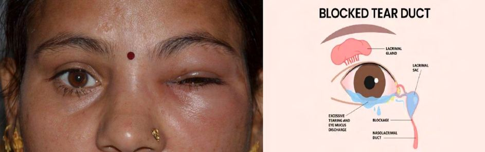
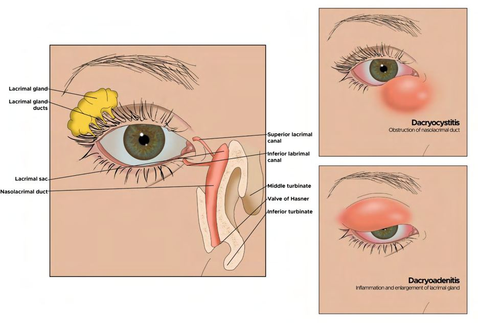

# Tear Duct Blockages (Dacryocystitis)

Source: `Eye Diseases & Conditions-compressed.pdf`, pages 386-390.

## Images

## Extracted text

<!-- Page 386 -->
Tear Duct Blockages (Dacryocystitis)
Tear duct blockage, also known as dacryocystitis, refers to the obstruction of the tear drainage
system, which leads to an infection or inflammation of the tear sac (dacryocyst). The tear ducts
are small tubes that carry tears from the eyes to the nose. When these ducts become blocked,
tears can accumulate in the eyes, causing discomfort, infection, or watery eyes. Dacryocystitis is
most common in infants but can also affect adults.
Tear duct blockages can occur in one or both eyes, and depending on the cause and severity, the
treatment may involve a range of approaches from conservative management to surgery.
Symptoms and Causes
Symptoms of Tear Duct Blockage (Dacryocystitis):
Excessive tearing (epiphora): Tears accumulate in the eye and overflow onto the face,
especially during crying or other eye movements.
Red, swollen, and tender area near the inner corner of the eye: This is often the area
where the tear duct is blocked.
Discharge from the eye: There may be thick, yellow, or green discharge coming from
the eye, indicating infection.
Pain or discomfort in the affected eye: This may worsen if the blockage is infected.
Fever: In cases of infection, fever may accompany other symptoms.
Crusting around the eyelid: This can occur as a result of constant tearing or discharge.
Causes of Tear Duct Blockages (Dacryocystitis):
Congenital blockages: In infants, dacryocystitis is often caused by a congenital blockage
where the tear duct has not fully developed or opened. This condition is common in
newborns and typically resolves on its own within the first year of life.

<!-- Page 387 -->
Infections: Bacterial infections, such as Staphylococcus aureus or Streptococcus
pneumoniae, can cause the tear duct to become blocked and inflamed.
Aging: In older adults, the tear ducts may become narrowed or blocked due to age-related
changes, leading to chronic eye irritation.
Trauma or injury: Physical injury to the face or eye can damage the tear duct, causing
blockage or scarring.
Sinus infections: Sinus issues can sometimes contribute to or cause tear duct blockages.
Chronic inflammation: Conditions like chronic conjunctivitis or other inflammatory eye
diseases can increase the risk of tear duct obstruction.
Tumors or growths: Rarely, tumors or growths in or around the tear duct area can block
the tear passage.
Diagnosis and Tests
Diagnosing tear duct blockage generally involves a thorough eye exam. Some of the tests used to
confirm the condition include:
Physical examination: A healthcare provider will inspect the eye and surrounding area
for signs of swelling, discharge, and excessive tearing.
Dacryocystography: This is an imaging test where a special dye is injected into the tear
duct to see if there are any blockages along the duct.
Fluorescein dye test: A drop of fluorescent dye may be placed in the eye to track the tear
flow and assess whether the ducts are functioning properly.
Nasolacrimal duct irrigation: In this test, saline is injected into the tear duct to see if it
flows through the nasal passage. If the liquid fails to drain, it indicates a blockage.
Cultures or samples: If infection is suspected, samples of discharge may be taken for
laboratory analysis to identify the bacteria or virus causing the infection.
Management and Treatment
Treatment for tear duct blockages varies depending on the severity and cause. The goal is to
relieve symptoms, prevent complications, and restore normal tear drainage. Management
strategies include:
1. Conservative Treatment:
o
Massage: Gently massaging the area around the tear duct can help to clear mild
blockages in infants and toddlers. This technique helps to dislodge any debris or
mucus that may be obstructing the duct.
o
Warm compresses: Applying a warm, moist cloth to the eye can help ease
discomfort, reduce swelling, and promote drainage.
o
Antibiotics: If an infection is present, antibiotics (oral or topical) may be
prescribed to treat bacterial dacryocystitis.
2. Surgical Treatment:
o
Probing: A common procedure to clear a blocked tear duct is probing, which is
often performed in young children. A thin instrument is inserted into the tear duct
to open the obstruction.

<!-- Page 388 -->
o
Balloon dacryoplasty: A small balloon is inflated inside the blocked duct to
widen the passage and improve tear drainage. This procedure is less invasive than
traditional surgery.
o
Dacryocystorhinostomy (DCR): For more severe cases or chronic blockages,
surgery may be necessary to create a new drainage pathway between the tear sac
and the nasal cavity. This procedure is effective in patients who have not
responded to other treatments.
3. Chronic Management: For older adults or patients with recurrent blockages, regular
follow-up and management may include maintenance care, such as scheduled lacrimal
duct probing or possible drainage tube placement.
Tear Duct Blockages (Dacryocystitis) Types & Surgery
Types of Tear Duct Blockages:
1. Congenital Dacryocystitis: Common in infants, where a blockage occurs due to
incomplete development of the tear duct system.
2. Acquired Dacryocystitis: More common in adults, usually caused by aging, infections,
or trauma to the tear duct.
Surgical Treatment:
Dacryocystorhinostomy (DCR): This is the most common surgery for adults with
chronic or severe tear duct blockages. It involves creating a new opening between the tear
sac and the nasal cavity to bypass the blockage.
Probing and irrigation: For children with congenital blockages, this minimally invasive
procedure often resolves the issue.
Endoscopic surgery: An endoscope may be used to explore the tear duct system and
remove obstructions.
Complicated Tear Duct Blockages (Dacryocystitis)
Complications from dacryocystitis can include:
Chronic infection: If left untreated, dacryocystitis can lead to persistent or recurrent
infections, which can cause more severe damage to the tear duct system.
Abscess formation: An untreated infection may lead to the formation of an abscess, a
collection of pus that can cause severe pain, swelling, and fever.
Vision problems: In rare cases, a blockage may interfere with the function of the eye,
leading to blurred vision or discomfort.
Spread of infection: If the infection is severe or untreated, it can spread to surrounding
areas, such as the eye socket or sinuses, and may require more aggressive treatment.

<!-- Page 389 -->
Tear Duct Blockages (Dacryocystitis) in Adults
Tear duct blockages in adults are typically acquired due to aging, infections, or trauma.
Treatment for adults generally involves more advanced procedures like balloon dacryoplasty or
dacryocystorhinostomy (DCR). Chronic blockages in adults can also be associated with other
health issues like sinus infections or conditions that affect the nasal cavity, so managing these
underlying causes is important.
Tear Duct Blockages (Dacryocystitis) in Children
In children, particularly infants, tear duct blockages are often congenital and may resolve on their
own within the first year of life. If the blockage persists, procedures like probing or massage
techniques may be used to clear the duct. In cases where conservative treatments fail, surgical
interventions may be required.
Prevention
There is no guaranteed way to prevent tear duct blockages, but certain measures can help
minimize the risk:
Good hygiene: Regular cleaning of the eyes and face can prevent infections that may
lead to blockage.
Prompt treatment of infections: Timely medical attention to eye infections can reduce
the risk of complications, including tear duct blockages.
Early intervention: For infants with congenital tear duct blockages, early massage
therapy or consultation with an eye specialist can promote natural drainage.
Outlook / Prognosis
The prognosis for tear duct blockages varies depending on the cause and the effectiveness of
treatment:
In infants, congenital tear duct blockages often resolve with minimal treatment, and
long-term outcomes are generally good.
In adults, the prognosis is also favorable with proper treatment, though chronic cases or
those involving infection may require surgery for long-term relief.
With appropriate medical care, including antibiotics and possibly surgery, most people
recover fully without long-term complications.
Living With Tear Duct Blockages (Dacryocystitis)
Living with tear duct blockages may involve ongoing care, such as routine eye exams, antibiotics
for recurring infections, or occasional surgeries to maintain tear duct function. For children, early
intervention is essential for avoiding prolonged discomfort or developmental delays in visual
processing.

<!-- Page 390 -->
Additional Common Questions (FAQs)
Q: What is the cause of tear duct blockages in children?
A: In children, tear duct blockages are often congenital, meaning they are present at birth due to
incomplete development of the tear duct system.
Q: How are tear duct blockages treated in adults?
A: In adults, treatment options include medications, warm compresses, and in some cases,
surgical procedures like dacryocystorhinostomy (DCR) to bypass the blockage.
Q: Are tear duct blockages dangerous?
A: If untreated, tear duct blockages can lead to chronic infections, abscess formation, or other
complications. However, with proper treatment, the condition is usually manageable.
Q: Can tear duct blockages recur?
A: Yes, in some cases, especially if the underlying cause, such as infection or trauma, is not
properly addressed, tear duct blockages can recur.
Q: Is surgery necessary for a tear duct blockage?
A: Not always. In mild cases, conservative treatments like massage, antibiotics, and warm
compresses may resolve the blockage. Surgery is typically reserved for severe or chronic cases.
