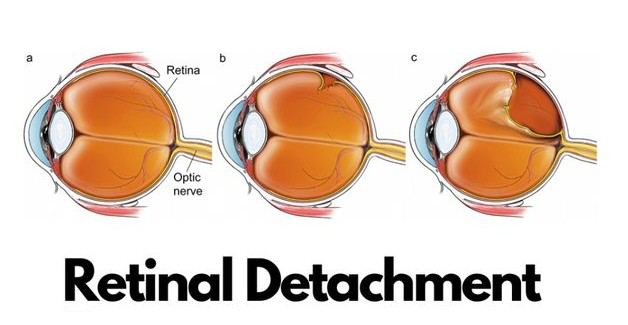
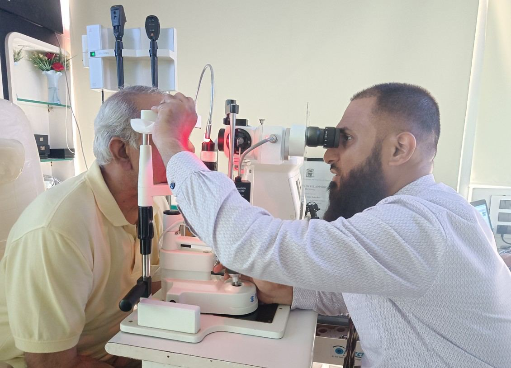

# Retinal Detachment

Source: `Eye Diseases & Conditions-compressed.pdf`, pages 394-398.

## Images

## Extracted text

<!-- Page 394 -->
Retinal Detachment
Overview
Retinal detachment is a serious eye condition where the retina—the thin, light-sensitive tissue at
the back of the eye—pulls away from its normal position. The retina is crucial for processing
visual signals. When it detaches, it loses access to essential nutrients and oxygen, which can lead
to permanent vision loss if not treated quickly.

<!-- Page 395 -->
Symptoms and Causes
Common Symptoms:
Sudden appearance of floaters
Flashes of light in one or both eyes
A shadow or curtain moving across your field of vision
Blurred or distorted vision
Sudden decrease in vision
Symptoms can come on quickly and may worsen over hours or days.
Primary Causes:
Aging: As the vitreous gel shrinks with age, it may tug on the retina.
Eye trauma: Injuries can tear the retina.
Diabetic retinopathy: Damaged blood vessels in the retina can lead to scarring and
pulling of the retina.
Previous eye surgeries: Such as cataract surgery, which may increase the risk.
Genetic factors: Family history or inherited conditions like Stickler syndrome.
Diagnosis and Tests
An eye specialist (ophthalmologist) will conduct a series of tests to confirm retinal detachment:
Dilated eye exam: To inspect the retina directly.
Ocular ultrasound: Used if there is bleeding or cloudiness blocking a direct view.
Optical Coherence Tomography (OCT): Provides cross-sectional images of the retina
for detailed examination.
Early diagnosis is critical to prevent irreversible vision loss.
Management and Treatment
Initial Management:
Immediate evaluation is essential. If retinal detachment is suspected, prompt treatment
may prevent permanent damage.
Treatment Options:
1. Laser Photocoagulation: A laser seals small retinal tears before detachment occurs.
2. Cryopexy (freezing therapy): Freezes the area around a tear to help reattach the retina.

<!-- Page 396 -->
3. Scleral Buckling: A flexible band is placed around the eye to relieve pressure on the
retina.
4. Vitrectomy: The vitreous gel is removed and replaced with gas or silicone oil to reattach
the retina.
5. Pneumatic Retinopexy: A gas bubble is injected into the eye, which presses the retina
back into place.
The choice of treatment depends on the type and severity of the detachment.
Retinal Detachment Types & Surgery
Types of Retinal Detachment:
Rhegmatogenous: The most common type, caused by a tear or break in the retina.
Tractional: Occurs when scar tissue on the retina's surface pulls it away from the back of
the eye.
Exudative (serous): Caused by fluid buildup beneath the retina without a tear.
Surgical Intervention:
Surgery is often urgent and customized to the detachment type. Recovery varies, and follow-up
is crucial to ensure the retina stays attached. Surgical risks include infection, cataracts, or
recurrence of detachment.
Complicated Retinal Detachment
Complications can arise in cases involving:
Re-detachment after surgery
Macula involvement, which affects central vision
Scar tissue formation (proliferative vitreoretinopathy or PVR)
Concurrent eye conditions like glaucoma or uveitis
These cases require specialized surgical techniques and ongoing care.
Retinal Detachment in Adults
Retinal detachment is most common in adults over age 50. Risk factors include:
Severe nearsightedness (high myopia)
Previous eye trauma or surgeries
Lattice degeneration (thinning of the retina)
Family history of retinal disorders
Adults should seek immediate care for any new visual disturbances.

<!-- Page 397 -->
Retinal Detachment in Children
Though rare, retinal detachment can affect children due to:
Congenital eye abnormalities
Eye injuries (accidental or from abuse)
Genetic syndromes like Marfan or Stickler
Inflammatory eye conditions
Early diagnosis and intervention are essential to preserve vision in children.
Prevention
While not all retinal detachments can be prevented, steps to lower risk include:
Routine eye exams—especially for high-risk individuals
Wearing protective eyewear during sports or risky activities
Managing systemic diseases like diabetes
Prompt attention to warning signs like flashes or floaters
Avoiding contact sports or activities that risk eye trauma if predisposed
Outlook / Prognosis
The prognosis largely depends on how quickly the detachment is treated and whether the macula
was involved. With timely surgery:
90%+ of cases can be successfully reattached
Vision recovery depends on severity and location of detachment
Some patients may need multiple procedures
If untreated, retinal detachment can result in permanent blindness in the affected eye.
Living with Retinal Detachment
Post-surgery life may involve:
Frequent follow-up visits to monitor healing
Temporary changes in vision during recovery
Limitations on activity, such as avoiding air travel after gas bubble surgery
Protective eyewear to prevent re-injury
Adjusting to vision loss, including use of magnifiers or low-vision aids, if full vision
isn’t restored
Support groups and vision rehabilitation services can help patients adapt.

<!-- Page 398 -->
Frequently Asked Questions (FAQs)
Q1: Is retinal detachment painful?
A: No, it’s not painful, but the visual symptoms can be alarming and require immediate attention.
Q2: Can retinal detachment heal on its own?
A: No. It always requires medical or surgical intervention to prevent vision loss.
Q3: How long does it take to recover from surgery?
A: Recovery may take several weeks, and vision improvement can continue for months.
Q4: Can retinal detachment happen again?
A: Yes, especially in the other eye or if the initial surgery was complex. Regular monitoring is
essential.
Q5: What is the success rate of surgery?
A: Most surgeries successfully reattach the retina, though some patients may need more than one
procedure.
