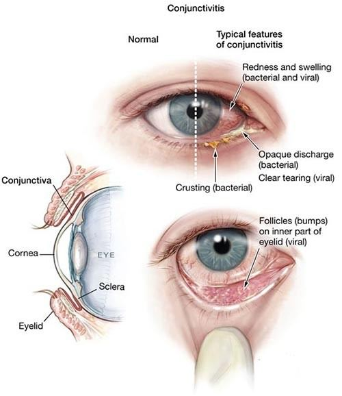
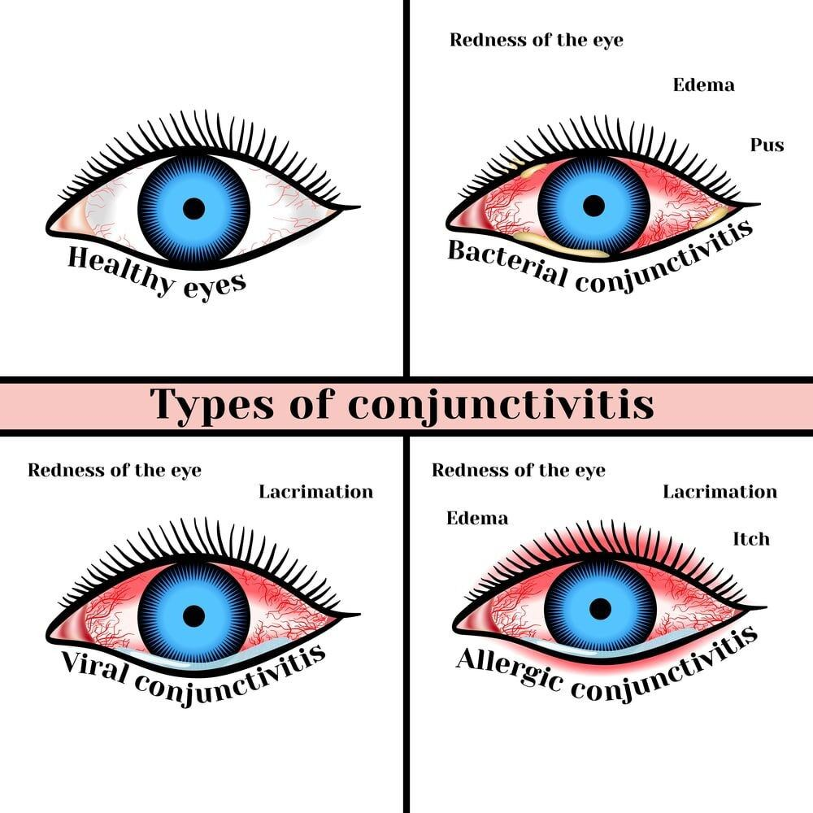

# Pink Eye (Conjunctivitis)

Source: `Eye Diseases & Conditions-compressed.pdf`, pages 399-404.

## Images

## Extracted text

<!-- Page 399 -->
Pink Eye (Conjunctivitis)
Overview
Pink eye, medically known as conjunctivitis, is an inflammation or infection of the conjunctiva
—the thin, transparent membrane lining the eyelid and covering the white part of the eyeball.
When the blood vessels in the conjunctiva become inflamed, they become more visible, giving
the eye a reddish or pink appearance. Pink eye can be caused by viruses, bacteria, allergens, or
irritants and is common in both children and adults.

<!-- Page 400 -->
Symptoms and Causes
Common Symptoms:
Red or pink discoloration of the white part of the eye
Watery or thick discharge from the eye
Itchy, burning, or gritty sensation
Swollen eyelids
Crusting of the eyelids, especially after sleep
Sensitivity to light
Blurred vision in severe cases
Common Causes:
Viral infection: Most often caused by the same viruses that trigger colds.
Bacterial infection: Usually results in more discharge and may require antibiotics.
Allergies: Triggered by pollen, dust, pet dander, or cosmetics.
Chemical irritants: Smoke, chlorine in pools, or household cleaners.
Foreign objects: Dust or particles that get trapped in the eye.
Diagnosis and Test
A healthcare provider can usually diagnose pink eye based on symptoms and a physical exam.
However, in some cases:
Eye swab may be taken to identify the cause (bacterial vs viral).
Allergy testing might be suggested if seasonal or persistent allergic conjunctivitis is
suspected.
Slit-lamp exam allows a detailed view of the eye structures if needed.
Management and Treatment
Viral Conjunctivitis:
No specific treatment—usually resolves in 7–10 days.
Artificial tears, cold compresses, and good hygiene can provide relief.
Bacterial Conjunctivitis:
Often treated with antibiotic eye drops or ointments.
Improvement typically occurs within 2–5 days of starting treatment.
Allergic Conjunctivitis:
Antihistamine or anti-inflammatory eye drops.

<!-- Page 401 -->
Avoidance of known allergens.
Irritant-Induced Conjunctivitis:
Rinsing the eye with saline or clean water.
Avoidance of the irritant source.
Types & Surgery
Types of Pink Eye:
Viral: Most contagious and common.
Bacterial: Also contagious, often affects both eyes.
Allergic: Not contagious; related to environmental triggers.
Irritant: Caused by chemicals or foreign objects.
Surgical Intervention:
Surgery is not a standard treatment for pink eye. However, in extremely rare cases where
conjunctivitis leads to complications or when it's linked to other eye disorders, minor procedures
may be needed.
Complicated Pink Eye
While pink eye is typically mild, complications can occur, especially if left untreated:
Keratitis: Inflammation of the cornea, which can affect vision.
Chronic conjunctivitis: Lasts for weeks or recurs frequently.
Corneal ulcers: Usually in severe bacterial or viral cases.
Vision impairment: Rare, but possible with untreated complications.
Immediate medical care is needed if symptoms worsen or don’t improve within a few days.
Pink Eye in Adults
Adults may contract pink eye through:
Contact with infected surfaces or people
Use of contaminated cosmetics or contact lenses
Exposure to allergens or chemicals
Maintaining good hygiene, avoiding eye-rubbing, and not sharing personal items are essential
preventive measures.
Pink Eye in Children

<!-- Page 402 -->
Children are especially prone to pink eye due to:
Close contact in school or daycare environments
Weaker hygiene practices (e.g., touching eyes with dirty hands)
Exposure to allergens or viruses
Parents should seek prompt treatment to prevent spreading and ensure comfort. Schools may
require a doctor’s note before a child returns to class.
Prevention
To reduce the risk of contracting or spreading pink eye:
Wash hands frequently and thoroughly
Avoid touching or rubbing the eyes
Do not share towels, pillows, or cosmetics
Disinfect commonly touched surfaces
Replace eye makeup regularly
Clean or replace contact lenses as directed
Outlook / Prognosis
The prognosis for pink eye is typically excellent. Most cases resolve on their own or with
minimal treatment. However, complications can arise without proper care, particularly in cases
caused by bacteria or viruses. Allergic conjunctivitis may persist without allergen management
but is not harmful to vision.
Living with Pink Eye
While recovering:
Avoid contact lenses until symptoms resolve
Use a clean, warm (or cold) compress for relief
Follow the full course of prescribed medications
Practice strict hygiene to avoid spreading it to others
Stay home from work or school if symptoms are severe or contagious
Recovery typically takes 1–2 weeks, depending on the cause.

<!-- Page 403 -->
Additional Common Questions (FAQs)
Q1: Is pink eye contagious?
A: Viral and bacterial forms are highly contagious; allergic and irritant types are not.
Q2: Can pink eye spread to both eyes?
A: Yes, especially if proper hygiene is not followed.
Q3: Do I need antibiotics for pink eye?
A: Only bacterial conjunctivitis requires antibiotics. Viral and allergic types do not.

<!-- Page 404 -->
Q4: How long should I stay home from school/work?
A: Until symptoms improve, typically 1–3 days after starting treatment for bacterial cases.
Q5: Can pink eye cause permanent vision loss?
A: Rarely. Most cases resolve without lasting damage if treated properly.
