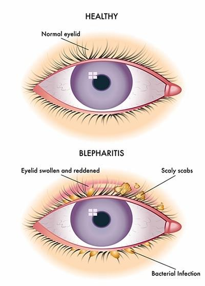
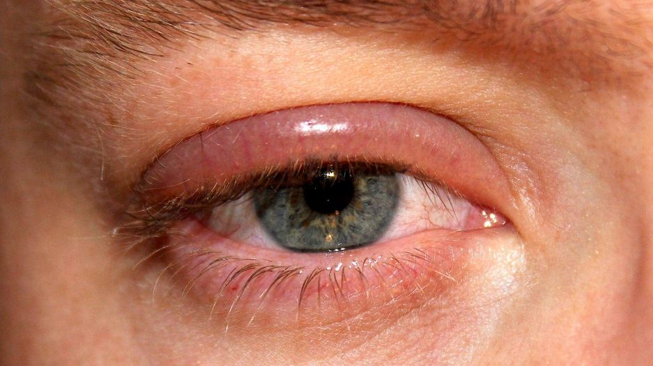

# Blepharitis

Source: `Eye Diseases & Conditions-compressed.pdf`, pages 404-409.

## Images

## Extracted text

<!-- Page 404 -->
Blepharitis

<!-- Page 405 -->
Overview
Blepharitis is a common, often chronic condition involving inflammation of the eyelids,
typically affecting the edges where the eyelashes grow. It can cause irritation, redness, crusting,
and discomfort. Although not usually sight-threatening, untreated blepharitis can lead to more
serious eye issues, including dry eye disease, styes, or even damage to the cornea.
Symptoms and Causes
Common Symptoms:
Itchy or burning eyelids
Redness and swelling around the eyelid margins
Crusting or flaking around the eyelashes
Watery or dry eyes

<!-- Page 406 -->
Gritty, foreign-body sensation
Light sensitivity
Eyelash loss or abnormal growth
Primary Causes:
Bacterial overgrowth: Most commonly Staphylococcus bacteria.
Clogged oil glands (Meibomian gland dysfunction)
Seborrheic dermatitis (scalp dandruff that spreads to eyelids)
Rosacea: A skin condition that affects the face and eyelids.
Allergic reactions: To makeup, contact lens solutions, or environmental triggers.
Mite infestations (Demodex mites on lashes)
Diagnosis and Tests
Diagnosis typically involves:
Detailed medical history to assess symptoms, duration, and possible triggers.
Slit-lamp examination: A magnified eye inspection to check for inflammation, clogged
glands, or mites.
Eyelash or skin sample: In rare cases, samples may be examined under a microscope to
detect mites or fungal elements.
No blood tests are typically needed unless other conditions are suspected.
Management and Treatment
Blepharitis often requires long-term management. There’s no one-time cure, but symptoms can
be controlled with consistent care.
Conservative Management:
Warm compresses: Loosen crusts and unclog oil glands.
Lid hygiene: Daily cleaning with diluted baby shampoo or lid scrubs.
Artificial tears: Help with dry eyes.
Omega-3 supplements: Support healthy oil gland function.
Medications:
Antibiotic ointments or drops (e.g., erythromycin, azithromycin)
Oral antibiotics (for more severe or resistant cases)
Steroid eye drops: Short-term use to reduce inflammation
Anti-mite treatments: If Demodex is involved
Blepharitis Types & Surgery

<!-- Page 407 -->
Types of Blepharitis:
1. Anterior blepharitis: Affects the outside front edge of the eyelids.
2. Posterior blepharitis: Involves the inner edge of the eyelid where oil glands are located.
3. Mixed blepharitis: A combination of anterior and posterior forms.
Surgery and Advanced Procedures:
Surgery is not commonly used but may be considered in cases of:
Severe, recurring chalazia or styes
Meibomian gland probing or thermal pulsation therapy (e.g., LipiFlow)
Laser therapy for chronic rosacea-related blepharitis
Complicated Blepharitis
If left untreated, blepharitis can lead to:
Chronic dry eye
Styes or chalazia (painful eyelid lumps)
Corneal ulcers or damage
Conjunctivitis
Altered eyelash growth (trichiasis)
Eyelid scarring
These complications may affect vision and often require more aggressive treatment or surgical
intervention.
Blepharitis in Adults
Adults often develop blepharitis due to:
Skin conditions like rosacea or dandruff
Hormonal changes affecting oil production
Use of makeup or contact lenses
Aging-related gland dysfunction
Daily eyelid hygiene and managing skin conditions play a key role in long-term control.
Blepharitis in Children
Children can develop blepharitis due to:
Poor hygiene (frequent eye rubbing or unclean hands)
Allergic reactions or eye infections
Underlying skin conditions (eczema or seborrhea)

<!-- Page 408 -->
Pediatric treatment focuses on gentle eyelid cleaning and early symptom recognition to avoid
complications.
Prevention
Though not always preventable, you can reduce risk and flare-ups by:
Daily eyelid cleansing
Avoiding eye makeup if symptoms persist
Replacing makeup and brushes regularly
Washing hands before touching the eyes
Managing skin conditions like rosacea or dandruff
Using preservative-free artificial tears to support eye moisture
Outlook / Prognosis
Blepharitis is generally not dangerous, but it is often chronic and requires ongoing
management. With proper eyelid hygiene and treatment, most people can keep symptoms under
control and prevent complications. Regular follow-ups with an eye care provider can help
manage persistent cases effectively.
Living with Blepharitis
Daily life with blepharitis involves:
Incorporating eyelid hygiene into your morning or evening routine
Avoiding known irritants (e.g., certain makeup or soaps)
Taking prescribed medications as directed
Monitoring symptoms and reporting changes to your eye doctor
Using warm compresses during flare-ups to ease discomfort
Living with blepharitis is manageable, but consistency is key.

<!-- Page 409 -->
Frequently Asked Questions (FAQs)
Q1: Is blepharitis contagious?
A: No, it’s not contagious. However, poor hygiene may spread bacteria that contribute to
symptoms.
Q2: Can blepharitis be cured permanently?
A: It can be managed but not typically cured. Symptoms often come and go.
Q3: Is blepharitis related to dry eyes?
A: Yes, it often coexists with dry eye syndrome due to disrupted oil production.
Q4: Can I wear makeup or contact lenses with blepharitis?
A: You can, but it's best to avoid during flare-ups and always practice good hygiene.
Q5: How long does treatment take to work?
A: Improvement can begin within days to weeks, but maintenance is usually ongoing to prevent
recurrence.
