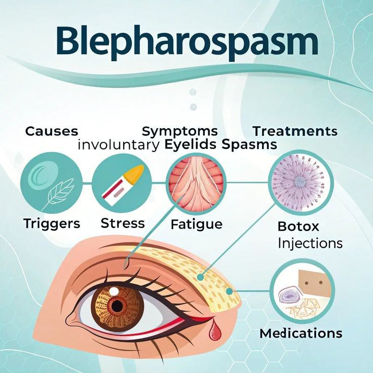
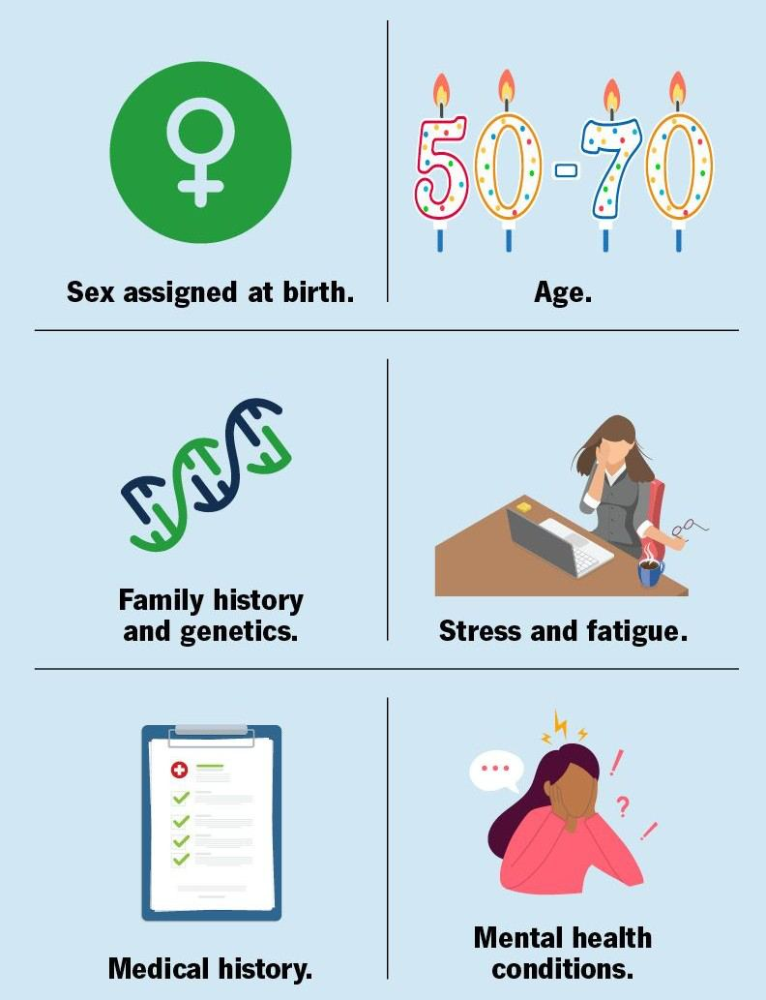

# Blepharospasm

Source: `Eye Diseases & Conditions-compressed.pdf`, pages 410-415.

## Images

## Extracted text

<!-- Page 410 -->
Blepharospasm
Overview
Blepharospasm is a rare neurological condition that causes involuntary, repetitive contractions
or twitching of the eyelid muscles, typically affecting both eyes. Initially, it may appear as
frequent blinking or eye irritation, but over time, it can progress to uncontrollable eyelid closure.
While not life-threatening, blepharospasm can significantly impact vision and quality of life if
left untreated.

<!-- Page 411 -->
Symptoms and Causes
Common Symptoms:
Involuntary blinking or eye twitching
Difficulty keeping eyes open
Dryness, irritation, or a gritty feeling in the eyes
Light sensitivity (photophobia)
Facial tension or eye fatigue
Symptoms that worsen with stress, fatigue, or bright lights
Primary Causes:
Essential blepharospasm: A form of focal dystonia with no identifiable cause.
Secondary blepharospasm: May result from neurological conditions (e.g., Parkinson’s
disease, brain injury), medication side effects, or eye conditions such as dry eye or
blepharitis.
Environmental triggers: Bright lights, wind, or eye strain can worsen symptoms.
Though the exact cause of essential blepharospasm is unknown, it is believed to involve
dysfunction in the basal ganglia, a brain region that helps control movement.
Diagnosis and Tests
Diagnosis is primarily clinical and involves:
Detailed medical history and symptom review
Neurological examination to rule out underlying conditions
Eye exam to check for dry eye or irritation
Observation of muscle movements during various tasks
In rare cases, MRI or CT scan may be used to exclude structural brain disorders
There’s no single test for blepharospasm, so diagnosis often relies on exclusion of other
disorders.
Management and Treatment
Non-Surgical Management:
Botulinum toxin (Botox) injections: The most effective and widely used treatment.
Injections into the eyelid muscles relax them and reduce spasms, with effects lasting 3–4
months.
Oral medications: Such as anticholinergics, benzodiazepines, or muscle relaxants—less
effective and used in selected cases.
Eye protection: Tinted glasses or moisture chamber goggles can help with light
sensitivity and dryness.

<!-- Page 412 -->
Supportive Therapies:
Stress management: Relaxation techniques can help reduce symptom severity.
Physical therapy: May benefit muscle control and coordination.
Types & Surgery
Types of Blepharospasm:
Essential Blepharospasm: Primary form with no known cause, often progressive.
Reflex Blepharospasm: Triggered by irritation or eye surface problems.
Secondary Blepharospasm: Resulting from neurological damage or systemic disease.
Surgical Options:
Myectomy: Surgical removal of part of the eyelid muscles to reduce spasms in severe
cases unresponsive to Botox.
Deep Brain Stimulation (DBS): An experimental option for severe, generalized dystonia
including blepharospasm.
Surgery is usually reserved for severe or treatment-resistant cases.
Complicated Blepharospasm
Complications may include:
Functional blindness: The inability to keep eyes open, despite normal vision
Depression or anxiety: Due to social embarrassment or isolation
Facial dystonia: In some cases, spasms spread to surrounding muscles (Meige
syndrome)
Injury risk: From falls or accidents due to sudden vision blockage
Complicated cases often require a multidisciplinary approach for treatment.
Blepharospasm in Adults
Most cases of blepharospasm occur in middle-aged or older adults, especially women over 50.
Adults with chronic eye irritation, neurological conditions, or high stress levels are more prone to
developing the condition.
Blepharospasm in Children
Blepharospasm is extremely rare in children. If it does occur, it is often linked to:
Medication reactions

<!-- Page 413 -->
Eye injury or irritation
Neurological disorders
Any persistent eye twitching or eyelid closing in children should be evaluated by a pediatric
neurologist or ophthalmologist.
Prevention
While essential blepharospasm can’t always be prevented, the following steps may help reduce
symptoms or delay progression:
Manage eye dryness or irritation early
Avoid triggers like bright lights and screen overuse
Use lubricating eye drops regularly
Wear tinted or wraparound sunglasses
Reduce stress and fatigue
Identifying personal symptom triggers is key in minimizing episodes.
Outlook / Prognosis
Blepharospasm is chronic but manageable. While it may progress over time, most patients
experience significant symptom control with regular Botox treatments. Though not curable,
people can maintain a good quality of life with proper treatment, support, and lifestyle
adaptations.
Living with Blepharospasm
Daily life may require adjustments:
Schedule regular Botox treatments for symptom relief
Plan rest breaks during visually demanding tasks
Use eye shields or glasses to limit exposure to light or wind
Stay informed and connected with support groups or specialists
Explore accommodations at work or school if symptoms interfere with daily tasks
Adaptation and consistency in care are vital to living well with blepharospasm.

<!-- Page 414 -->
Frequently Asked Questions (FAQs)
Q1: Is blepharospasm the same as an eye twitch?
A: No. A typical eye twitch is usually harmless and short-lived, while blepharospasm is a
chronic neurological condition involving both eyelids.
Q2: Can stress make blepharospasm worse?
A: Yes. Stress, fatigue, and anxiety are common triggers that can intensify spasms.

<!-- Page 415 -->
Q3: How long does Botox treatment last for blepharospasm?
A: Effects typically last 3–4 months, requiring repeated injections for ongoing control.
Q4: Can blepharospasm lead to blindness?
A: No, but the spasms can make it difficult to keep the eyes open, leading to functional
blindness.
Q5: Is surgery a cure for blepharospasm?
A: Surgery can reduce symptoms in severe cases but is not a guaranteed cure and may have risks.
