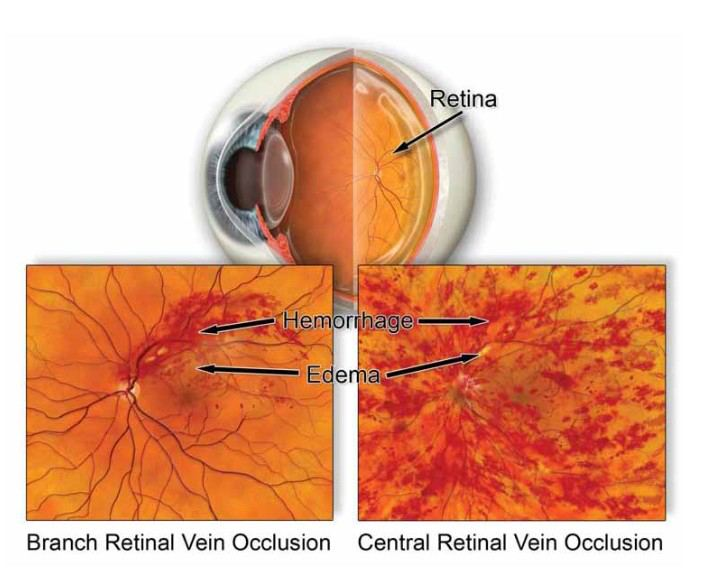
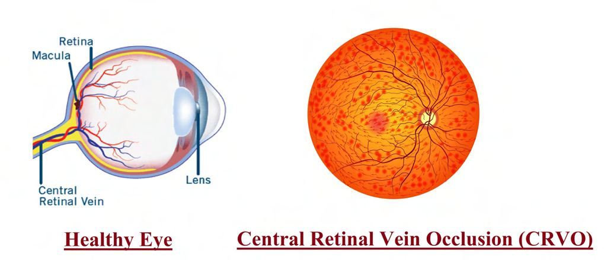

# Central Retinal Vein Occlusion (CRVO)

Source: `Eye Diseases & Conditions-compressed.pdf`, pages 415-420.

## Images

## Extracted text

<!-- Page 415 -->
Central Retinal Vein Occlusion (CRVO)

<!-- Page 416 -->
Overview
Central Retinal Vein Occlusion (CRVO) is a serious eye condition that occurs when the main
vein responsible for draining blood from the retina becomes blocked, usually due to a blood clot.
This blockage disrupts normal blood flow, causing blood and fluid to back up into the retina,
leading to swelling, vision problems, or even sudden vision loss. CRVO is considered a form of
retinal vascular disease and is more common in older adults with underlying health conditions.
Symptoms and Causes
Common Symptoms:
Sudden, painless vision loss in one eye
Blurred or distorted central vision
Appearance of dark spots or floaters
Reduced ability to see colors or fine details
Vision that worsens over hours or days

<!-- Page 417 -->
Causes and Risk Factors:
Atherosclerosis (hardening of the arteries)
High blood pressure
Diabetes mellitus
Glaucoma
Blood clotting disorders
Smoking
Age (most common in those over 50)
CRVO occurs when a clot or compression affects the central retinal vein, leading to poor
drainage and increased pressure in retinal blood vessels, resulting in damage to retinal tissue.
Diagnosis and Tests
Early diagnosis is key to preventing permanent vision loss.
Diagnostic Tests Include:
Comprehensive eye exam with dilated pupils
Ophthalmoscopy: Examines the retina for swelling or hemorrhages
Fluorescein angiography: Uses dye to highlight blood flow in the retina
Optical Coherence Tomography (OCT): Provides detailed imaging of retinal layers
and swelling
Blood tests: May be ordered to check for underlying systemic or clotting issues
Management and Treatment
There is no cure for CRVO, but early and targeted treatment can minimize damage and improve
visual outcomes.
Medical Management:
Anti-VEGF injections (e.g., ranibizumab, aflibercept): Reduce macular swelling and
restore vision
Steroid injections or implants: Used when anti-VEGF is ineffective or not suitable
Laser photocoagulation: Treats areas of the retina with poor blood flow or prevents
neovascularization
Managing underlying conditions: Controlling diabetes, blood pressure, and cholesterol
is critical
Monitoring:
Frequent follow-ups are essential to monitor for complications and adjust treatment.

<!-- Page 418 -->
Types & Surgery
Types of CRVO:
1. Ischemic CRVO – Severe form with significant vision loss and risk of complications
like neovascular glaucoma.
2. Non-ischemic CRVO – Milder form; vision loss is less severe, and prognosis is
generally better.
Surgical Interventions:
While not common, surgery may be considered for severe or non-responsive cases:
Radial optic neurotomy (experimental)
Vitrectomy: In cases with vitreous hemorrhage or traction on the retina
Glaucoma surgery: If CRVO causes elevated eye pressure
Complicated CRVO
Complications can significantly threaten vision:
Macular edema: Swelling in the central retina, a major cause of vision loss
Neovascular glaucoma: Abnormal blood vessel growth leading to high eye pressure
Retinal hemorrhages
Optic nerve damage
Permanent vision impairment
Patients with ischemic CRVO are more likely to experience complications and require
aggressive treatment.
CRVO in Adults
CRVO is most common in adults over the age of 50 and particularly affects those with:
Cardiovascular disease
Diabetes or metabolic syndrome
Glaucoma
Obesity or sedentary lifestyle
Routine eye exams are important, especially for at-risk individuals.
CRVO in Children
CRVO is rare in children, but when it occurs, it's often linked to:

<!-- Page 419 -->
Blood clotting disorders (e.g., protein C/S deficiency)
Inflammatory conditions
Trauma
Certain infections
Diagnosis in children requires a thorough systemic workup and may involve a pediatric
specialist.
Prevention
While CRVO cannot always be prevented, risk reduction is possible by:
Controlling systemic conditions like hypertension, diabetes, and cholesterol
Not smoking
Maintaining a healthy weight and active lifestyle
Regular eye exams, particularly after age 40 or with existing health concerns
Treating glaucoma or high intraocular pressure early
Outlook / Prognosis
The outcome of CRVO varies based on the type and speed of treatment:
Non-ischemic CRVO may improve or stabilize with early treatment
Ischemic CRVO often leads to significant, sometimes irreversible, vision loss
Ongoing injections and follow-up may be required for months or years
Although full vision recovery is rare, timely therapy can preserve functional sight and prevent
complications.
Living With CRVO
Adapting to life with CRVO involves:
Adhering to treatment schedules, especially for eye injections
Monitoring and managing health conditions closely
Using visual aids if necessary, such as magnifiers or enhanced lighting
Avoiding visual strain and protecting eye health
Staying engaged with your ophthalmologist for long-term management
Support from vision rehabilitation services can help those with lasting impairment live
independently.

<!-- Page 420 -->
Frequently Asked Questions (FAQs)
Q1: Can CRVO affect both eyes?
A: CRVO usually affects one eye, but having it in one eye increases the risk for the other.
Q2: Is CRVO painful?
A: No, CRVO typically causes painless vision changes or loss.
Q3: Can vision be restored after CRVO?
A: Some vision can often be regained, especially in non-ischemic CRVO, but full recovery is
rare.
Q4: How long will I need eye injections?
A: Many patients require injections every 4–8 weeks for several months to years, depending on
response.
Q5: Is CRVO a medical emergency?
A: While not emergent like trauma, sudden vision loss should be evaluated immediately to start
treatment early.
