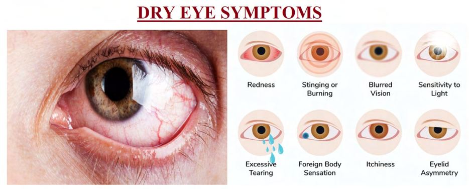
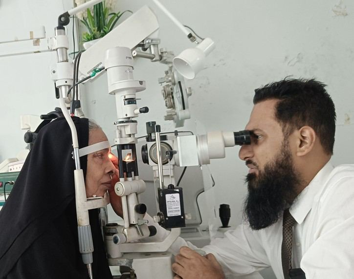

# Dry Eyes

Source: `Eye Diseases & Conditions-compressed.pdf`, pages 421-426.

## Images

## Extracted text

<!-- Page 421 -->
Dry Eyes
Overview
Dry eyes occur when your eyes don’t produce enough tears or when the tears evaporate too
quickly. This condition, also known as dry eye syndrome or keratoconjunctivitis sicca, affects
millions of people worldwide and can range from mild irritation to chronic discomfort. While it
isn’t usually vision-threatening, it can significantly impact daily life and, if left untreated, may
lead to damage on the surface of the eye.
Symptoms and Causes
Common Symptoms:
Stinging or burning sensation
Gritty or sandy feeling in the eyes
Redness or inflammation
Sensitivity to light (photophobia)
Blurred vision or fluctuating clarity
Eye fatigue, especially after screen use
Watery eyes (paradoxical tearing due to irritation)
Difficulty wearing contact lenses
Primary Causes:
Reduced tear production (aqueous-deficient dry eye): Often age-related or linked to
conditions like Sjögren’s syndrome.
Increased tear evaporation (evaporative dry eye): Often caused by Meibomian gland
dysfunction, eyelid issues, or environmental factors.

<!-- Page 422 -->
Long-term screen use: Reduced blinking rate can disrupt tear film.
Certain medications: Antihistamines, antidepressants, and blood pressure drugs can
reduce tear flow.
Environmental factors: Wind, dry air, smoke, and pollution.
Hormonal changes: Particularly during menopause.
Contact lens use or previous eye surgeries like LASIK.
Diagnosis and Tests
An eye specialist will perform a detailed eye exam and may use specific tests to assess tear
quality and quantity:
Slit-lamp exam: Inspects the eye surface and tear film.
Schirmer’s test: Measures how much tear your eyes produce.
Tear breakup time (TBUT): Evaluates how long the tear film stays stable.
Ocular surface staining: Uses dyes to detect damage or dryness.
Meibography: Checks Meibomian gland health (for evaporative dry eye).
Accurate diagnosis helps determine the type and cause of dry eyes for effective treatment.
Management and Treatment
Non-Medical Remedies:
Artificial tears/lubricating eye drops: Provide temporary relief.
Warm compresses: Help open up blocked oil glands.
Eyelid hygiene: Gentle cleansing to prevent gland dysfunction.
Environmental modifications: Using humidifiers, avoiding fans or smoke.
Medical Treatments:
Prescription eye drops: Such as cyclosporine (Restasis) or lifitegrast (Xiidra) to reduce
inflammation.
Punctal plugs: Tiny devices inserted into tear ducts to retain moisture.
Meibomian gland expression or LipiFlow: Treatments for oil gland dysfunction.
Omega-3 supplements: May support tear quality.
Types & Surgery
Types of Dry Eye:
1. Aqueous-deficient dry eye – Caused by insufficient tear production.
2. Evaporative dry eye – Tears evaporate too quickly, often from gland dysfunction.
3. Mixed dry eye – A combination of both.

<!-- Page 423 -->
Surgical Interventions:
Punctal occlusion surgery: A more permanent alternative to temporary plugs.
Amniotic membrane therapy: Used for severe surface damage.
Tarsorrhaphy: In extreme cases, partially sewing the eyelids together to reduce tear
evaporation.
Surgery is typically reserved for chronic or severe cases unresponsive to conventional treatment.
Complicated Dry Eyes
Untreated or severe dry eyes can lead to:
Corneal ulcers or abrasions
Chronic eye inflammation
Conjunctival scarring
Vision impairment or light sensitivity
Increased risk of infection
These complications underscore the importance of early diagnosis and consistent care.
Dry Eyes in Adults
Dry eyes are especially common in adults due to:
Aging (especially over 50)
Workplace exposure (air conditioning, screens)
Hormonal changes in women
Systemic illnesses like rheumatoid arthritis
Adult treatment plans often involve both lifestyle changes and medical therapy.
Dry Eyes in Children
Though less common, children can develop dry eyes due to:
Excessive screen time
Allergies or eye rubbing
Autoimmune disorders
Certain medications
Parents should watch for signs like frequent blinking, eye rubbing, or complaints of discomfort,
and consult a pediatric eye specialist when needed.
Prevention

<!-- Page 424 -->
Preventive measures can significantly reduce the risk of developing dry eyes or worsening
existing symptoms:
Take regular screen breaks (20-20-20 rule)
Use protective eyewear in windy or dry environments
Stay hydrated
Avoid smoke and air pollutants
Maintain eyelid hygiene
Use humidifiers in dry indoor environments
Early lifestyle changes go a long way in preventing chronic symptoms.
Outlook / Prognosis
Dry eye is a chronic but manageable condition. While not typically curable, most people find
long-term relief through a combination of treatments and daily care. The key is early
intervention, especially before complications develop.
With personalized management, many patients regain comfort and can resume normal visual
tasks without major limitations.
Living with Dry Eyes
Managing dry eyes daily involves:
Keeping up with prescribed drops or treatments
Adjusting screen habits and lighting
Monitoring for symptom flare-ups
Attending regular eye checkups
Using assistive tools like humidifiers or moisture goggles
Support from vision specialists and consistency in care help maintain quality of life and prevent
deterioration.

<!-- Page 425 -->
Frequently Asked Questions (FAQs)
Q1: Can dry eyes be cured?
A: Dry eyes usually can’t be cured, but symptoms can be effectively controlled in most cases.
Q2: How often can I use artificial tears?
A: Preservative-free drops can be used as often as needed. Preserved drops should be limited to 3
–4 times a day.
Q3: Why do my eyes water if they’re dry?
A: Excess tearing is a reflex to irritation caused by dryness—these tears lack the lubricating oils
that prevent evaporation.
Q4: Are dry eyes dangerous?
A: Not immediately, but long-term untreated dry eyes can damage the cornea and affect vision.
Q5: Can diet help with dry eyes?
A: Yes. Omega-3 fatty acids from fish oil or flaxseed can improve tear quality.
