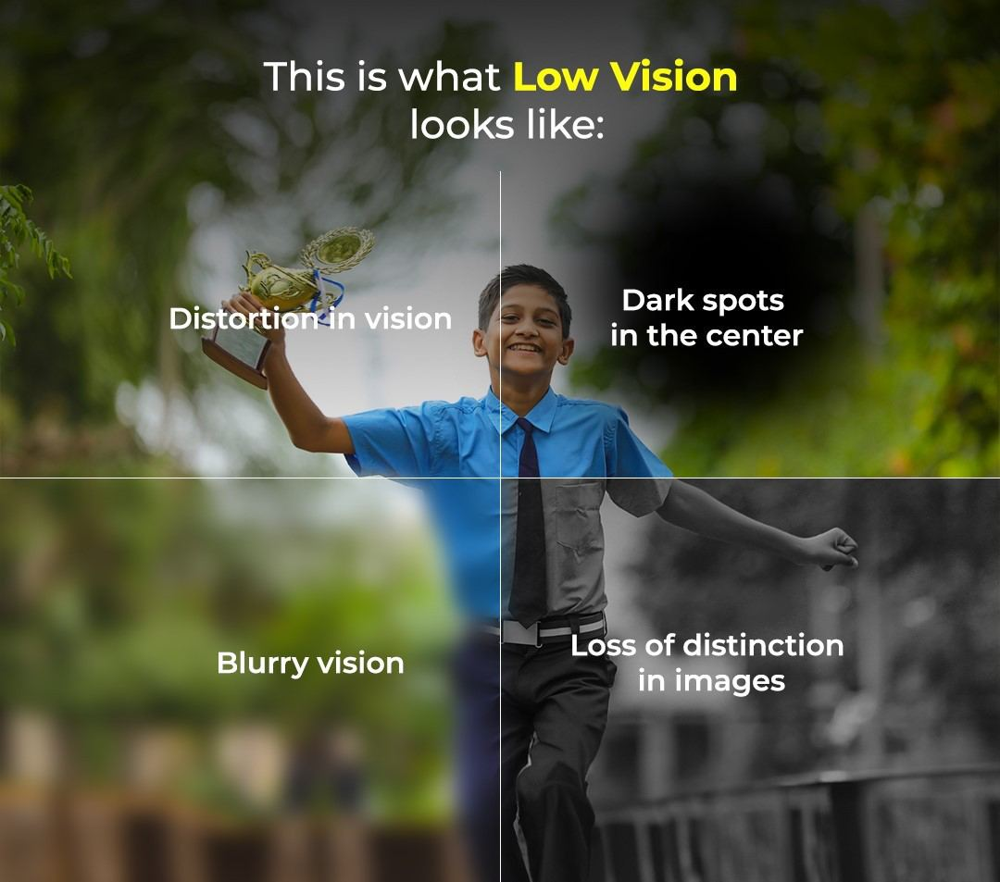

# Low Vision

Source: `Eye Diseases & Conditions-compressed.pdf`, pages 426-431.

## Images

## Extracted text

<!-- Page 426 -->
Low Vision
Overview
Low vision refers to a significant visual impairment that cannot be fully corrected with standard
glasses, contact lenses, medication, or surgery. People with low vision may struggle with
everyday tasks like reading, driving, recognizing faces, or navigating their surroundings—even
with corrective lenses. Unlike complete blindness, low vision allows for some usable sight and
can affect people of any age, although it’s more common in older adults.
Symptoms and Causes

<!-- Page 427 -->
Common Symptoms:
Blurry or hazy vision
Difficulty reading or writing, even with glasses
Trouble recognizing faces
Sensitivity to light or glare
Loss of peripheral (side) or central vision
Need for extra light when doing close-up tasks
Challenges with contrast or color distinction
Primary Causes:
Age-related macular degeneration (AMD) – A leading cause of central vision loss
Glaucoma – Gradual loss of peripheral vision
Diabetic retinopathy – Damage to retinal blood vessels
Retinitis pigmentosa – Inherited disorder causing night and peripheral vision loss
Cataracts – Clouding of the eye’s lens
Optic nerve damage – From injury, disease, or tumors
Stroke or brain injury affecting the visual processing centers
Low vision can also result from congenital conditions, premature birth, or severe eye infections.
Diagnosis and Tests
A thorough eye evaluation by an optometrist or ophthalmologist is essential for diagnosing low
vision.
Diagnostic Tools:
Visual acuity test: Measures clarity of vision (e.g., reading letters on an eye chart)
Visual field test: Assesses peripheral vision
Contrast sensitivity test: Evaluates ability to distinguish objects from their background
Fundus photography and OCT scans: Imaging tools used to assess the retina and optic
nerve
Functional vision assessment: Determines how vision impacts daily life
Early diagnosis helps identify underlying causes and suitable low vision aids.
Management and Treatment
While low vision cannot usually be reversed, various strategies can enhance visual function and
independence.

<!-- Page 428 -->
Vision Rehabilitation:
Low vision aids: Magnifiers, high-powered reading glasses, telescopic lenses, and digital
magnifiers
Assistive technology: Screen readers, talking watches, voice-activated devices, and apps
Training in adaptive skills: Orientation and mobility training, daily task modifications
Occupational therapy: Helps adjust the home and daily routines to accommodate vision
loss
Medical and Surgical Options:
Managing underlying diseases like glaucoma, diabetes, or AMD may prevent further
loss
Surgery (e.g., cataract removal) can improve remaining vision in some cases
Types & Surgery
Types of Low Vision:
1. Central vision loss – Difficulty seeing in the center of your view (common in AMD)
2. Peripheral vision loss – "Tunnel vision" seen in glaucoma or retinitis pigmentosa
3. Night blindness – Poor vision in low light conditions
4. Blurry or hazy vision – From uncorrectable refractive issues or corneal diseases
5. Reduced contrast sensitivity – Hard to distinguish objects from similar backgrounds
Surgical Interventions:
Cataract surgery: Can partially restore vision in coexisting conditions
Retinal procedures: May stabilize conditions like diabetic retinopathy or retinal
detachment
Implantable telescopic lenses: Used in some advanced AMD cases to magnify central
vision
Surgery doesn't cure low vision but may support other treatments.
Complicated Low Vision
Complications of low vision include:
Loss of independence
Increased risk of falls or injuries
Social isolation or depression
Learning delays in children
Difficulty managing chronic health issues due to reduced visual input
Addressing the psychological and social aspects is just as important as physical treatment.

<!-- Page 429 -->
Low Vision in Adults
Low vision is most prevalent among adults over 60 and can significantly impact their lifestyle:
Reading, driving, and using electronic devices become more difficult
Medication management and cooking may require adaptations
Social withdrawal and frustration are common but treatable with support and tools
Routine eye exams are crucial to detect vision loss early and adjust care accordingly.
Low Vision in Children
Children can be born with or develop low vision due to:
Congenital eye diseases
Prematurity
Neurological conditions or eye injuries
Inherited retinal conditions
Early intervention through low vision therapy, special education services, and family support
is essential for optimal development and academic success.
Prevention
Not all forms of low vision can be prevented, but many risk factors can be reduced:
Manage chronic conditions like diabetes and hypertension
Protect your eyes from injury and UV light
Quit smoking
Eat a vision-friendly diet rich in leafy greens and omega-3s
Get regular eye exams – especially if you’re over 40 or have a family history of eye
disease
Outlook / Prognosis
While low vision is typically permanent, early support and tailored rehabilitation significantly
improve quality of life. Vision often stabilizes with proper care, and many individuals adapt
successfully using assistive tools, training, and community support.
With modern advancements, those with low vision can live independently, work, and pursue
hobbies.
Living with Low Vision
Adapting to life with low vision involves:

<!-- Page 430 -->
Using magnifying tools and contrast-enhancing devices
Organizing your environment with high-contrast labels and lighting
Accessing vision rehabilitation services
Connecting with support groups
Exploring hobbies that don’t rely heavily on visual input
A positive outlook and access to the right tools can empower people to lead fulfilling lives
despite vision loss.
Frequently Asked Questions (FAQs)
Q1: Is low vision the same as legal blindness?
A: Not necessarily. Low vision includes a range of visual impairments. Legal blindness is a
specific level of visual acuity or field loss, often within low vision classifications.

<!-- Page 431 -->
Q2: Can glasses fix low vision?
A: Standard glasses typically can’t fully correct low vision, but specialized lenses and low vision
aids can help.
Q3: Is low vision always permanent?
A: Most forms of low vision are permanent, though early detection and treatment may improve
or preserve remaining vision.
Q4: Are there devices to help with reading and daily tasks?
A: Yes, there are many—from handheld magnifiers to text-to-speech readers and wearable
technology.
Q5: Can children with low vision go to regular school?
A: Yes, with appropriate support, including IEPs (Individualized Education Plans), assistive
tech, and vision services.
