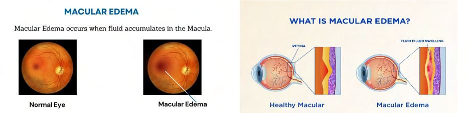

# Macular Edema

Source: `Eye Diseases & Conditions-compressed.pdf`, pages 431-437.

## Images

## Extracted text

<!-- Page 431 -->
Macular Edema
Overview
Macular Edema is a condition where fluid accumulates in the macula, the central part of the
retina responsible for sharp, detailed vision. This fluid buildup causes the macula to swell and
distorts vision, making it difficult to see fine details, read, or recognize faces. Macular edema can
develop due to various underlying conditions, including diabetes, retinal vein occlusion, or post-
surgery complications. While it often affects adults, it can also be seen in children, especially
when there are specific underlying eye issues.
Symptoms and Causes

<!-- Page 432 -->
Common Symptoms:
Blurry or distorted vision
Difficulty seeing fine details or reading
Colors appearing washed out or less vibrant
Straight lines appearing wavy
Reduced central vision (difficulty with tasks requiring sharp vision)
Primary Causes:
1. Diabetic Retinopathy: High blood sugar can damage the blood vessels in the retina,
causing leakage and fluid buildup.
2. Retinal Vein Occlusion (RVO): A blockage in the retinal veins can cause fluid
accumulation in the macula.
3. Post-surgery complications: After cataract surgery, macular edema can develop due to
inflammation.
4. Uveitis: Inflammation of the middle layer of the eye can lead to fluid leakage in the
macula.
5. Age-related Macular Degeneration (AMD): Wet AMD causes blood vessels to leak
fluid and proteins into the macula.
6. Eye trauma or injury: Direct damage to the retina can result in fluid buildup.
7. Inherited conditions: Certain genetic factors can contribute to macular edema.
Diagnosis and Tests
To diagnose macular edema, an eye care professional will conduct a thorough eye exam,
including:
Comprehensive eye exam: Includes checking visual acuity and examining the retina.
Fluorescein Angiography: A dye is injected into the bloodstream, and a camera takes
pictures of the retina to show areas of leakage or fluid buildup.
Optical Coherence Tomography (OCT): This imaging test provides detailed, cross-
sectional images of the retina, helping to detect swelling in the macula.
Fundus photography: Captures images of the retina and macula to assess changes and
swelling.
Visual Field Test: Evaluates the extent of vision loss, especially in the central vision
area.
These tests help confirm the presence of macular edema and pinpoint the underlying cause.
Management and Treatment

<!-- Page 433 -->
The goal of treating macular edema is to reduce the swelling, preserve vision, and address the
underlying cause.
Treatment Options:
1. Anti-VEGF Injections: Medications like ranibizumab (Lucentis) or aflibercept (Eylea)
are injected into the eye to block the vascular endothelial growth factor (VEGF), a
protein that causes abnormal blood vessel growth and leakage.
2. Steroid Injections or Implants: Corticosteroids can reduce inflammation and fluid
buildup in the macula.
3. Laser Therapy: Focal laser treatment can help seal leaking blood vessels, preventing
further fluid leakage.
4. Cataract Surgery: If macular edema develops after cataract surgery, careful
management and medication may be used to control swelling.
5. Diabetes Management: Controlling blood sugar levels is critical in preventing diabetic
macular edema (DME).
Lifestyle Changes:
Control underlying conditions such as diabetes and hypertension.
Follow a healthy diet rich in antioxidants and omega-3 fatty acids.
Quit smoking: Smoking can worsen retinal conditions.
In some cases, combination therapies of the above methods are used for better results.
Types & Surgery
Types of Macular Edema:
1. Diabetic Macular Edema (DME): The most common cause of macular edema, linked to
uncontrolled diabetes.
2. Cystoid Macular Edema (CME): Fluid-filled cysts form in the macula, often due to
inflammation or retinal vein occlusion.
3. Post-surgical Macular Edema: Occurs after cataract surgery, primarily due to
inflammation.
4. Uveitic Macular Edema: Associated with uveitis, inflammation in the eye’s middle
layer.
Surgical Options:
Vitrectomy: In severe cases, the vitreous gel in the eye may be removed to allow better
access to the macula for treatment.
Retinal Surgery: If macular edema is associated with retinal conditions like diabetic
retinopathy or retinal vein occlusion, surgical intervention may be necessary.

<!-- Page 434 -->
Laser Photocoagulation: Uses a laser to shrink blood vessels that are leaking fluid into
the macula.
Complicated Macular Edema
If left untreated, macular edema can lead to serious complications:
Permanent vision loss: Prolonged swelling can cause irreversible damage to the retinal
cells, resulting in significant vision impairment.
Macular scarring: Inflammation and fluid buildup can lead to scarring in the macula,
affecting central vision.
Glaucoma: Increased eye pressure due to complications from macular edema or
treatment may lead to glaucoma.
Retinal detachment: Severe cases of macular edema can cause changes in the retina,
leading to retinal detachment.
Early detection and treatment are key to preventing complications.
Macular Edema in Adults
Macular edema primarily affects adults, especially those with:
Diabetes: Diabetic macular edema (DME) is the leading cause of vision impairment in
people with diabetes.
Age-related macular degeneration (AMD): Wet AMD leads to abnormal blood vessel
growth and fluid leakage in the macula.
Retinal vein occlusion: More common in older adults, this condition leads to a blockage
in the retinal veins and fluid accumulation in the macula.
Regular eye exams and managing underlying conditions are essential for preventing and
managing macular edema in adults.
Macular Edema in Children
Although rare, macular edema can occur in children due to:
Inherited retinal diseases: Genetic conditions like Stargardt disease or retinitis
pigmentosa can cause fluid buildup in the macula.
Uveitis: Inflammation in the eye can result in macular edema.
Trauma or injury: Eye injuries can cause swelling in the macula.

<!-- Page 435 -->
Prompt diagnosis and treatment are critical in children, as macular edema can affect their visual
development.
Prevention
Preventing macular edema focuses on managing the underlying conditions that contribute to its
development:
Control diabetes: Proper blood sugar management can help prevent diabetic macular
edema.
Monitor eye health: Regular eye exams, especially for those at risk (e.g., diabetics,
people with retinal conditions), can catch macular edema early.
Healthy lifestyle: Maintain a healthy diet, avoid smoking, and stay active to support
overall eye health.
Blood pressure control: Hypertension can contribute to retinal diseases, including
macular edema.
Outlook / Prognosis
The outlook for macular edema depends on the underlying cause, the extent of the damage, and
the effectiveness of treatment:
Diabetic Macular Edema (DME): With proper diabetes management and timely
treatment, the progression of DME can be slowed, and vision can often be preserved.
Post-surgical Macular Edema: This typically resolves with proper medication and care.
Retinal Vein Occlusion: The prognosis varies based on the severity, but treatments like
anti-VEGF injections and laser therapy can significantly improve vision.
Even though macular edema may not be completely reversible, appropriate intervention can
preserve vision and prevent further damage.
Living with Macular Edema
Living with macular edema involves ongoing management and adjustments to maintain daily
functioning:
Vision aids: Magnifiers, large print, or text-to-speech technology can assist with reading
and other tasks.
Regular monitoring: Frequent eye exams help track the condition and adjust treatments
as necessary.

<!-- Page 436 -->
Support systems: Engaging with low vision support groups and rehabilitation services
can provide emotional and practical support.
Lifestyle changes: Following a healthy lifestyle, including managing underlying health
conditions, helps prevent further complications.
People with macular edema can often lead full, active lives with proper care and support.
Frequently Asked Questions (FAQs)
Q1: Can macular edema be cured?
A: There is no definitive cure for macular edema, but treatments can reduce swelling, preserve
vision, and slow the condition’s progression.
Q2: How long does it take to recover from macular edema treatment?
A: Recovery time varies depending on the treatment. For example, after anti-VEGF injections,
improvement can take a few weeks to months.
Q3: Can macular edema cause permanent vision loss?
A: Yes, if left untreated, macular edema can lead to permanent vision impairment due to retinal
damage or scarring.

<!-- Page 437 -->
Q4: Can lifestyle changes prevent macular edema?
A: While you cannot completely prevent macular edema, managing risk factors such as diabetes,
blood pressure, and maintaining a healthy diet can help reduce the risk.
Q5: Is macular edema painful?
A: Macular edema typically does not cause pain but can lead to blurry or distorted vision.
