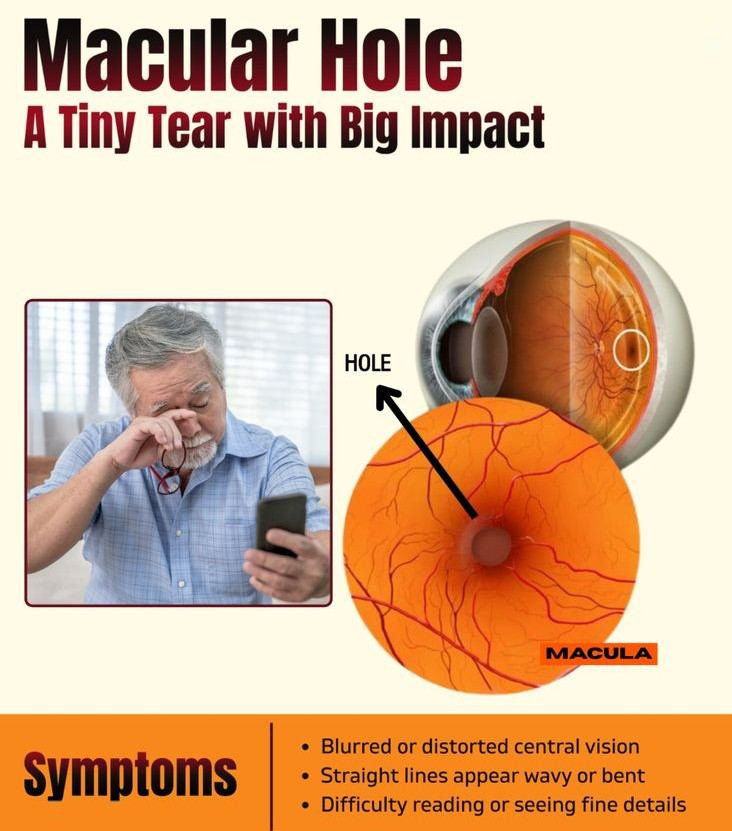
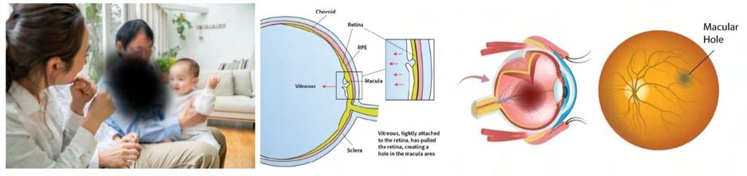

# Macular Hole

Source: `Eye Diseases & Conditions-compressed.pdf`, pages 437-443.

## Images

## Extracted text

<!-- Page 437 -->
Macular Hole

<!-- Page 438 -->
Overview
A macular hole is a small tear or break in the macula, the central part of the retina responsible
for sharp, central vision. This condition can result in distorted or blurred central vision,
significantly impacting daily activities such as reading, driving, or recognizing faces. Macular
holes most often affect individuals aged 60 and older, but they can also occur in younger people
due to trauma or other factors. If untreated, a macular hole can lead to permanent central vision
loss.
Symptoms and Causes
Common Symptoms:
Blurry or distorted central vision: You may notice a dark or blurry spot in the center of
your vision.

<!-- Page 439 -->
Difficulty with tasks requiring sharp vision: Activities like reading, sewing, or using a
computer may become challenging.
Visual distortions: Straight lines may appear wavy or broken, especially when reading
or looking at detailed objects.
Reduced visual acuity: The ability to see fine details diminishes, making it difficult to
perform everyday tasks.
Primary Causes:
Age-related changes: The most common cause of macular holes is related to aging. As
the vitreous (gel-like substance) in the eye shrinks, it can pull away from the macula,
leading to a tear or hole.
Eye trauma: Injury to the eye can cause damage to the macula, resulting in a hole.
High myopia (nearsightedness): People with severe nearsightedness are at higher risk of
developing a macular hole.
Diabetic retinopathy: Diabetic eye disease can increase the likelihood of developing a
macular hole, especially when associated with macular edema.
Previous eye surgery: In rare cases, cataract surgery can lead to macular hole formation.
Diagnosis and Tests
A thorough eye exam by an ophthalmologist is necessary to diagnose a macular hole. Several
diagnostic tests help confirm the condition:
Visual acuity test: Measures the sharpness of central vision, which is usually decreased
in macular hole patients.
Fundus examination: The eye doctor will use a special instrument to examine the retina
and check for any holes or tears.
Optical coherence tomography (OCT): This non-invasive imaging test provides
detailed cross-sectional images of the retina, helping to identify the size and location of
the macular hole.
Fluorescein angiography: In some cases, a dye is injected into the bloodstream to
capture images of the blood vessels in the retina and rule out other conditions.
Amsler grid test: A simple grid used to detect visual distortions or blurriness that may
indicate a macular hole.
Management and Treatment
The treatment for macular holes largely depends on the severity of the hole and how much it has
affected vision.

<!-- Page 440 -->
Non-Surgical Treatments:
For small macular holes or those that are in early stages, your doctor may recommend close
monitoring. In some cases, special treatments may include:
Ocular injections: Sometimes, injections of medications like anti-VEGF (vascular
endothelial growth factor inhibitors) are used to reduce inflammation or prevent
abnormal blood vessel growth, although these are less commonly used for macular holes.
Surgical Treatment:
The most effective treatment for macular holes is surgery. Vitrectomy is the primary surgical
option:
Vitrectomy: This procedure involves removing the vitreous gel from the eye to relieve
any pulling on the macula. The surgeon may then use a gas bubble to help close the hole.
Internal limiting membrane (ILM) peeling: During a vitrectomy, the surgeon may also
remove the inner layer of the retina (ILM) to help facilitate hole closure.
Post-surgery positioning: After surgery, patients often need to maintain a face-down
position for several days to help the gas bubble apply pressure to the macular hole and
promote healing.
In some cases, the hole may not fully close, but surgery can significantly improve vision,
especially if done early.
Types & Surgery
Types of Macular Holes:
1. Full-thickness macular hole: A hole that goes completely through the macula, causing
significant vision loss.
2. Partial-thickness macular hole (or macular pseudohole): A less severe form, where
the hole does not go all the way through the macula but still causes vision distortion.
Surgical Approach:
Vitrectomy remains the standard approach for treating macular holes. The goal of
surgery is to remove the vitreous gel to reduce the traction on the retina and allow the
macula to heal properly.
In some cases, gas or silicone oil may be injected into the eye to help the retina heal by
applying pressure to the macula.

<!-- Page 441 -->
Complicated Macular Hole
While macular hole surgery is highly effective, complications can arise:
Incomplete closure: In some cases, the macular hole may not completely close,
especially if the surgery is delayed.
Retinal detachment: A rare but serious complication where the retina detaches from the
back of the eye after surgery.
Increased eye pressure (glaucoma): Surgery may lead to an increase in intraocular
pressure, requiring management.
Cataract formation: After a vitrectomy, cataracts can develop, particularly in older
adults.
Careful monitoring and follow-up with your ophthalmologist are essential after surgery to detect
and address complications early.
Macular Hole in Adults
Macular holes are most common in older adults, typically those over 60. Age-related vitreous
changes are a significant risk factor for macular hole formation. Adults with high myopia, retinal
diseases, or those who have had eye trauma or surgery are also at increased risk.
The impact on vision can range from mild to severe, and while some people notice gradual
vision loss, others may experience more sudden and noticeable changes.
Macular Hole in Children
Macular holes are extremely rare in children, but they can occur due to:
Trauma: Eye injuries can lead to retinal damage and macular hole formation.
Congenital conditions: Some rare inherited retinal disorders may cause macular holes in
childhood.
High myopia: Although less common in children, severe nearsightedness may increase
the risk.
In children, macular holes may affect the development of central vision, so early detection and
treatment are crucial for preserving vision and quality of life.

<!-- Page 442 -->
Prevention
Since macular holes are often age-related or linked to trauma, prevention focuses on minimizing
known risk factors:
Protect your eyes from injury: Wear protective eyewear when participating in sports or
activities that pose a risk to the eyes.
Control myopia: Regular eye exams can help detect and manage high nearsightedness.
Healthy lifestyle: A balanced diet, managing underlying health conditions like diabetes,
and avoiding smoking may help maintain overall eye health.
Unfortunately, macular holes related to aging or genetic factors cannot be fully prevented.
Outlook / Prognosis
The prognosis for macular hole treatment depends on several factors:
Size of the hole: Smaller holes are more likely to close successfully with surgery, while
larger holes may require more intensive treatment.
Timeliness of treatment: Early intervention significantly increases the chances of a
successful outcome. Delaying treatment may result in permanent vision loss.
Post-surgery recovery: Following surgery and adhering to post-operative instructions
(such as maintaining a face-down position) is crucial for optimal healing.
While some degree of vision loss may persist even after surgery, many individuals experience
significant improvement in their central vision.
Living with Macular Hole
Living with a macular hole can be challenging, especially if vision loss affects daily activities.
However, with proper treatment and rehabilitation, many individuals adapt and lead fulfilling
lives:
Vision aids: Magnifiers, larger print books, and screen readers can help with tasks like
reading.
Low vision rehabilitation: Working with specialists to learn adaptive techniques can
improve independence.
Mental and emotional health: Coping with vision changes can be difficult, and joining
support groups or seeking counseling can help.

<!-- Page 443 -->
Post-surgery, many people recover significant vision and resume their daily activities, though
follow-up care is essential to monitor for any complications.
Frequently Asked Questions (FAQs)
Q1: Can macular holes heal on their own?
A: No, macular holes typically do not heal on their own. Surgery is often required to close the
hole and prevent further vision loss.
Q2: How long does recovery take after macular hole surgery?
A: Recovery time varies but generally takes several weeks to a few months. It’s important to
follow your doctor’s instructions and attend follow-up visits.
Q3: Will I need to stay face-down after surgery?
A: Yes, after surgery, you will likely be instructed to maintain a face-down position to ensure
that the gas bubble presses against the macula to help close the hole.
Q4: Can a macular hole recur?
A: Once successfully treated with surgery, macular holes rarely recur, but complications like
retinal detachment can occur in some cases.
Q5: What are the long-term effects of a macular hole?
A: With timely surgery, many patients experience improved vision, but some may continue to
have permanent visual distortions or a blind spot in the center of their vision.
