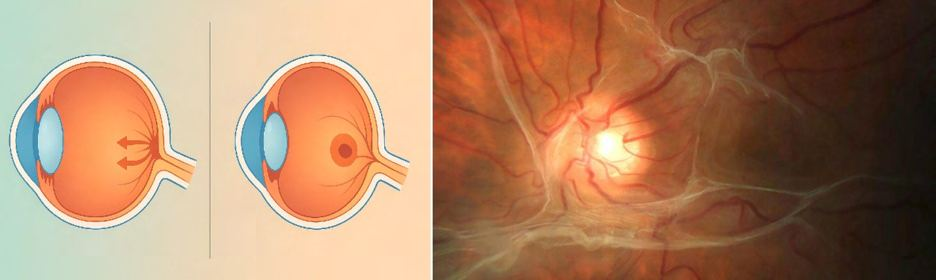

# Macular Pucker

Source: `Eye Diseases & Conditions-compressed.pdf`, pages 444-449.

## Images

## Extracted text

<!-- Page 444 -->
Macular Pucker
Overview
Macular pucker, also known as epiretinal membrane (ERM), occurs when a thin layer of scar
tissue forms on the surface of the macula, the central part of the retina. This membrane can
contract and cause the macula to wrinkle, leading to visual distortions or blurriness. While
macular pucker often develops with age, it can also be caused by other factors such as retinal
conditions or eye surgery. Though it primarily affects adults, it can occasionally occur in
children due to specific retinal conditions. The condition is generally non-painful but can
significantly affect central vision, making it difficult to perform tasks requiring sharp vision like
reading or driving.
Symptoms and Causes
Common Symptoms:
Blurry or distorted vision: Central vision becomes unclear or wavy, often noticed when
reading or viewing objects straight ahead.
Difficulty with fine detail: Tasks like reading, knitting, or working on the computer may
become difficult due to blurred vision.
Visual distortions: Straight lines may appear wavy or broken, particularly when looking
at text or detailed images.
Decreased visual acuity: Reduced clarity of central vision, making it challenging to see
faces or objects clearly.
Primary Causes:
Age-related changes: The most common cause of macular pucker is the natural aging
process. As the vitreous (the gel-like substance inside the eye) shrinks and pulls away

<!-- Page 445 -->
from the retina, it can create small tears that lead to the formation of a membrane on the
macula.
Retinal conditions: Conditions like diabetic retinopathy, retinal vein occlusion, or uveitis
can increase the likelihood of developing macular pucker due to inflammation or damage
to the retina.
Eye surgery: Surgeries such as cataract surgery or vitrectomy can cause the formation of
scar tissue on the macula, resulting in macular pucker.
Retinal trauma: Injury to the retina or eye can also lead to macular pucker.
Inherited conditions: Some genetic retinal conditions can predispose individuals to
macular pucker.
Diagnosis and Tests
An ophthalmologist will perform several tests to diagnose macular pucker and assess the extent
of the condition:
Visual acuity test: This simple test evaluates the sharpness of your vision, which is
usually affected by macular pucker.
Fundus examination: The doctor will use special tools to examine the retina and check
for any signs of scarring or membrane formation on the macula.
Optical coherence tomography (OCT): This non-invasive imaging test provides
detailed images of the retina, allowing the doctor to see the extent of the macular pucker
and assess whether the membrane is causing distortion or damage to the macula.
Fluorescein angiography: In some cases, a dye is injected into the bloodstream to take
images of the retina and evaluate any blood vessel changes or retinal abnormalities.
Amsler grid test: This simple test helps detect visual distortions that are often associated
with macular pucker, such as wavy lines or blurred vision.
Management and Treatment
Non-Surgical Treatment:
In mild cases of macular pucker, the condition may not require surgery. Management strategies
include:
Monitoring: Regular follow-up appointments with your eye doctor to track the
progression of the condition and determine if the pucker is affecting vision.
Vision aids: Magnifiers, large-print books, or digital devices with zoom functions can
help with reading and other detailed tasks.
Diabetic management: If macular pucker is caused by diabetic retinopathy, controlling
blood sugar levels is crucial in preventing further damage to the retina.

<!-- Page 446 -->
Surgical Treatment:
In cases where macular pucker significantly affects vision, surgery may be recommended:
Vitrectomy with membrane peeling: The primary surgical procedure for macular
pucker is vitrectomy, which involves removing the vitreous gel from the eye. The
surgeon then carefully peels away the membrane from the surface of the macula,
relieving the distortion.
Post-operative care: After surgery, patients often need to maintain a specific head
position (e.g., face-down) for several days to help the retina heal properly. Some patients
may also need to use eye drops to prevent infection or inflammation.
Types & Surgery
Types of Macular Pucker:
1. Idiopathic Macular Pucker: This is the most common form, occurring due to natural
aging and changes in the vitreous gel.
2. Secondary Macular Pucker: This type occurs due to other underlying conditions, such
as retinal vein occlusion, diabetic retinopathy, retinal trauma, or after cataract surgery.
Surgical Approaches:
Vitrectomy with membrane peeling: As mentioned, this is the most common surgical
approach. It involves removing the vitreous gel to reduce pressure on the retina and
peeling away the epiretinal membrane to relieve distortion.
Gas bubble injection: In some cases, a gas bubble is injected into the eye to help hold
the retina in place after surgery and promote healing.
Complicated Macular Pucker
While many cases of macular pucker are manageable, complications can arise if the condition is
left untreated:
Permanent vision loss: In severe cases, untreated macular pucker can cause permanent
damage to the macula, leading to irreversible central vision loss.
Retinal tears or detachment: If the epiretinal membrane pulls too forcefully on the
retina, it can cause retinal tears or detachment, which is a medical emergency.
Glaucoma: In rare cases, macular pucker can lead to increased eye pressure, contributing
to glaucoma.
Cataract formation: Vitrectomy or other surgeries can sometimes lead to cataract
development, particularly in older adults.

<!-- Page 447 -->
Early detection and surgical intervention can help prevent complications and preserve vision.
Macular Pucker in Adults
Macular pucker is most commonly seen in adults, particularly in individuals over the age of 60.
The condition is often related to the natural aging process when the vitreous gel begins to shrink
and detach from the retina. Adults with conditions like diabetes or retinal vein occlusion may
also have an increased risk of developing macular pucker. Although age is a primary factor,
trauma to the eye or previous surgeries can also increase the likelihood of the condition.
Macular Pucker in Children
Macular pucker is extremely rare in children, but it can occur due to:
Inherited retinal diseases: Genetic conditions like retinitis pigmentosa or Stargardt
disease can predispose children to macular pucker.
Retinal trauma: Severe eye injuries can result in scar tissue formation on the macula.
Retinal surgeries: Children who undergo surgery for other eye conditions may develop
macular pucker as a secondary complication.
Because macular pucker in children is uncommon, early diagnosis and treatment are essential for
preventing long-term vision problems.
Prevention
While it’s impossible to fully prevent macular pucker, the following steps can help reduce the
risk:
Eye protection: Wear protective eyewear to prevent trauma to the eye, especially during
sports or activities that could cause injury.
Control underlying conditions: Managing diabetes, high blood pressure, or other retinal
diseases can help reduce the risk of macular pucker.
Regular eye exams: Routine eye exams can help detect macular pucker early, especially
for individuals at higher risk, such as those over 60 or with a history of retinal conditions.
Outlook / Prognosis
The outlook for individuals with macular pucker largely depends on the severity of the condition
and the timing of treatment:

<!-- Page 448 -->
Mild cases: If the macular pucker does not significantly impact vision, many people can
manage the condition with periodic monitoring and vision aids.
Surgical cases: Surgery (vitrectomy with membrane peeling) can lead to significant
improvement in vision, although full recovery is not always guaranteed. Some
individuals may still experience mild visual distortions or reduced clarity.
Long-term outcomes: If treated early, many individuals experience good outcomes after
surgery, but full recovery can take time, often requiring several months for vision to
stabilize.
Living with Macular Pucker
Living with macular pucker can be challenging, especially if central vision is affected. However,
many people adapt by:
Using vision aids: Magnifiers, screen readers, and large-print materials can help with
tasks like reading or using a computer.
Making lifestyle adjustments: People with macular pucker may need to modify certain
activities to accommodate changes in vision. This might include using larger text or
seeking assistance for tasks that require fine detail.
Emotional and psychological support: Coping with vision changes can be difficult.
Support groups and counseling can help individuals adjust to life with macular pucker
and provide valuable emotional support.

<!-- Page 449 -->
Frequently Asked Questions (FAQs)
Q1: Can macular pucker be treated without surgery?
A: Yes, in mild cases, macular pucker may not require surgery. Vision aids and monitoring by an
eye doctor are often sufficient to manage the condition.
Q2: How long does recovery take after surgery for macular pucker?
A: Recovery can take several weeks to months. Most people notice improvement in their vision
within a few months, but it may take time for the eye to heal completely.
Q3: Can macular pucker cause blindness?
A: While macular pucker can significantly affect central vision, it does not typically lead to total
blindness. However, untreated severe cases may result in permanent vision loss in the central
visual field.
Q4: Is macular pucker painful?
A: No, macular pucker does not usually cause pain. The primary symptom is visual distortion or
blurriness.
Q5: Can macular pucker return after surgery?
A: It is rare for macular pucker to return after successful surgery. However, complications like
retinal tears or detachment can occur, which may require further treatment.
