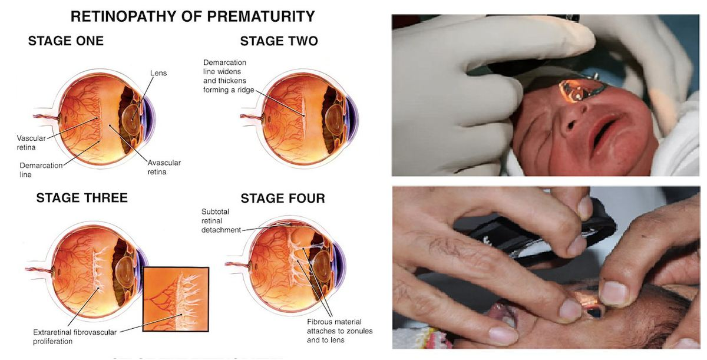
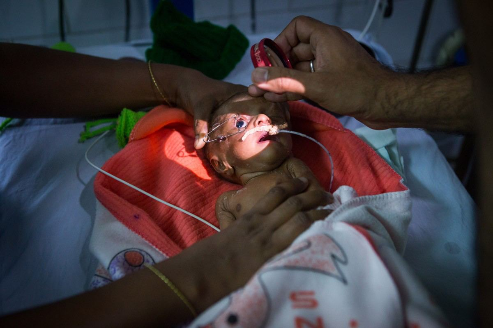

# Retinopathy of Prematurity (ROP

Source: `Eye Diseases & Conditions-compressed.pdf`, pages 449-456.

## Images

## Extracted text

<!-- Page 449 -->
Retinopathy of Prematurity (ROP

<!-- Page 450 -->
Overview
Retinopathy of Prematurity (ROP) is a serious eye condition that affects premature infants,
particularly those born before 31 weeks of gestation. ROP occurs when the blood vessels in the
retina, which is the light-sensitive layer at the back of the eye, develop abnormally. In the early
stages of the condition, abnormal blood vessels may grow and spread across the retina, leading to
potential damage. If left untreated, ROP can cause retinal detachment and even blindness. Early
detection and treatment are critical to preventing permanent vision loss.
Symptoms and Causes
Common Symptoms of ROP:
In the early stages of ROP, there may be no visible symptoms. However, as the condition
progresses, signs of visual impairment can become apparent, including:
Abnormal eye movement: Infants with ROP may exhibit abnormal eye movements,
such as jerky or rapid movement of the eyes.
Poor visual response: Infants with ROP may not respond to light or show normal
tracking behaviors.
Lazy eye (amblyopia): If the condition affects vision, one eye may appear to be weaker
than the other.
Delayed developmental milestones: As the condition progresses, the infant may exhibit
delays in visual tracking and following objects with their eyes.

<!-- Page 451 -->
Primary Causes of ROP:
Prematurity: The leading cause of ROP is being born prematurely, particularly those
born before 32 weeks of gestation.
Low birth weight: Infants weighing less than 3.3 pounds (1.5 kilograms) at birth are at
greater risk.
Oxygen therapy: Premature infants who are placed on oxygen to help with lung
development are at higher risk of developing ROP, especially if oxygen levels fluctuate.
Intrauterine factors: Certain maternal factors like high blood pressure, diabetes, or
infection during pregnancy can increase the likelihood of ROP.
Genetic factors: Some research suggests that a genetic predisposition may also play a
role in the development of ROP, although this is still being studied.
Diagnosis and Tests
Early diagnosis of ROP is critical for effective treatment. A thorough eye examination by a
pediatric ophthalmologist or retinal specialist is necessary to detect the condition.
Retinal examination: After birth, premature infants are typically screened for ROP
through a retinal examination. A special instrument called an ophthalmoscope is used to
examine the retina.
Indirect ophthalmoscopy: This test uses a light and magnifying lens to closely examine
the retina and assess the extent of abnormal blood vessel growth.
Fluorescein angiography: This imaging test uses a dye injected into the bloodstream to
capture detailed images of the retina and check for abnormal blood vessels or areas of
leakage.
Ultrasound: In some cases, an eye ultrasound may be used to evaluate the retina and
detect any signs of detachment or damage.
The screening process often begins within the first 4 to 6 weeks after birth and continues until
the blood vessels in the retina have fully developed.
Management and Treatment
The management of ROP depends on the severity of the condition and the stage of development.
In mild cases, observation may be sufficient, but more severe cases require intervention.
Non-Surgical Management:
Observation: In early stages of ROP, close monitoring is often all that is needed, as
some cases may resolve on their own as the infant grows and the retina matures.
Oxygen regulation: Oxygen therapy should be carefully controlled to avoid excessive
levels, which can contribute to the development of ROP. Maintaining stable oxygen
levels in preterm infants is crucial in preventing progression of the disease.

<!-- Page 452 -->
Surgical Treatments:
In advanced stages of ROP, where the retina is at risk of detaching, surgical intervention is often
necessary:
Laser therapy: Laser surgery is used to treat abnormal blood vessels by applying laser
beams to the peripheral areas of the retina. This treatment can help prevent retinal
detachment.
Cryotherapy: This procedure uses freezing temperatures to treat abnormal retinal blood
vessels.
Vitrectomy: If the retina has become detached or scar tissue is present, a vitrectomy
(surgical removal of the vitreous gel in the eye) may be necessary to reattach the retina.
Types & Surgery
ROP Stages:
ROP is classified into five stages, ranging from mild to severe:
1. Stage 1: Mild abnormal blood vessel growth. Usually resolves without treatment.
2. Stage 2: Moderate abnormal growth, but no immediate risk of retinal detachment.
3. Stage 3: Severe abnormal blood vessel growth, potentially leading to retinal detachment.
4. Stage 4: Partial retinal detachment. Vision loss may occur without treatment.
5. Stage 5: Total retinal detachment. This is the most severe stage and can result in
blindness.
Surgical Procedures:
Laser photocoagulation: This procedure uses a laser to create tiny burns in the retina,
which help prevent abnormal blood vessel growth and further damage.
Vitrectomy: In cases where the retina is detached or severely scarred, vitrectomy may be
used to remove the vitreous gel and reattach the retina. This is typically considered for
more advanced cases.
Complicated Retinopathy of Prematurity (ROP)
In severe cases, untreated or poorly managed ROP can lead to significant complications:
Retinal detachment: The most serious complication, leading to permanent vision loss if
not treated in time.
Glaucoma: Increased pressure in the eye can occur in advanced ROP, damaging the optic
nerve and causing further vision loss.
Strabismus: Abnormal eye alignment, also known as crossed eyes, can develop as a
result of ROP.

<!-- Page 453 -->
Amblyopia (lazy eye): Vision impairment due to the brain not properly processing visual
signals from one eye.
Early intervention and consistent follow-up care are essential to preventing these complications.
Retinopathy of Prematurity (ROP) in Adults
Adults who were born prematurely and developed ROP in infancy may experience long-term
vision issues related to their early eye development. Some of the potential outcomes in adulthood
include:
Decreased visual acuity: Adults who experienced severe ROP may suffer from poor
central vision or overall reduced vision quality.
Retinal scarring: Scar tissue from ROP can cause visual distortions or even retinal
detachment later in life.
Increased risk of retinal problems: People with a history of ROP may be at higher risk
for developing other retinal conditions, such as macular degeneration or retinal tears, as
they age.
Regular eye exams and preventive care are crucial for adults who were born prematurely to
monitor their eye health.
Retinopathy of Prematurity (ROP) in Children
While ROP primarily affects premature infants, it can also cause lasting effects in children who
were born prematurely. Some possible concerns include:
Vision problems: Children who had ROP may continue to have issues with central
vision, depth perception, and visual tracking.
Strabismus: This eye misalignment can cause difficulties with coordinated vision,
potentially requiring treatment such as corrective lenses or surgery.
Amblyopia: If one eye is affected more than the other, lazy eye can develop, requiring
vision therapy or corrective lenses to treat.
Delayed visual development: Children with significant visual impairment may
experience delays in meeting visual milestones, such as reading or recognizing faces.
Children born prematurely should be monitored regularly for potential vision issues and treated
promptly if any signs of vision impairment develop.
Prevention
Prevention of ROP mainly involves addressing the primary risk factors:

<!-- Page 454 -->
Prevent premature birth: The best way to prevent ROP is by preventing premature
birth. Proper prenatal care, regular check-ups, and managing conditions like diabetes or
high blood pressure during pregnancy can reduce the risk of preterm birth.
Careful management of oxygen therapy: Premature infants who need oxygen should
have their oxygen levels closely monitored to avoid fluctuations that could increase the
risk of ROP.
Early detection: Premature infants should be screened for ROP starting within the first 4
to 6 weeks of life to detect the condition early.
Outlook / Prognosis
The prognosis for infants with ROP varies depending on the stage of the condition, the treatment
received, and how early the condition was detected:
Mild cases: Most infants with mild ROP recover without treatment and develop normal
vision.
Severe cases: In more advanced stages, ROP can lead to permanent vision loss,
particularly if not treated promptly. However, laser therapy and vitrectomy can improve
the chances of preserving vision.
Long-term outcomes: With early detection and effective treatment, many children with
ROP can go on to lead relatively normal lives, although some may experience long-term
vision problems.
Living with Retinopathy of Prematurity
Living with ROP often involves regular monitoring and managing potential long-term effects on
vision:
Routine eye exams: Children and adults with a history of ROP should have regular eye
exams to monitor for any changes in vision and catch problems early.
Vision aids: Children and adults with ROP may benefit from magnifiers, special lenses,
or screen readers to assist with daily tasks and improve their quality of life.
Adaptations for school: Children with vision impairment may need accommodations at
school, such as larger print materials or seating adjustments to enhance their visual
access.

<!-- Page 455 -->
Frequently Asked Questions (FAQs)
Q1: Can ROP be fully cured?
A: While ROP can often be treated effectively, it is not always completely reversible. Early
treatment can prevent severe outcomes like retinal detachment, but some vision loss may still
occur, especially in advanced cases.
Q2: Is ROP preventable?
A: ROP is primarily related to premature birth, so preventing premature birth is the most
effective way to reduce the risk. Monitoring oxygen levels in preterm infants is also crucial.
Q3: What are the chances of an infant with ROP having permanent vision loss?
A: With early detection and appropriate treatment, the chances of permanent vision loss can be
minimized. However, severe ROP can lead to significant visual impairment if left untreated.
Q4: How can I help my child with ROP?
A: Ensure that your child receives regular eye exams and follow the recommended treatments if
necessary. You may also need to provide vision aids and adaptations to help them succeed in
school and daily life.
Q5: Can adults who had ROP as infants experience vision problems later in life?
A: Yes, adults who had ROP may experience vision problems such as decreased visual acuity,

<!-- Page 456 -->
retinal scarring, or increased susceptibility to other retinal conditions. Regular eye exams are
crucial.
