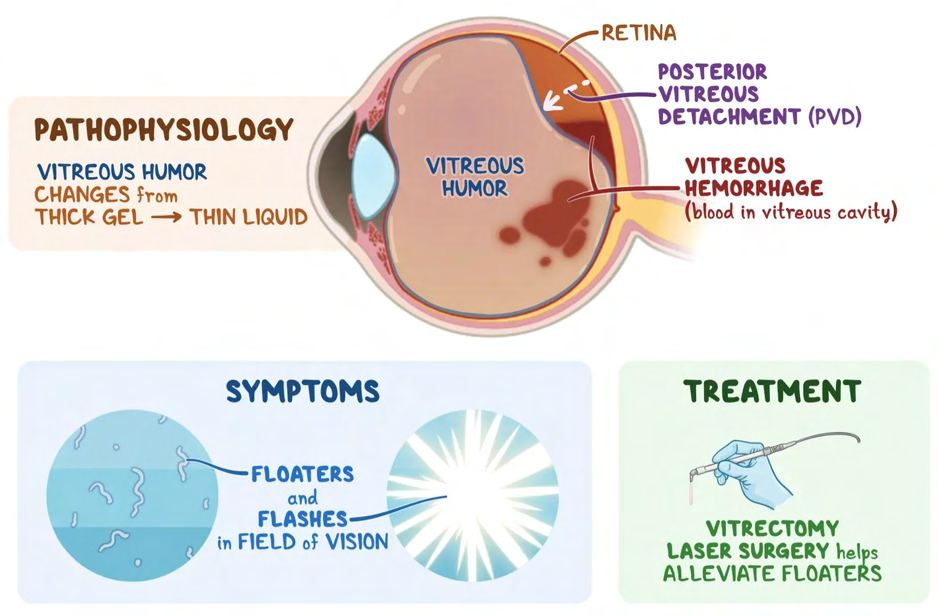
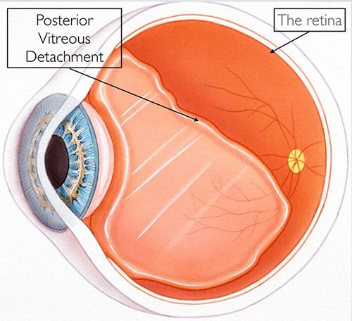

# Vitreous Detachment

Source: `Eye Diseases & Conditions-compressed.pdf`, pages 456-462.

## Images

## Extracted text

<!-- Page 456 -->
Vitreous Detachment
Overview
Vitreous detachment occurs when the vitreous body, the gel-like substance inside the eye that
helps maintain its shape, separates from the retina at the back of the eye. This process is
common, especially in people over the age of 50, and is often part of the natural aging process.
While vitreous detachment itself is usually not a cause for alarm, it can lead to other serious

<!-- Page 457 -->
conditions if not monitored, such as retinal tears or detachment. Understanding the causes,
symptoms, and potential treatments for vitreous detachment is essential for maintaining good eye
health.
Symptoms and Causes
Symptoms of Vitreous Detachment:
Floaters: Sudden onset of floaters or dark specks in the field of vision. These appear to
float around as you move your eyes and are often more noticeable when looking at bright
backgrounds like a clear sky or white walls.
Flashes of light: You may notice flashes of light, especially in your peripheral vision,
which can be a sign that the vitreous is tugging on the retina.
Blurred vision: Some individuals report a sudden decrease in visual clarity or a sense of
"cobwebs" in their vision.
Shadow or curtain in the vision: In rare cases, the separation of the vitreous from the
retina can cause a shadow or curtain-like effect in the field of vision, which could signal
more serious conditions like retinal tears or detachment.
Causes of Vitreous Detachment:
Aging: The most common cause of vitreous detachment is the natural aging process. As
we age, the vitreous gel becomes more liquid and less cohesive, eventually pulling away
from the retina.
Myopia (nearsightedness): People with high levels of nearsightedness are more likely to
experience vitreous detachment earlier than those with normal vision.
Eye injury or trauma: A blow to the eye or head can cause the vitreous to detach
prematurely.
Eye surgery: Certain eye surgeries, such as cataract surgery, may increase the risk of
vitreous detachment.
Inflammation or infection: Conditions like uveitis (inflammation of the middle layer of
the eye) or eye infections can contribute to vitreous detachment.
Other medical conditions: Diabetic retinopathy and other vascular disorders may
increase the risk of vitreous detachment.
Diagnosis and Tests
Vitreous detachment is diagnosed through a comprehensive eye exam performed by an
ophthalmologist or optometrist. The following diagnostic tests and evaluations are typically
used:
Dilated eye exam: During this exam, the eye doctor uses special drops to dilate the
pupils and examine the vitreous and retina for signs of detachment.
Ophthalmoscopy: This is a technique where a doctor uses a special tool to look at the
back of the eye to check for any issues with the retina, such as tears or holes.

<!-- Page 458 -->
Ultrasound: If the retina is difficult to view due to bleeding or cloudiness, an eye
ultrasound may be used to get a better image of the retina and vitreous body.
Optical coherence tomography (OCT): This non-invasive imaging test uses light waves
to create detailed images of the retina and vitreous.
Management and Treatment
For most people, vitreous detachment does not require treatment, especially if there is no retinal
tear or other complications. However, if there are signs of retinal damage or detachment, medical
intervention will be necessary.
Non-Surgical Management:
Observation: Most cases of vitreous detachment will resolve on their own without the
need for surgery. The main approach is careful monitoring to ensure that no
complications, such as retinal tears, develop.
Managing floaters: In many cases, floaters diminish over time as the brain adapts to
them. If floaters persist and cause significant visual disturbance, a vitrectomy (removal of
the vitreous) may be considered in rare cases.
Surgical Treatment:
Vitrectomy: If a retinal tear, detachment, or other complications arise, a vitrectomy may
be performed. This involves removing the vitreous gel to prevent further damage to the
retina and to repair any tears or detachments.
Laser therapy: If there are retinal tears or small detachments, a laser may be used to seal
the tear and prevent further retinal damage.
Types of Vitreous Detachment
There are different classifications of vitreous detachment based on the extent of the separation
and any associated complications:
1. Complete Vitreous Detachment: This is when the vitreous completely separates from
the retina.
2. Partial Vitreous Detachment: This occurs when only part of the vitreous body detaches
from the retina.
3. Posterior Vitreous Detachment (PVD): The most common form of vitreous
detachment, in which the vitreous separates from the back of the eye near the retina.
4. Tractional Vitreous Detachment: This occurs when the vitreous body tugs on the
retina, potentially leading to retinal tears or detachment.
Complicated Vitreous Detachment

<!-- Page 459 -->
While vitreous detachment is generally a non-threatening condition, complications can arise,
especially if the vitreous pulls on the retina:
Retinal tears: If the vitreous detachment causes the retina to tear, this can lead to retinal
detachment, a serious condition that can result in permanent vision loss.
Retinal detachment: The vitreous can pull on the retina so much that it causes the retina
to lift away from the underlying tissues, resulting in retinal detachment.
Macular hole: In some cases, vitreous detachment can lead to the formation of a hole in
the macula, which may cause central vision loss.
Any of these complications require prompt medical attention and treatment to prevent permanent
vision damage.
Vitreous Detachment in Adults
Vitreous detachment is most common in adults, particularly those over the age of 50. As we age,
the vitreous gel naturally begins to shrink and become more liquefied, leading to separation from
the retina. It’s important for adults to be vigilant about their eye health as they may experience
symptoms such as floaters and flashes of light. Regular eye exams are essential to detect any
complications early, such as retinal tears or detachment.
Risk Factors in Adults:
Age (especially over 50)
Myopia (nearsightedness)
Eye surgery or trauma
Family history of retinal conditions
Vitreous Detachment in Children
Vitreous detachment is rare in children but may occur as a result of injury, surgery, or specific
eye conditions like uveitis. In these cases, the symptoms and treatment are similar to those in
adults, though the likelihood of complications is less common. However, children with vitreous
detachment should be closely monitored for any signs of retinal issues.
Risk Factors in Children:
Eye trauma or injury
Inflammatory conditions like uveitis
Genetic predispositions to eye conditions
Prevention
While vitreous detachment is often part of the aging process and cannot be prevented, certain
steps can help reduce the risk of complications:

<!-- Page 460 -->
Protect your eyes from injury: Wearing protective eyewear during sports or activities
that pose a risk to the eyes can help prevent trauma-related vitreous detachment.
Manage health conditions: Proper management of conditions like diabetes,
hypertension, and myopia can reduce the risk of vitreous-related issues.
Routine eye exams: Regular eye exams, especially after the age of 50, can help detect
vitreous detachment early and monitor for any associated complications.
Outlook / Prognosis
For most people, vitreous detachment is a relatively benign condition that resolves without
causing any permanent damage to vision. However, the prognosis depends largely on whether
any complications, such as retinal tears or detachments, develop. With appropriate monitoring
and treatment, most people with vitreous detachment maintain good vision. If complications
occur, timely medical intervention can often prevent severe outcomes.
Living with Vitreous Detachment
Living with vitreous detachment generally involves adapting to the presence of floaters and other
visual disturbances, which may gradually improve over time. If you experience significant visual
impairment, treatments like laser therapy or vitrectomy may help improve vision. Routine eye
exams are essential to monitor the health of the retina and detect any potential complications
early.
Tips for Living with Vitreous Detachment:
Adapt to floaters: Over time, floaters may become less noticeable as your brain adapts
to them. Try to avoid fixating on them.
Monitor for changes: Keep an eye on any changes in your vision, such as increased
floaters, flashes of light, or a shadow in your peripheral vision, and seek medical
attention if necessary.
Follow-up care: Regular eye exams are crucial to ensure that there are no retinal tears or
detachments developing.

<!-- Page 461 -->
Additional Common Questions (FAQs)
Q1: Can vitreous detachment lead to blindness?
A: Vitreous detachment itself typically does not lead to blindness. However, if complications
such as retinal tears or detachment occur, they can lead to significant vision loss or blindness
without timely treatment.
Q2: How long does it take for floaters from vitreous detachment to go away?
A: Floaters caused by vitreous detachment can persist for weeks, months, or even longer. While
they may eventually become less noticeable, they may not completely disappear.
Q3: Is vitreous detachment the same as retinal detachment?
A: No, vitreous detachment and retinal detachment are different. Vitreous detachment refers to
the separation of the vitreous gel from the retina, while retinal detachment involves the retina
itself detaching from the underlying tissues, which can lead to vision loss.
Q4: How is vitreous detachment treated?
A: In most cases, vitreous detachment does not require treatment. However, if complications like

<!-- Page 462 -->
retinal tears or detachment occur, treatments such as laser therapy or vitrectomy may be
necessary.
Q5: Can vitreous detachment occur in both eyes?
A: Yes, vitreous detachment can occur in both eyes, either at the same time or one after the
other, though it is more commonly seen in one eye initially.
