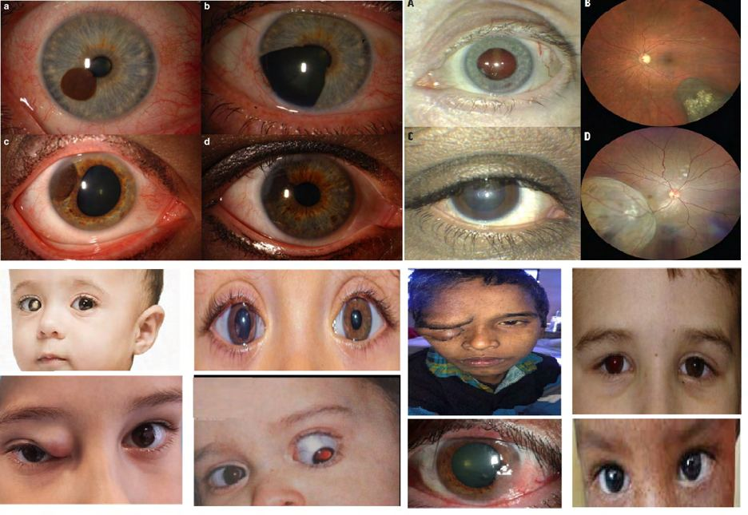
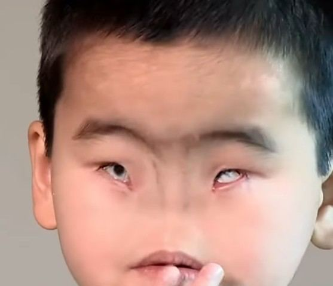

# Rare Eye Diseases

Source: `Eye Diseases & Conditions-compressed.pdf`, pages 462-468.

## Images

## Extracted text

<!-- Page 462 -->
Rare Eye Diseases
Overview
Rare eye diseases are conditions that affect the eyes and vision, but occur infrequently in the
general population. These diseases are often complex, with many having genetic origins, and
may lead to visual impairment or blindness if not diagnosed and managed early. Due to their

<!-- Page 463 -->
rarity, these conditions are often under-recognized, making awareness, early diagnosis, and
proper treatment crucial for managing these diseases effectively.
This guide covers the major aspects of rare eye diseases, including their symptoms, causes,
diagnostic processes, treatment options, and more. It also highlights specific challenges faced by
both adults and children dealing with rare eye conditions.
Symptoms and Causes
Symptoms of Rare Eye Diseases
The symptoms of rare eye diseases vary significantly depending on the specific condition but
may include:
Vision loss: Progressive or sudden loss of vision in one or both eyes, often due to damage
to the retina, optic nerve, or other parts of the eye.
Visual distortions: Changes in the shape or clarity of vision, such as seeing halos,
blurred vision, or distorted images.
Eye pain or discomfort: Severe or chronic pain in the eyes, which may be accompanied
by redness, sensitivity to light, or headaches.
Color vision abnormalities: Difficulty distinguishing between colors or complete color
blindness, common in some genetic conditions.
Floating spots or flashes: The presence of floaters or flashes of light in the field of
vision, which may indicate retinal issues.
Causes of Rare Eye Diseases
The causes of rare eye diseases vary, but common causes include:
Genetic mutations: Many rare eye diseases are inherited through specific genetic
mutations that affect the development and function of the eye.
Infections: Certain infections can lead to rare conditions, such as ocular tuberculosis,
fungal infections, or viral retinitis.
Environmental factors: Exposure to toxins, radiation, or chemicals may increase the
risk of developing some rare eye diseases.
Autoimmune diseases: Some rare eye diseases occur as part of systemic autoimmune
conditions, where the body's immune system attacks its own tissues, including the eyes.
Trauma: Physical injuries to the eyes can lead to rare diseases such as traumatic
cataracts or retinal tears.
Diagnosis and Tests
Given the rarity and complexity of these conditions, accurate diagnosis is essential. Some
common diagnostic tools and tests used to identify rare eye diseases include:

<!-- Page 464 -->
Comprehensive eye exam: The first step in diagnosing any eye condition, which
involves a visual acuity test, pupil dilation, and retinal examination.
OCT (Optical Coherence Tomography): A non-invasive imaging test that provides
detailed cross-sectional images of the retina, helping doctors identify subtle changes
caused by rare eye diseases.
Genetic testing: In cases of hereditary eye diseases, genetic testing can help confirm the
diagnosis and identify specific mutations that may contribute to the condition.
Electroretinogram (ERG): This test measures the electrical activity of the retina and can
be used to diagnose conditions like retinitis pigmentosa or other retinal disorders.
Fluorescein angiography: This test involves injecting a dye into the bloodstream to
examine the blood vessels in the eye and can help identify diseases like diabetic
retinopathy or retinal vein occlusions.
Ultrasound: Eye ultrasound can be used to assess the structure of the eye and detect
tumors, retinal detachments, or other abnormalities.
Management and Treatment
Treatment for rare eye diseases varies depending on the specific condition, its severity, and
whether complications are present. Options include:
Medications: For conditions like uveitis, glaucoma, or certain infections, medications
such as corticosteroids, antibiotics, or antivirals are often prescribed.
Surgery: In cases like cataracts, retinal detachment, or eye tumors, surgical intervention
may be necessary. Surgical options include lens replacement, laser surgery, or
vitreoretinal surgery.
Gene therapy: Experimental treatments, such as gene therapy, aim to replace or repair
defective genes responsible for genetic eye diseases like Leber congenital amaurosis or
retinitis pigmentosa.
Vision aids and rehabilitation: For those who experience significant vision impairment,
low-vision aids, and rehabilitation programs can improve quality of life and help
individuals adapt to their visual challenges.
Immunotherapy: In autoimmune-related eye diseases like ocular cicatricial pemphigoid,
immunotherapy may be used to suppress abnormal immune responses and reduce
inflammation.
Types of Rare Eye Diseases & Surgery
Several rare eye diseases exist, each with unique causes and treatment approaches. Some notable
examples include:
1. Retinitis Pigmentosa: A hereditary retinal disease-causing progressive vision loss, often
leading to night blindness and tunnel vision. Treatment focuses on slowing progression
with the use of vitamins, retinal implants, or gene therapy.
2. Leber Congenital Amaurosis (LCA): A genetic condition leading to severe vision loss
in childhood, often from birth. Gene therapy is an emerging treatment option.

<!-- Page 465 -->
3. Uveitis: Inflammation of the uvea (middle layer of the eye), which can be caused by
autoimmune diseases, infections, or trauma. Treatment includes anti-inflammatory
medications and immunosuppressants.
4. Fuch's Endothelial Dystrophy: A condition that causes gradual loss of corneal cells,
leading to vision problems. In severe cases, a corneal transplant may be necessary.
5. Stargardt Disease: A genetic disorder that affects the macula and leads to central vision
loss in young adults. There is currently no cure, but genetic counseling and support can
help.
6. Ocular Melanoma: A rare cancer of the eye that may require radiation therapy, surgical
removal of the tumor, or enucleation (removal of the eye).
Complicated Rare Eye Diseases
Complications from rare eye diseases can significantly impact an individual’s vision and quality
of life. For example:
Vision loss: Progressive or sudden loss of vision may occur if the disease affects the
retina, optic nerve, or cornea.
Glaucoma: Some rare conditions, such as uveitis or retinal diseases, may increase the
risk of developing secondary glaucoma, leading to further damage to the optic nerve.
Retinal detachment: Certain conditions, like retinitis pigmentosa, can increase the risk
of retinal detachment, requiring urgent treatment to prevent permanent vision loss.
Cataracts: Some rare eye diseases cause the lens of the eye to become clouded, leading
to cataracts and requiring surgical intervention.
Systemic involvement: Some rare eye conditions are associated with other systemic
health issues, such as autoimmune diseases or genetic syndromes, complicating the
management of the disease.
Rare Eye Diseases in Adults
Rare eye diseases can affect adults at any stage of life. Common issues include:
Macular Degeneration: Age-related macular degeneration (AMD) is a common cause of
vision loss in older adults, but rarer forms of AMD also exist, such as Stargardt disease,
which can affect young adults.
Retinal Diseases: Conditions like retinal vein occlusion, diabetic retinopathy, or retinal
dystrophies are rarer forms of retinal disease in adults.
Ocular Tumors: Rare cancers like ocular melanoma may be more common in adults,
often presenting with vision changes or eye pain.
Genetic Disorders: Genetic conditions such as retinitis pigmentosa and LCA can lead to
significant visual impairment in adulthood, typically beginning in childhood but
continuing into adulthood.
Rare Eye Diseases in Children

<!-- Page 466 -->
Children are also susceptible to rare eye diseases, which can significantly impact their
development. Examples include:
Leber Congenital Amaurosis: A severe retinal disorder that causes vision loss at birth
or in early childhood.
Congenital Cataracts: Cataracts that are present at birth and may affect a child’s ability
to see clearly.
Ocular Albinism: A condition that causes a lack of pigment in the eyes and skin, leading
to poor vision and sensitivity to light.
Retinopathy of Prematurity (ROP): A condition that affects premature infants, where
abnormal blood vessels grow in the retina, potentially leading to blindness if untreated.
Cyclic Esotropia: A rare condition in which a child experiences intermittent eye
misalignment (strabismus), often linked to genetic factors.
Prevention
Prevention of rare eye diseases largely depends on genetic and environmental factors:
Genetic counseling: For individuals with a family history of genetic eye diseases,
genetic counseling and screening can help identify at-risk individuals early.
Regular eye exams: Early detection of rare conditions through routine eye exams can
prevent or slow down the progression of diseases.
Protecting eyes from injury: Using protective eyewear during sports or hazardous
activities can prevent trauma-related eye diseases.
Managing underlying health conditions: Proper management of diabetes, hypertension,
and autoimmune diseases can help reduce the risk of developing certain rare eye
conditions.
Outlook / Prognosis
The outlook for rare eye diseases varies depending on the specific condition, its severity, and
how early it is diagnosed:
Vision preservation: Early detection and treatment can help preserve vision and prevent
complications in many rare eye diseases.
Long-term care: For progressive conditions like retinitis pigmentosa, regular monitoring
and adaptive devices can help individuals maintain quality of life.
Gene therapy and innovation: Advances in gene therapy and other treatments may offer
hope for those with hereditary eye diseases, potentially slowing progression or even
reversing damage.
Living with Rare Eye Diseases
Living with a rare eye disease can be challenging, but support systems, medical advancements,
and coping strategies can make a significant difference:

<!-- Page 467 -->
Vision aids: Low vision aids, such as magnifiers, screen readers, or adaptive devices, can
help individuals with visual impairments continue daily activities.
Counseling and support groups: Connecting with others who have the same condition
can provide emotional support and practical advice.
Rehabilitation programs: Orientation and mobility training, as well as other
rehabilitation programs, can help individuals adjust to vision loss.
Additional Common Questions (FAQs)
Q1: Can rare eye diseases be cured?
A: While many rare eye diseases cannot be fully cured, advances in medical treatments, such as
gene therapy and stem cell research, are providing hope for managing or even reversing some
conditions.
Q2: Are rare eye diseases genetic?
A: Many rare eye diseases have a genetic basis, but environmental factors, injuries, and
infections can also play a role in developing some rare eye conditions.

<!-- Page 468 -->
Q3: How can I protect my child from rare eye diseases?
A: Regular eye exams from a young age, especially for children with a family history of genetic
conditions, can help detect rare eye diseases early. Additionally, protecting their eyes from injury
and managing any underlying health conditions can reduce risk.
Q4: Is early detection important for rare eye diseases?
A: Yes, early detection is crucial for managing rare eye diseases effectively. It can help preserve
vision, slow disease progression, and improve the overall prognosis.
Q5: What is the treatment for ocular melanoma?
A: Treatment for ocular melanoma may include radiation therapy, laser therapy, or in some
cases, surgical removal of the eye (enucleation) if the tumor is large or not treatable with other
methods.
