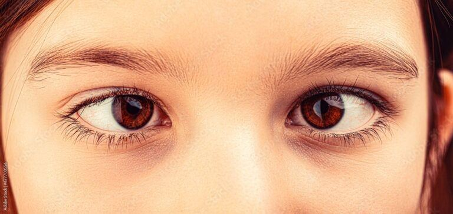
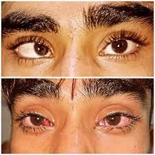

# Esotropia

Source: `Eye Diseases & Conditions-compressed.pdf`, pages 468-474.

## Images

## Extracted text

<!-- Page 468 -->
Overview
Esotropia, commonly known as "crossed eyes," is a type of strabismus (eye misalignment) where
one or both eyes turn inward toward the nose. This condition can be constant or intermittent and
may affect one or both eyes. Esotropia can occur at any age, though it is most often diagnosed in
children. If left untreated, it can lead to poor depth perception, double vision, or even amblyopia
(lazy eye), where one eye does not develop proper vision.

<!-- Page 469 -->
Symptoms and Causes
Symptoms of Esotropia
The symptoms of esotropia can vary depending on the severity of the condition, but common
signs include:
Inward turning of one or both eyes: This is the most apparent symptom, often
noticeable when a person is looking straight ahead.
Double vision (diplopia): When both eyes are misaligned, the brain may struggle to
combine the images from both eyes, resulting in double vision.
Difficulty focusing: Difficulty maintaining focus or reading, especially if the eyes are
misaligned.
Poor depth perception: Due to misalignment, the ability to perceive depth (3D vision) is
impaired.
Squinting or closing one eye: People with esotropia may squint or close one eye to
avoid double vision or to make the alignment of their eyes appear normal.
Eye strain or fatigue: Misalignment can cause strain as the eyes work harder to focus.
Causes of Esotropia
Esotropia can be caused by a variety of factors, including:
Genetic predisposition: A family history of strabismus increases the risk of developing
esotropia.
Neurological issues: Conditions affecting the nerves and muscles that control eye
movement can cause esotropia, such as brain injuries, strokes, or tumors.
Refractive errors: Uncorrected farsightedness (hyperopia) can lead to esotropia,
especially in children. The effort to focus can cause the eyes to turn inward.
Muscle imbalance: Abnormalities in the muscles around the eyes or the nerves
controlling these muscles can lead to misalignment.
Systemic health conditions: Diseases like cerebral palsy or Down syndrome can
increase the risk of strabismus, including esotropia.
Trauma: Injury to the eye or the area around the eye can damage the muscles, leading to
misalignment.
Diagnosis and Tests
To diagnose esotropia, an eye specialist (optometrist or ophthalmologist) will typically perform
several tests:
Comprehensive eye exam: This includes visual acuity testing, a thorough eye
examination, and checking for any refractive errors.
Cover test: This test involves covering one eye at a time to observe how the other eye
responds, helping to identify the misalignment.

<!-- Page 470 -->
Ocular motility test: This test examines how well the eye muscles move, checking for
any limitations in eye movement that might contribute to esotropia.
Binocular vision tests: These tests evaluate how the eyes work together and can help
identify depth perception issues caused by misalignment.
Retinal and optic nerve examination: To rule out any underlying conditions such as
nerve damage or retinal diseases.
Cycloplegic refraction: This test uses eye drops to temporarily relax the focusing
muscles and help detect any refractive errors contributing to the esotropia.
Management and Treatment
Treatment Options for Esotropia
The goal of treatment is to correct the misalignment, reduce symptoms like double vision, and
improve visual development. Common treatments include:
Eyeglasses: In cases where refractive errors such as farsightedness contribute to
esotropia, corrective lenses may help realign the eyes.
Prism lenses: Special lenses that alter the way light enters the eye can help reduce double
vision by shifting the image slightly to compensate for misalignment.
Vision therapy: A structured program of eye exercises that helps improve eye
coordination, focusing, and alignment. Vision therapy may help strengthen the eye
muscles and improve the ability to work together.
Botulinum toxin (Botox) injections: In some cases, Botox is injected into the eye
muscles to temporarily weaken them, allowing the eyes to realign.
Surgery for Esotropia
If non-surgical treatments are not effective, surgery may be required to adjust the muscles around
the eyes and improve alignment. Surgery involves:
Strabismus surgery: The surgeon may shorten, lengthen, or reposition the eye muscles
to help align the eyes. This procedure can be done on one or both eyes, depending on the
severity of the condition.
Post-surgical care: After surgery, follow-up visits are important to monitor healing and
ensure that the eyes remain properly aligned. In some cases, additional surgery may be
necessary.
Types of Esotropia
There are several different types of esotropia, which can be classified based on their causes and
how they present:
1. Congenital esotropia: This type is present at birth and is often diagnosed in infants. It is
one of the most common forms of strabismus.

<!-- Page 471 -->
2. Accommodative esotropia: Caused by excessive focusing efforts due to uncorrected
hyperopia (farsightedness), which leads to the eyes turning inward.
3. Intermittent esotropia: This occurs occasionally, and the eyes may only turn inward at
certain times, such as when the individual is tired or focusing on something up close.
4. Non-accommodative esotropia: This form of esotropia occurs without a significant
refractive error and is often associated with neurological issues or muscle imbalance.
5. Sensory esotropia: Occurs when vision loss in one eye (due to cataracts, retinopathy,
etc.) leads to misalignment of the eyes.
Complicated Esotropia
Esotropia can sometimes lead to complications, especially if left untreated:
Amblyopia (lazy eye): If one eye is consistently misaligned, the brain may ignore the
image from that eye, leading to poor vision development in that eye.
Double vision: Misalignment of the eyes can cause double vision, which can be both
confusing and disorienting.
Reduced depth perception: Strabismus, including esotropia, can interfere with the
brain’s ability to combine the two images from each eye, leading to poor depth
perception.
Cosmetic concerns: Misalignment of the eyes can affect self-esteem and body image,
especially in social or professional situations.
Treatment for these complications often involves a combination of corrective measures,
including vision therapy, patching, or surgery.
Esotropia in Adults
While esotropia is commonly diagnosed in childhood, adults can develop this condition due to
various factors such as:
Onset in childhood: Some individuals may have developed esotropia in childhood and
only seek treatment as adults.
Acquired esotropia: Adults may develop esotropia due to neurological conditions,
trauma, or other systemic health problems like thyroid disease or diabetes.
Aging: As people age, changes in the eye muscles or the development of cataracts may
contribute to esotropia.
Treatment for adults typically involves addressing the underlying cause, corrective lenses, and
sometimes surgery if necessary.
Esotropia in Children
Esotropia is more common in children and can be particularly concerning as it can affect vision
development. In young children, it is critical to:

<!-- Page 472 -->
Monitor eye alignment: Parents should observe their child for signs of eye
misalignment, especially if the child has a family history of strabismus.
Seek early intervention: The earlier esotropia is diagnosed, the better the chance of
preventing long-term complications like amblyopia or permanent vision loss.
Use patching or corrective lenses: For children with amblyopia, patching the stronger
eye can encourage the weaker eye to work harder, improving vision in the affected eye.
Regular follow-up: Ensuring that the child’s vision is properly monitored and that any
necessary treatments, such as surgery or vision therapy, are implemented.
Prevention
While esotropia cannot always be prevented, certain measures can reduce the risk:
Regular eye check-ups: Regular eye exams, especially for children with a family history
of eye disorders, can help catch misalignment early.
Proper correction of refractive errors: Ensuring that any farsightedness or other vision
problems are corrected with glasses can reduce the risk of developing accommodative
esotropia.
Eye protection: Protecting the eyes from injury can help prevent trauma-related
esotropia.
Outlook / Prognosis
The prognosis for individuals with esotropia depends on factors such as:
Early diagnosis and treatment: If diagnosed early, most cases of esotropia can be
treated successfully, often resulting in normal or near-normal vision.
Severity of misalignment: Mild cases may require only glasses or vision therapy, while
more severe cases may need surgery.
Underlying causes: For individuals with neurological or systemic conditions causing
esotropia, the prognosis may depend on managing the primary health issue.
Living with Esotropia
Living with esotropia can be challenging, but there are resources and strategies that can improve
quality of life:
Adaptive tools: Special lenses or prismatic glasses can help manage double vision and
improve visual comfort.
Vision therapy: A structured program of eye exercises can help improve eye alignment
and coordination.
Emotional support: Support groups or therapy can help individuals cope with the
emotional and social impact of esotropia, especially in children and adults with visible
misalignment.

<!-- Page 473 -->
Additional Common Questions (FAQs)
Q1: Can esotropia go away on its own?
A: While some mild forms of esotropia may improve with age or correction of refractive errors,
most cases require treatment to prevent complications like amblyopia or permanent vision
impairment.
Q2: Is esotropia the same as strabismus?
A: Yes, esotropia is a type of strabismus, which refers to any misalignment of the eyes. Esotropia
specifically refers to the inward turning of the eyes.
Q3: Can esotropia be caused by stress or fatigue?
A: While stress or fatigue can exacerbate misalignment in some cases, esotropia is typically
caused by underlying issues such as refractive errors, neurological conditions, or muscle
imbalances.
Q4: How soon should I seek treatment for esotropia in a child?
A: Early treatment is essential for children, ideally before the age of 2, to prevent complications
such as amblyopia. The earlier you address the issue, the better the chances of successful
treatment.
Q5: Can surgery correct esotropia completely?
A: Surgery can be highly effective in realigning the eyes, but it may require follow-up treatment
or additional surgeries in some cases to maintain proper eye alignment.
