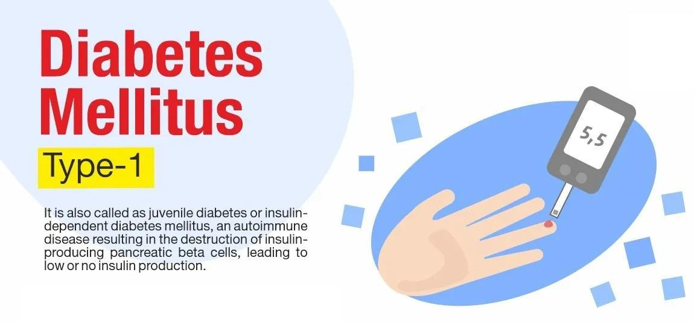
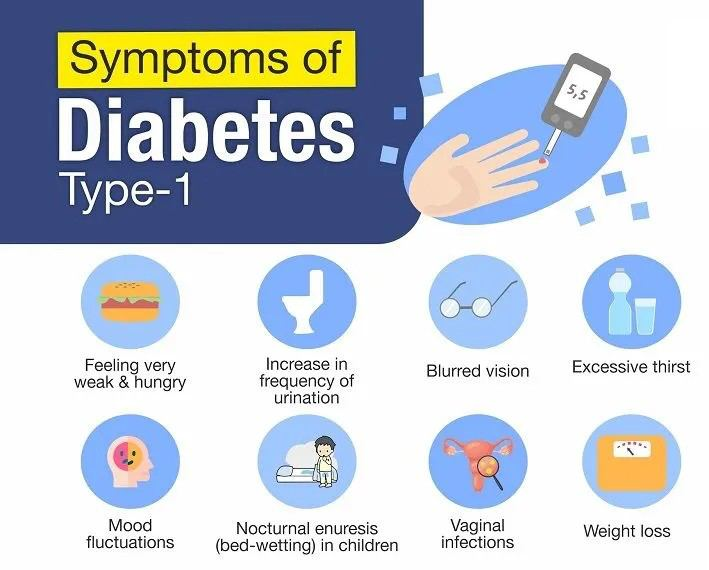

# Type 1 Diabetes

Source: `Eye Diseases & Conditions-compressed.pdf`, pages 474-479.

## Images

## Extracted text

<!-- Page 474 -->
Type 1 Diabetes
Overview
Type 1 diabetes is a chronic condition that affects the body’s ability to regulate blood sugar
(glucose) levels. It occurs when the body's immune system mistakenly attacks and destroys the
insulin-producing cells in the pancreas. Insulin is a hormone that helps cells absorb glucose for
energy. Without sufficient insulin, glucose builds up in the blood, leading to high blood sugar
levels.
Unlike Type 2 diabetes, which is often linked to lifestyle factors, Type 1 diabetes is an
autoimmune condition, and its exact cause is still not fully understood. It typically develops in
children, teenagers, or young adults, but it can also occur at any age. Although there is no cure,
effective management through insulin therapy and lifestyle adjustments can help individuals lead
healthy lives.
Symptoms and Causes

<!-- Page 475 -->
Symptoms of Type 1 Diabetes
The symptoms of Type 1 diabetes can develop rapidly and may include:
Excessive thirst: High blood sugar causes fluid to be pulled from tissues, leading to
dehydration.
Frequent urination: The kidneys work to filter excess glucose, which can lead to
increased urination.
Extreme hunger: Despite eating, individuals may feel excessively hungry due to the
body’s inability to use glucose properly.
Unexplained weight loss: The body starts using muscle and fat for energy since glucose
isn't being absorbed by cells.
Fatigue: Lack of energy can occur as cells do not receive the necessary glucose for
proper function.
Blurred vision: High blood sugar levels can affect the lens of the eye, leading to vision
problems.
Slow healing of cuts or bruises: High blood sugar can impair the body’s ability to heal.
Frequent infections: People with Type 1 diabetes are more prone to infections due to a
weakened immune system.
Causes of Type 1 Diabetes
The exact cause of Type 1 diabetes remains unclear, but several factors are thought to contribute:
Genetic factors: A family history of Type 1 diabetes increases the risk of developing the
condition, though not all individuals with a family history will develop it.
Autoimmune response: In Type 1 diabetes, the immune system mistakenly attacks and
destroys the insulin-producing beta cells in the pancreas.
Environmental triggers: Certain viral infections or environmental factors may trigger
the autoimmune response in genetically predisposed individuals.
Genetic predisposition: Certain genes, such as those involved in immune system
regulation, may make a person more susceptible to Type 1 diabetes.
Diagnosis and Tests
Diagnosing Type 1 diabetes typically involves a combination of clinical symptoms and blood
tests:
Blood glucose test: A high blood glucose level is the primary diagnostic indicator for
Type 1 diabetes. A fasting blood glucose level of 126 mg/dL (7.0 mmol/L) or higher, or a
random blood glucose level of 200 mg/dL (11.1 mmol/L) or higher, may indicate
diabetes.
Hemoglobin A1c test: This test measures average blood sugar levels over the past 2-3
months. An A1c level of 6.5% or higher is indicative of diabetes.

<!-- Page 476 -->
Oral glucose tolerance test (OGTT): This test involves drinking a sugary liquid and
measuring blood glucose levels at intervals to determine how well the body processes
glucose.
Urinalysis: The presence of glucose or ketones in the urine may suggest diabetes, though
this is more commonly used to monitor diabetes rather than diagnose it.
C-peptide test: This test measures the level of C-peptide, which indicates the amount of
insulin being produced by the pancreas. Low levels of C-peptide are common in Type 1
diabetes.
Management and Treatment
The primary goal of Type 1 diabetes treatment is to manage blood glucose levels effectively and
prevent complications. Treatment typically involves:
Insulin therapy: Since the body cannot produce its own insulin, individuals with Type 1
diabetes must take insulin regularly. Insulin can be administered through injections or an
insulin pump. There are different types of insulin, including:
o
Rapid-acting insulin: Starts working within minutes and lasts for a few hours.
o
Long-acting insulin: Provides a steady release of insulin over a 24-hour period.
o
Intermediate-acting insulin: Works for about 12 to 16 hours.
Blood glucose monitoring: Individuals with Type 1 diabetes need to monitor their blood
sugar levels multiple times a day using a glucose meter or continuous glucose monitor
(CGM).
Dietary management: Carbohydrate counting and healthy meal planning are key
components of managing blood sugar levels. A balanced diet with appropriate amounts of
carbohydrates, proteins, and fats helps maintain stable blood sugar.
Exercise: Regular physical activity helps regulate blood sugar levels by improving
insulin sensitivity. It is important for individuals with Type 1 diabetes to monitor their
blood sugar before, during, and after exercise to prevent hypoglycemia (low blood sugar).
Education and self-management: Learning about the condition, understanding how
insulin and food interact, and developing a routine for testing blood sugar are critical for
effective diabetes management.
Types & Surgery
While there are no surgical treatments specifically for Type 1 diabetes, there are options like
pancreatic islet cell transplant and pancreas transplant in some cases. These are generally
considered when insulin therapy is no longer effective or complications become severe.
Islet cell transplant: In this procedure, insulin-producing cells from a donor pancreas are
transplanted into the recipient’s liver. This can restore insulin production in some people.
Pancreas transplant: This is a more complex surgery where a whole pancreas is
transplanted from a donor. It is typically reserved for individuals with severe
complications or those also in need of a kidney transplant.
Complicated Type 1 Diabetes

<!-- Page 477 -->
If Type 1 diabetes is not well-controlled, it can lead to several complications, such as:
Diabetic ketoacidosis (DKA): A serious condition where the body starts breaking down
fat for energy, producing ketones. DKA can lead to coma or death if left untreated.
Hypoglycemia (low blood sugar): Excessive insulin or not eating enough can cause
blood sugar levels to drop too low, leading to symptoms like shakiness, confusion, or loss
of consciousness.
Chronic complications: Over time, poorly controlled blood sugar can damage blood
vessels and nerves, leading to complications like:
o
Diabetic retinopathy: Damage to the blood vessels in the eyes, potentially
leading to blindness.
o
Diabetic nephropathy: Kidney damage, which can lead to kidney failure.
o
Peripheral neuropathy: Nerve damage, especially in the feet and hands, leading
to pain or loss of sensation.
o
Cardiovascular diseases: Increased risk of heart disease, stroke, and high blood
pressure.
Type 1 Diabetes in Adults
Type 1 diabetes can occur at any age, though it is most commonly diagnosed in childhood or
adolescence. In adults, the condition may present differently:
Late-onset Type 1 diabetes: Some adults develop Type 1 diabetes after the age of 30. It
can be misdiagnosed as Type 2 diabetes due to its later onset.
Management: Adults with Type 1 diabetes face unique challenges, such as managing the
condition with work, family life, and other commitments. Maintaining consistent blood
sugar control and managing stress levels are key to staying healthy.
Type 1 Diabetes in Children
Type 1 diabetes is often diagnosed in children, especially those aged 5-14. Parents and caregivers
play an essential role in the child's treatment, ensuring that insulin injections, blood glucose
monitoring, and dietary management are followed. Key considerations include:
School support: Teachers and school staff should be educated on the child's condition
and emergency response procedures in case of hypoglycemia.
Growth and development: Ensuring proper nutrition and physical activity are important
for a child's development while managing diabetes.
Emotional well-being: Children with Type 1 diabetes may face emotional challenges
such as feeling different or dealing with the fear of complications. Support from family,
friends, and healthcare providers is crucial.
Prevention
Currently, there is no known way to prevent Type 1 diabetes. However, early detection and
intervention can significantly reduce the risk of complications. Genetic and environmental

<!-- Page 478 -->
factors contribute to the development of the disease, but there is no method for preventing it at
this time.
Outlook / Prognosis
With proper management, people with Type 1 diabetes can lead long, healthy lives. The
prognosis depends on how well an individual manages their blood sugar levels and avoids
complications. Continuous monitoring, insulin therapy, and a healthy lifestyle are essential for
minimizing the risk of complications and maintaining good quality of life.
Living with Type 1 Diabetes
Living with Type 1 diabetes requires ongoing management. Here are some strategies to help
individuals manage the condition:
Daily routine: Maintaining a consistent daily routine of blood sugar checks, insulin
injections, and meals is essential.
Support network: Connecting with other people living with Type 1 diabetes, as well as
healthcare professionals, can provide valuable support and knowledge.
Mental health: Managing the emotional toll of living with a chronic condition is
important. Counseling, stress management, and peer support groups can help.
Technological aids: Continuous glucose monitors (CGMs) and insulin pumps can help
simplify daily management and improve blood sugar control.

<!-- Page 479 -->
Additional Common Questions (FAQs)
Q1: Can Type 1 diabetes be cured?
A: Currently, there is no cure for Type 1 diabetes. However, with proper management,
individuals can lead normal lives.
Q2: Can Type 1 diabetes be prevented?
A: Type 1 diabetes cannot be prevented, but early detection and effective management can
prevent complications.
Q3: Can Type 1 diabetes develop later in life?
A: Yes, Type 1 diabetes can develop at any age, though it is more commonly diagnosed in
childhood or adolescence.
Q4: What happens if I don’t manage my blood sugar levels?
A: Poor blood sugar control can lead to complications such as diabetic ketoacidosis, nerve
damage, eye problems, kidney failure, and heart disease.
Q5: Are there any alternative treatments for Type 1 diabetes?
A: Insulin therapy remains the primary treatment for Type 1 diabetes. Some alternative therapies,
like herbal supplements, may help manage symptoms but should never replace insulin treatment.
