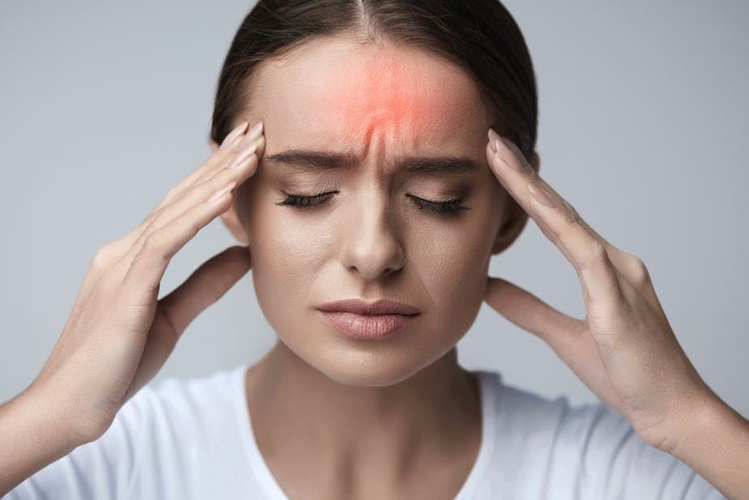
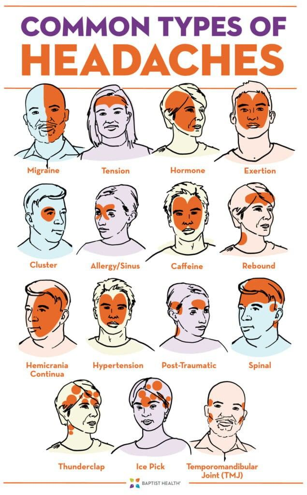

# Headaches

Source: `Eye Diseases & Conditions-compressed.pdf`, pages 479-486.

## Images

## Extracted text

<!-- Page 479 -->
Headaches

<!-- Page 480 -->
Overview of Headaches
Headaches are one of the most common forms of pain experienced by people worldwide. They
can range from mild, occasional discomfort to severe, debilitating pain that impacts daily
functioning. A headache occurs when pain receptors in the head, neck, or face are activated.
These receptors may respond to a variety of triggers, including physical, emotional,
environmental, or chemical factors.
Headaches can affect individuals of all ages and backgrounds. Although the pain can be
distressing, in many cases, it is not a symptom of a serious underlying condition. However, in
certain circumstances, headaches can indicate a more serious medical issue that requires
attention.
Symptoms and Causes of Headaches
Symptoms:
The symptoms of headaches can vary greatly depending on the type and cause of the headache.
Common signs include:
Pain in the head or face (typically described as throbbing, dull, or sharp)
Sensitivity to light and sound

<!-- Page 481 -->
Nausea or vomiting
Blurred vision
Fatigue
Neck stiffness
Tingling or numbness in the face or head
In some cases, headaches may be accompanied by visual disturbances, such as flashing lights or
blind spots (aura), particularly in migraines.
Causes:
The causes of headaches can be broadly classified into primary and secondary categories:
1. Primary Headaches: These are not caused by another medical condition but occur due
to specific triggers. Common types include:
o
Tension headaches: Often caused by stress, poor posture, or muscle tension.
o
Migraine headaches: Thought to be linked to genetic and environmental factors,
often triggered by hormonal changes, certain foods, or stress.
o
Cluster headaches: Intense headaches that occur in "clusters," often around the
eye area.
2. Secondary Headaches: These result from another underlying condition, such as:
o
Sinus infections
o
Head injuries
o
Eye problems (e.g., strained vision)
o
High blood pressure
o
Medication overuse
Diagnosis and Tests
Diagnosing headaches typically begins with a detailed medical history and physical examination.
Your doctor may inquire about the frequency, intensity, and duration of the headaches, along
with potential triggers.
In certain cases, additional tests may be necessary to rule out other health conditions:
CT scan or MRI: These imaging tests can identify structural issues, such as brain tumors
or abnormalities.
Blood tests: To check for signs of infection or metabolic imbalances.
Eye examination: In cases where the headache may be linked to vision problems.
Electroencephalogram (EEG): Used to assess brain activity if seizures or neurological
concerns are suspected.

<!-- Page 482 -->
Management and Treatment
Over-the-Counter Medications:
Pain relievers: Common over-the-counter options include ibuprofen, acetaminophen, or
aspirin.
Antacids: Sometimes, acid reflux or heartburn can cause headaches, which may be
alleviated with antacids.
Prescription Medications:
Triptans: These are often used for migraines to reduce the intensity of symptoms.
Beta-blockers or antidepressants: Sometimes prescribed to reduce the frequency of
tension headaches or migraines.
Pain relief injections: In extreme cases, Botox injections or nerve blocks may be
administered.
Non-Medication Therapies:
Cognitive-behavioral therapy (CBT): Helps individuals manage stress and emotional
triggers.
Biofeedback: Helps you monitor bodily functions (like muscle tension) to better control
headache symptoms.
Acupuncture and massage: These therapies are often used for managing tension
headaches.
Types of Headaches & Surgery
Headaches can be classified into different types, each requiring unique management strategies:
1. Tension Headaches: Often described as a band-like sensation around the head, these are
usually triggered by stress or muscle tension in the neck.
2. Migraine: A severe headache often accompanied by nausea, vomiting, and sensitivity to
light or sound. Some individuals also experience an aura before the onset of the
headache.
3. Cluster Headaches: Extremely painful headaches that occur in clusters, often around the
eye. These are more common in men and tend to occur during specific times of the day.
4. Sinus Headaches: Associated with sinus infections, these headaches are accompanied by
facial pressure and a stuffy nose.
5. Rebound Headaches: These headaches result from overuse of pain-relieving medication
and can occur in individuals who frequently use over-the-counter pain medications.
Surgery:
In some rare and severe cases, surgery may be considered for chronic headaches. Surgical
options may include:

<!-- Page 483 -->
Nerve decompression surgery: This is often done for patients with chronic migraines to
relieve pressure on certain nerves.
Deep brain stimulation: In extreme cases of chronic cluster headaches, this can help
modulate brain activity.
Complicated Headaches
Some headaches can be classified as complicated, meaning they present with additional
symptoms or are linked to a more serious medical issue. Examples include:
Thunderclap headaches: Sudden, severe headaches that come on very quickly, often
associated with conditions like an aneurysm or stroke.
Headaches due to brain tumors: While rare, headaches combined with other symptoms
such as neurological changes (e.g., vision problems, difficulty speaking) could indicate a
tumor.
Cerebral infections: Conditions such as meningitis can cause headaches, along with
fever, stiffness, and neurological symptoms.
Headaches in Adults
In adults, headaches are often related to lifestyle factors like stress, poor sleep, or dehydration.
Chronic headaches can significantly impair quality of life, but with the right management
approach, many individuals can find relief. It is important to distinguish between primary and
secondary headaches to determine the most effective treatment.
Headaches in Children
Headaches in children can be challenging to diagnose, as children may not be able to fully
articulate their symptoms. Common types of headaches in children include tension headaches,
migraines, and sinus headaches. Triggers can include school stress, dehydration, or lack of sleep.
Management strategies for children may involve:
Lifestyle changes (e.g., improving sleep habits)
Age-appropriate pain relief medication
Stress management techniques (e.g., relaxation exercises)
Headaches Due to Eye Problems
Vision issues, such as nearsightedness, farsightedness, or astigmatism, can strain the eyes and
lead to headaches. Eye strain headaches often occur after prolonged periods of reading, screen
time, or focusing on detailed tasks. Symptoms include:
Pain around the eyes and forehead
Difficulty focusing

<!-- Page 484 -->
Fatigue and blurred vision
Corrective eyewear (glasses or contact lenses) can often help prevent these types of headaches.
For individuals experiencing frequent eye strain, regular eye exams are essential.
Prevention
Preventing headaches involves addressing lifestyle factors that contribute to their onset. Here are
some tips:
Hydration: Ensure you drink enough water to avoid dehydration, a common headache
trigger.
Sleep hygiene: Aim for a consistent sleep schedule to reduce the risk of migraines and
tension headaches.
Stress management: Engage in regular relaxation techniques like meditation, yoga, or
deep breathing exercises.
Avoiding triggers: Identify and avoid specific headache triggers (e.g., certain foods,
bright lights, or strong smells).
Regular exercise: Physical activity can help reduce the frequency and intensity of
headaches.
Outlook/Prognosis
The prognosis for individuals with headaches largely depends on the type and cause of the
headache. Primary headaches like migraines or tension headaches can be managed effectively
with medications and lifestyle changes. For secondary headaches, treating the underlying
condition (e.g., an infection or vision problem) may alleviate the headache symptoms.
In general, headaches are not typically life-threatening, but chronic or severe cases can
significantly impact daily life and well-being.
Living with Headaches
Living with frequent headaches can be challenging, especially if they interfere with work,
school, or other activities. Support from family, friends, and healthcare providers is crucial in
managing the psychological and emotional aspects of chronic headaches. Implementing coping
strategies such as pacing yourself, setting aside time for relaxation, and maintaining a healthy
lifestyle can improve overall well-being.

<!-- Page 486 -->
Additional Common Questions (FAQs)
1. Can headaches be a sign of something serious?
o
While most headaches are benign, severe or sudden headaches can indicate a
serious condition, such as a stroke or aneurysm. It’s important to seek medical
advice if headaches are sudden and intense or if other neurological symptoms are
present.
2. What foods can trigger headaches?
o
Common headache triggers include caffeine, chocolate, alcohol, aged cheeses,
processed meats, and foods containing MSG.
3. How do I know if my headache is a migraine or a tension headache?
o
Migraines are typically characterized by throbbing pain, nausea, vomiting, and
sensitivity to light or sound. Tension headaches often cause a dull, band-like
pressure around the head and are usually less severe.
4. Are there natural remedies for headaches?
o
Some people find relief from headaches with natural remedies like herbal teas
(e.g., peppermint or ginger), aromatherapy, or acupressure. However, it’s
important to consult a healthcare
provider before trying alternative treatments.
5. Can headaches be prevented?
o
Many headaches can be prevented by identifying and avoiding triggers,
maintaining a healthy lifestyle, staying hydrated, and getting adequate rest.
