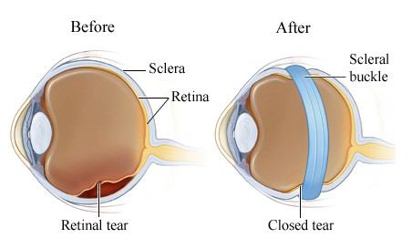
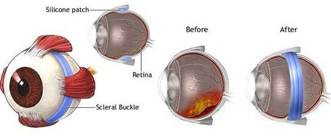

# Scleral Buckle

Source: `Eye Diseases & Conditions-compressed.pdf`, pages 486-492.

## Images

## Extracted text

<!-- Page 486 -->
Scleral Buckle

<!-- Page 487 -->
Overview of Scleral Buckle
A scleral buckle is a surgical device used to treat retinal detachment, a condition where the
retina (the light-sensitive layer at the back of the eye) separates from its underlying tissue. This
separation can lead to permanent vision loss if left untreated. The scleral buckle procedure
involves placing a silicone band (the buckle) around the sclera (the white part of the eye) to
gently push the eyeball inward, helping the retina reattach to the wall of the eye.
This procedure is typically performed when a retinal tear or hole is present, and it is most
commonly used for rhegmatogenous retinal detachment, which occurs when a tear or break in
the retina allows fluid to enter and separate it from the underlying tissue.
Symptoms and Causes of Retinal Detachment
Symptoms of Retinal Detachment:
Sudden flashes of light or "photopsia"
Floaters: Dark, shadowy spots or threads that appear in the field of vision
A curtain or shadow appearing in the peripheral vision
Blurry or distorted vision
Sudden loss of vision in one eye (in severe cases)
These symptoms can vary in intensity, and if you experience any of them, it's essential to seek
immediate medical attention to prevent permanent damage to the retina.
Causes of Retinal Detachment:
Age-related changes: The vitreous gel inside the eye shrinks over time and can pull
away from the retina, causing tears.
Eye injury: Trauma or impact to the eye can lead to retinal tears or detachment.

<!-- Page 488 -->
Previous eye surgeries: Certain surgeries, like cataract surgery, can increase the risk of
retinal detachment.
Diabetic retinopathy: Long-term diabetes can cause damage to the blood vessels in the
retina, leading to potential detachment.
Genetic factors: A family history of retinal detachment or other eye conditions can
increase risk.
High myopia (nearsightedness): Individuals with severe nearsightedness have a higher
risk of retinal detachment.
Diagnosis and Tests
To diagnose retinal detachment and determine whether a scleral buckle procedure is necessary,
an ophthalmologist will perform a comprehensive eye exam. Key diagnostic tools include:
Dilated Eye Exam: The doctor uses special eye drops to widen the pupil and examine
the retina and the back of the eye.
OCT (Optical Coherence Tomography): This imaging test provides detailed cross-
sectional images of the retina to detect any tears or detachment.
Ultrasound: If the retina cannot be clearly seen due to bleeding or cataracts, an
ultrasound of the eye may be used to assess the retina.
Fluorescein Angiography: A dye is injected into the bloodstream, and photos are taken
of the retina to detect abnormalities, including leaks or tears.
These tests help confirm the presence of retinal detachment and determine the most appropriate
treatment options.
Management and Treatment of Retinal Detachment
The goal of treating retinal detachment is to reattach the retina and preserve vision. Several
surgical approaches can be used, and the scleral buckle is one of the most common and effective
options.
Surgical Options:
1. Scleral Buckling: A silicone band is placed around the eye to gently compress the sclera,
which helps seal the retinal tear and allows the retina to reattach.
2. Vitrectomy: This procedure involves removing the vitreous gel that is pulling on the
retina, followed by the insertion of a gas or silicone oil bubble to hold the retina in place.
3. Pneumatic Retinopexy: A gas bubble is injected into the eye to push the retina back into
place, followed by cryotherapy or laser to seal the retinal tear.
In some cases, a combination of these techniques may be used, depending on the location and
severity of the detachment.

<!-- Page 489 -->
Post-surgery Care:
After a scleral buckle surgery, recovery typically involves:
Positioning: Patients may be instructed to maintain a specific head position for a certain
period, which helps ensure the retina stays in place.
Medications: Antibiotic or anti-inflammatory eye drops are prescribed to prevent
infection and reduce inflammation.
Follow-up visits: Regular check-ups with the ophthalmologist are necessary to monitor
healing and detect any complications.
Scleral Buckle Types & Surgery
There are various types of scleral buckles based on the size, shape, and placement around the
eye. These include:
Segmental Buckles: Used to treat specific areas of retinal detachment. They are smaller
and more localized.
Circumferential Buckles: A continuous band that encircles the entire eye, offering a
more comprehensive approach to retinal reattachment.
Scleral buckling surgery typically involves a small incision in the conjunctiva (the clear tissue
covering the white part of the eye), and the buckle is secured using sutures. Depending on the
severity of the detachment, additional procedures such as laser therapy or cryotherapy (freezing
treatment) may be used to close the retinal tear.
Complicated Scleral Buckle
While scleral buckling is generally a successful and routine procedure, complications can arise in
certain cases:
Infection: Any surgical procedure carries a risk of infection, though it's relatively rare.
Glaucoma: The buckle may increase pressure within the eye, potentially leading to
glaucoma.
Retinal Scarring: Scarring of the retina after surgery may impair vision, especially if the
detachment was extensive.
Buckle Erosion: In rare cases, the buckle may begin to erode through the eye,
necessitating further surgery.
It is important for patients to attend follow-up visits to detect and address any complications
promptly.

<!-- Page 490 -->
Scleral Buckle in Adults
In adults, the most common cause of retinal detachment is age-related changes, particularly in
those over the age of 50. Other contributing factors include eye trauma, diabetic retinopathy, and
high myopia. Scleral buckling in adults is usually successful in reattaching the retina and
preserving vision, especially when the procedure is performed early in the detachment process.
Postoperative Considerations:
Recovery time: Adults typically experience a recovery period of several weeks to
months.
Vision improvement: Depending on the extent of the detachment and any pre-existing
conditions, vision may improve, stabilize, or remain unchanged after surgery.
Lifestyle adjustments: Patients may need to adjust their activities during recovery,
avoiding strenuous activities or positions that could compromise the healing process.
Scleral Buckle in Children
Retinal detachment in children is much rarer than in adults but can still occur, often due to
trauma or congenital conditions. The procedure for placing a scleral buckle in children is similar
to that in adults, though special considerations must be taken, including:
Anesthesia: Children typically require general anesthesia for the procedure.
Post-surgery care: Parents must carefully follow aftercare instructions to ensure proper
healing and avoid complications.
Vision monitoring: After surgery, children will need to have their vision closely
monitored to detect any issues with healing or the development of amblyopia (lazy eye).
Children generally recover well from scleral buckle surgery, though close follow-up care is
essential to assess the long-term effects on their vision.
Prevention of Retinal Detachment
While it’s not always possible to prevent retinal detachment, certain steps can reduce the risk:
Regular eye exams: People at higher risk (e.g., those with high myopia or a family
history of retinal detachment) should have regular eye exams to detect early signs of
retinal problems.
Protecting the eyes: Wearing protective eyewear during sports or activities that pose a
risk of eye injury can help prevent trauma-related detachment.
Managing underlying conditions: If you have diabetes, maintaining good control over
blood sugar can prevent diabetic retinopathy, a common cause of retinal detachment.

<!-- Page 491 -->
Outlook/Prognosis
The prognosis after a scleral buckle procedure is generally good, with many patients
experiencing significant improvements in vision. The success of the surgery depends on factors
such as the extent of the retinal detachment, the promptness of treatment, and the presence of any
underlying eye conditions.
In general, the earlier the retinal detachment is treated, the better the chances for preserving
vision. However, even with surgery, some patients may experience reduced vision due to
scarring or other complications.
Living with a Scleral Buckle
Living with a scleral buckle can be a manageable experience, though patients may need to adjust
to certain changes in their vision, especially in the months following surgery. Long-term follow-
up care is necessary to ensure that the retina remains attached and to monitor for any
complications.
Lifestyle Adjustments:
Avoid heavy lifting or activities that could put strain on the eye.
Limit screen time to avoid eye strain during recovery.
Wear sunglasses to protect the eyes from UV light.
Additional Common Questions (FAQs)
1. How long does recovery take after a scleral buckle procedure?
o
Recovery varies, but it typically takes several weeks for initial healing. Full
recovery, including
vision stabilization, can take several months.

<!-- Page 492 -->
2. Will I lose my vision after a scleral buckle surgery?
o
In most cases, scleral buckling can prevent vision loss and restore some degree of
vision. However, outcomes vary based on the severity of the detachment and
other factors.
3. Can I resume normal activities after the surgery?
o
Patients are advised to avoid strenuous activities, heavy lifting, or any actions that
may put pressure on the eye during the initial recovery period.
4. Can a scleral buckle fail to reattach the retina?
o
While rare, failure of the scleral buckle to reattach the retina can occur, requiring
further surgery or alternative treatments like a vitrectomy.
5. Are there long-term risks associated with a scleral buckle?
o
Long-term risks may include elevated eye pressure (glaucoma), visual distortions,
or the need for additional surgeries. Regular follow-up appointments are essential
for detecting these issues early.
