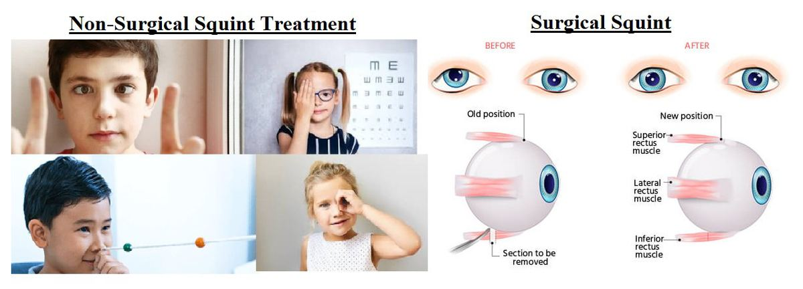
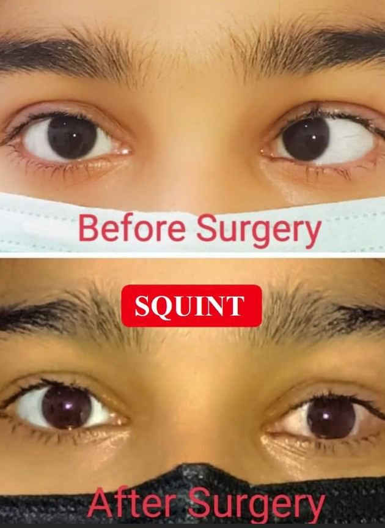

# Squint (Surgical & Non-Surgical)

Source: `Eye Diseases & Conditions-compressed.pdf`, pages 492-498.

## Images

## Extracted text

<!-- Page 492 -->
Squint (Surgical & Non-Surgical)
Overview of Squint (Strabismus)
Squint, medically known as strabismus, is a condition where the eyes do not align properly. One
eye may turn inwards, outwards, upwards, or downwards while the other eye stays focused. This
misalignment can lead to issues with depth perception, double vision, and, in some cases,
amblyopia (lazy eye), where the brain starts ignoring the input from the misaligned eye.

<!-- Page 493 -->
Squint can occur at any age and may be present from birth (congenital) or develop later in life
(acquired). Treatment options vary based on the severity, type, and underlying causes of the
squint.
Symptoms and Causes of Squint
Symptoms of Squint:
Misalignment of one or both eyes: Eyes may appear crossed, turned inwards
(esotropia), outwards (exotropia), upwards (hypertropia), or downwards (hypotropia).
Double vision: This occurs when both eyes focus on different points, causing images to
overlap.
Difficulty with depth perception: Since the eyes are not working together, it can be hard
to judge distances accurately.
Amblyopia (Lazy Eye): In some cases, the brain ignores input from the misaligned eye,
leading to reduced vision in that eye.
Eye strain or discomfort: A squinting eye can cause strain, headaches, or even blurred
vision due to the extra effort to focus.
Causes of Squint:
The causes of squint can be categorized into neurological, muscular, and refractive factors:
1. Neurological Causes: Abnormalities or issues with the nerves controlling the eye
muscles can result in misalignment. Conditions such as Cerebral Palsy, stroke, or brain
injury may be involved.
2. Muscular Causes: Weakness or dysfunction in the eye muscles, which control
movement, can lead to squinting. This is more common in conditions like congenital
esotropia.
3. Refractive Issues: High levels of uncorrected refractive errors (e.g., farsightedness or
astigmatism) may cause the eyes to focus improperly, potentially leading to a squint.
4. Genetic Factors: In some cases, squinting runs in families, indicating a genetic
predisposition to the condition.
5. Environmental and Developmental Factors: Premature birth or developmental delays
may contribute to squint in infants.
Diagnosis and Tests
The diagnosis of squint typically begins with a comprehensive eye examination by an
ophthalmologist or optometrist. The following tests may be conducted:
Visual Acuity Test: Assesses the sharpness of vision in each eye.
Cover Test: The doctor will cover one eye at a time to observe how the uncovered eye
moves to maintain focus, helping detect any misalignment.
Hirschberg Test: A simple test to observe the light reflection in both eyes. Any
misalignment will cause the light reflection to be asymmetric.

<!-- Page 494 -->
Refraction Test: Determines whether refractive errors (like nearsightedness or
farsightedness) are contributing to the squint.
Retinal Exam: Helps to rule out any other eye conditions that may cause squinting, such
as cataracts or retinal disorders.
Binocular Vision Testing: Assesses how well both eyes work together and how the brain
processes visual information from both eyes.
In some cases, further diagnostic imaging (like MRI or CT scans) may be recommended to
assess underlying neurological causes.
Management and Treatment of Squint
Non-Surgical Treatments:
1. Eyeglasses or Contact Lenses: Refractive errors like hyperopia (farsightedness) can
cause squinting. Correcting these with glasses or contacts may reduce the misalignment
or improve vision and coordination between the eyes.
2. Prism Lenses: Special lenses can be prescribed to realign the light entering the eyes,
helping reduce double vision and easing eye strain.
3. Vision Therapy: A series of exercises designed to strengthen the eye muscles, improve
coordination, and retrain the brain to use both eyes together. This is often used for mild
cases or as a complementary treatment after surgery.
4. Occlusion Therapy (Patch Therapy): In cases where amblyopia has developed,
patching the stronger eye forces the brain to use the weaker, misaligned eye, which can
help improve vision over time.
Surgical Treatments:
Surgery is typically considered when non-surgical treatments do not resolve the squint or if the
condition is severe. The goal of surgery is to adjust the length or position of the eye muscles to
realign the eyes.
1. Recession and Resection: The most common surgical technique, where the surgeon
weakens an overactive muscle (recession) or strengthens a weak muscle (resection).
2. Suturing: Some cases may require suturing the muscles to a new position to achieve the
desired alignment.
3. Adjustable Sutures: In some surgeries, sutures are adjusted after the procedure to fine-
tune the alignment of the eyes.
Complicated Squint (Surgical & Non-Surgical)
Squint can become complicated in various ways:
1. Amblyopia: If the brain starts ignoring input from the misaligned eye, leading to a
permanent decrease in vision in that eye.
2. Double Vision: Even after surgery, some individuals may continue to experience double
vision due to improper eye muscle balance.

<!-- Page 495 -->
3. Overcorrection or Undercorrection: Surgical correction may lead to the opposite
problem (e.g., if a previously crossed eye becomes overly divergent after surgery).
4. Vision Problems in Adults: Squint in adults may be harder to treat effectively,
especially if the condition has been long-standing or is linked to neurological issues like
stroke or trauma.
5. Relapse of Squint: In some cases, especially with young children, squint can recur after
surgery, necessitating additional interventions.
Squint in Adults
Squint in adults can develop due to a variety of causes, such as:
Neurological issues: Stroke or trauma to the brain can cause muscles to weaken or
misfire, leading to squint.
Muscle or nerve dysfunction: Weakness in the eye muscles or nerve problems can cause
an eye to wander out of alignment.
Uncorrected refractive errors: Severe farsightedness can cause the eyes to turn inward
as they strain to focus.
Treatment in Adults:
Adults with squint often benefit from surgery, especially if the condition leads to double vision
or poor cosmetic appearance. In addition to surgery, prism lenses, eyeglasses, or vision therapy
can help manage the condition.
Squint in Children
Squint in children is often congenital or develops in the early years. Early detection is crucial to
prevent complications like amblyopia (lazy eye), which can result in permanent vision loss in the
misaligned eye if left untreated.
Treatment in Children:
Non-surgical methods: If the squint is mild, glasses, patching, and vision therapy can
often improve the alignment of the eyes and restore proper vision.
Surgery: If conservative treatments do not resolve the issue, surgery may be needed to
correct the muscle imbalance. Early surgical intervention can help prevent long-term
vision problems.
Prevention of Squint
While squint is not always preventable, there are ways to reduce the risk:
Early eye exams: Children should have eye exams starting at 6 months of age to detect
any visual problems early. Regular eye exams are important for people with a family
history of strabismus or other eye conditions.

<!-- Page 496 -->
Preventing eye injuries: Use safety glasses during sports or activities that may cause eye
trauma.
Prompt treatment of refractive errors: Correcting vision problems in childhood, such
as farsightedness or astigmatism, can help prevent squint from developing.
Outlook/Prognosis
The prognosis for squint largely depends on the cause, severity, and age of onset. Early detection
and treatment typically lead to better outcomes. For children, treating squint before the age of 6
can prevent amblyopia and ensure normal visual development.
In adults, treatment can improve the cosmetic appearance and reduce double vision, but the
prognosis may be less favorable if neurological issues or long-standing strabismus are present.
Ongoing follow-up care is often necessary to ensure successful treatment outcomes.
Living with Squint
Living with squint can be challenging, particularly if it causes double vision, difficulty with
depth perception, or social concerns related to appearance. However, treatment options, both
surgical and non-surgical, can significantly improve quality of life.
Coping Strategies:
Emotional Support: For children and adults alike, squint can affect self-esteem and
confidence. Support from family, friends, or a counselor can help individuals cope.
Follow-up Care: Regular eye check-ups are important to monitor the condition and
adjust treatments as needed.
Adjustments in Daily Life: People with squint may benefit from techniques to help with
reading or tasks requiring depth perception, such as using one eye at a time for activities.

<!-- Page 498 -->
Additional Common Questions (FAQs)
1. Can squint be treated without surgery?
o
Yes, many cases of squint can be treated with glasses, patch therapy, or vision
therapy, especially in younger children or mild cases.
2. Will squint affect my ability to drive?
o
If the squint causes double vision or affects depth perception, it may impair
driving ability. However, treatment can often improve these symptoms.
3. How long does recovery take after squint surgery?
o
Recovery typically takes a few weeks. Vision may fluctuate during this period,
and the eyes may take time to adjust to the new alignment.
4. Can squint come back after surgery?
o
In some cases, squint may recur, especially in children. Further surgery or non-
surgical treatments may be needed.
5. Is squint hereditary?
o
Yes, squint can run in families, suggesting a genetic component to the condition.
However, environmental and developmental factors can also play a role.
