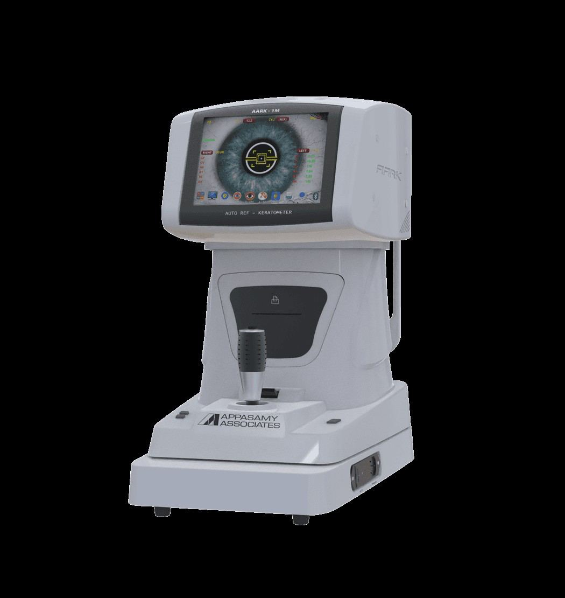
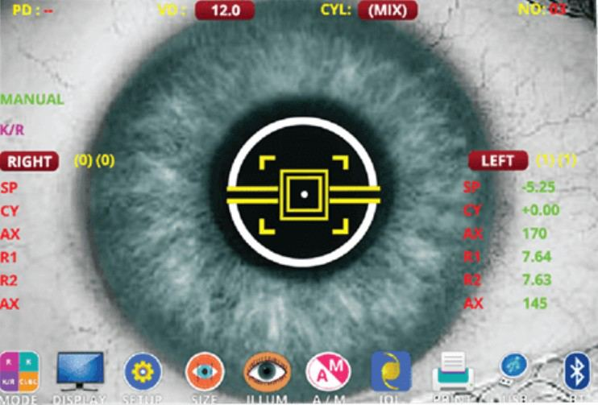

# Keratometry

Source: `Eye Diseases & Conditions-compressed.pdf`, pages 498-504.

## Images

## Extracted text

<!-- Page 498 -->
Keratometry

<!-- Page 499 -->
Overview of Keratometry
Keratometry is a diagnostic test used to measure the curvature of the cornea, which is the clear,
dome-shaped surface at the front of the eye. The primary purpose of keratometry is to assess the
shape and size of the cornea, which plays a vital role in focusing light onto the retina for clear
vision. This test is essential in evaluating the astigmatism, the fitting of contact lenses, and
monitoring conditions like keratoconus or corneal transplants.

<!-- Page 500 -->
Keratometry is typically performed using an instrument called a keratometer or auto-
keratometer. This test is quick, non-invasive, and is commonly conducted during routine eye
exams.
Symptoms and Causes
Symptoms Indicating the Need for Keratometry:
Keratometry is usually performed when patients experience vision issues that suggest corneal
abnormalities or irregularities. Common symptoms that may lead to keratometry include:
Blurry vision: Especially when both near and distant objects are hard to focus on clearly.
Eye strain or discomfort: Persistent discomfort, especially while reading or using digital
devices, could indicate a corneal issue.
Distorted vision: Seeing objects as blurry or skewed can be a sign of astigmatism or
other corneal irregularities.
Frequent changes in prescription: If you need frequent updates to your eyeglasses or
contact lenses prescription, it could indicate that the curvature of your cornea is changing.
Sensitivity to light: The inability to tolerate bright lights or glare could be associated
with corneal irregularities.
Causes of Abnormal Keratometry Results:
Keratometry measures the shape of the cornea and any irregularities. The causes of these
irregularities include:
Astigmatism: A common condition where the cornea has an uneven shape, leading to
blurred or distorted vision. It can be regular (where the curvature is consistent) or
irregular (where the curvature is more uneven).
Keratoconus: A progressive condition where the cornea becomes thin and bulges
outward, causing distorted vision.
Corneal scarring: Caused by trauma, infection, or surgery, which can affect the smooth
curvature of the cornea.
Corneal transplant: After a transplant, keratometry is used to monitor the healing and
shape of the new cornea.
Contact lens wear: Long-term use of contact lenses, especially improperly fitted ones,
can alter the corneal shape.
Diagnosis and Tests
Keratometry is typically performed during a comprehensive eye exam. The test measures the
radius of curvature of the cornea in different meridians and provides an overall shape of the
cornea. The most common methods of performing keratometry include:
Manual Keratometer: The patient looks into the device, which projects a series of
concentric rings onto the cornea. The device then measures the reflection of light from
the corneal surface to determine its curvature.

<!-- Page 501 -->
Autokeratometer: This is an automated version of the keratometer, which offers higher
precision and is often used for more detailed measurements. It provides a digital readout
of corneal curvature and can help identify irregularities.
Topography: This advanced imaging test can map the entire corneal surface, providing
more detailed information about irregularities. It’s often used in cases like keratoconus
or for contact lens fittings.
Other complementary tests may be conducted if corneal abnormalities are suspected, including:
Refraction: To determine the optical power of the eye and identify any refractive errors
(e.g., myopia, hyperopia, or astigmatism).
Slit Lamp Examination: To inspect the cornea and look for any signs of damage,
scarring, or disease.
Pachymetry: A test that measures the thickness of the cornea, which is important in
diagnosing conditions like glaucoma or keratoconus.
Management and Treatment of Abnormal Keratometry Results
The management and treatment following keratometry results depend on the diagnosis. Here’s
how common corneal conditions identified through keratometry are treated:
Astigmatism:
o
Eyeglasses or contact lenses: The most common treatment for correcting
astigmatism. Toric contact lenses are designed specifically to correct
astigmatism by compensating for the uneven corneal curvature.
o
Refractive surgery: Procedures like LASIK or PRK can be used to reshape the
cornea and correct astigmatism.
Keratoconus:
o
Rigid contact lenses: Specialized contact lenses are often required for
keratoconus patients to help improve vision.
o
Corneal cross-linking: A treatment that strengthens the corneal tissue and halts
the progression of keratoconus by using UV light and riboflavin.
o
Corneal transplant: In severe cases, where the cornea becomes too thin or
scarred, a transplant may be needed.
Corneal Scarring:
o
Antibiotics: If the scarring is caused by an infection, antibiotics or antiviral
medications may be required.
o
Surgery: In some cases, surgery or corneal transplant may be recommended to
remove damaged tissue.
Contact Lens Fitting:
o
Regular keratometry is used to fit contact lenses, especially for patients with
astigmatism or those who need special lenses like scleral lenses or hybrid lenses.

<!-- Page 502 -->
Keratometry Types & Surgery
Keratometry results guide the decision-making process for corneal surgery, particularly for
conditions like keratoconus or astigmatism. Types of keratometric procedures and surgeries
include:
LASIK (Laser-Assisted in Situ Keratomileusis): A type of refractive surgery where a
laser is used to reshape the cornea, correcting conditions like myopia, hyperopia, and
astigmatism.
PRK (Photorefractive Keratectomy): A similar surgery to LASIK, but instead of
creating a flap, the outer layer of the cornea is removed before reshaping.
Corneal Transplant: In cases of advanced keratoconus or corneal scarring, a transplant
may be necessary to replace a damaged cornea with a donor cornea.
Corneal Cross-linking: A procedure designed to strengthen the cornea, particularly for
keratoconus patients, by using UV light and riboflavin.
Complicated Keratometry
Complications can arise when keratometry identifies conditions that are difficult to treat or
manage. Some examples of complications include:
Irregular Corneal Shape: Conditions like keratoconus can lead to significant
irregularities that make it difficult to fit conventional contact lenses.
Corneal Scarring: If scarring from previous infections or trauma is severe, vision
correction through non-surgical methods may be impossible, and surgical intervention
might be required.
Poor Surgical Outcomes: In some cases, surgery (e.g., LASIK) may not achieve the
desired results, leading to the need for further intervention.
Keratometry in Adults
In adults, keratometry is often used to monitor eye health and detect refractive errors such as
astigmatism. Adults with certain conditions like dry eye syndrome, glaucoma, or cataracts
may also benefit from keratometry to assess how these conditions affect the corneal shape and
curvature.
For adults considering refractive surgery (LASIK, PRK), keratometry is an essential part of the
preoperative evaluation to ensure they are suitable candidates for the procedure.
Keratometry in Children
For children, keratometry is crucial in identifying conditions like childhood astigmatism or
keratoconus, which can affect vision development. If a child is diagnosed with amblyopia (lazy
eye), keratometry may help identify underlying causes like astigmatism or corneal
irregularities.

<!-- Page 503 -->
Early Detection and Treatment:
Early detection of conditions that affect keratometry, such as astigmatism, can lead to effective
treatments like corrective glasses or contact lenses to ensure proper visual development.
Prevention of Keratometry Abnormalities
While some conditions that affect keratometry, like keratoconus, cannot be prevented, there are
steps you can take to reduce the risk of corneal damage or irregularities:
Regular eye exams: Especially for those with a family history of eye conditions.
Proper contact lens hygiene: Prevent infections and corneal damage by following
proper lens care and replacing them as directed.
Protecting the eyes: Wearing safety glasses during activities that could lead to eye
injury.
Outlook/Prognosis
The prognosis depends on the condition diagnosed through keratometry:
Astigmatism: With corrective glasses, contact lenses, or refractive surgery, most
individuals can achieve normal vision.
Keratoconus: With appropriate treatment (contact lenses, corneal cross-linking, or a
transplant), many patients can maintain good vision
Corneal Scarring: The prognosis depends on the extent of scarring, but treatment with
surgery or corneal transplant may restore vision in some cases.
Living with Keratometry Results
For most people, managing conditions revealed by keratometry involves using corrective lenses
or undergoing surgery to improve vision. Living with conditions like astigmatism or
keratoconus may require ongoing monitoring and adjustments in treatment.
Regular follow-up exams are essential to ensure that conditions like keratoconus or corneal
scarring are managed appropriately. Contact lenses or surgeries may need to be adjusted as the
condition progresses.

<!-- Page 504 -->
Additional Common Questions (FAQs)
1. Is keratometry painful?
o
No, keratometry is a non-invasive and painless procedure.
2. How often should keratometry be done?
o
Keratometry is typically performed during routine eye exams. If you have a
condition like astigmatism or keratoconus, your doctor may recommend more
frequent testing.
3. Can keratometry help with fitting contact lenses?
o
Yes, keratometry helps determine the curvature of the cornea, which is essential
for fitting contact lenses, especially for patients with astigmatism or irregular
corneas.
4. What if my keratometry results show irregularities?
o
Irregular keratometry results could indicate a refractive error, corneal disease, or
the need for a contact lens fitting adjustment. Your doctor will discuss treatment
options based on the diagnosis.
5. Can keratometry detect keratoconus?
o
Yes, keratometry can detect irregularities in the cornea, which may indicate
keratoconus. Further tests like corneal topography may be used for a more
detailed diagnosis.
