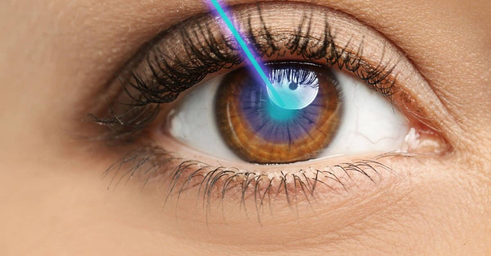
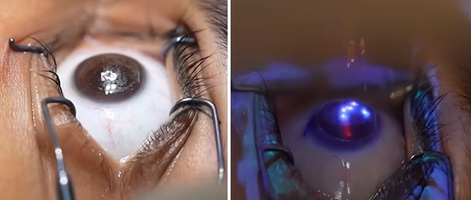

# Refractive Eye Surgery

Source: `Eye Diseases & Conditions-compressed.pdf`, pages 505-510.

## Images

## Extracted text

<!-- Page 505 -->
Refractive Eye Surgery
Overview of Refractive Eye Surgery
Refractive eye surgery is a type of surgical procedure designed to correct common vision
problems such as nearsightedness (myopia), farsightedness (hyperopia), and astigmatism, which
are caused by the irregular shape of the cornea or lens. The goal of refractive surgery is to
improve visual acuity, reducing or eliminating the need for corrective lenses like glasses or
contact lenses.
The procedures generally involve reshaping the cornea, the clear, front surface of the eye, to
enable light entering the eye to focus properly on the retina. Refractive eye surgeries are among
the most common elective surgeries worldwide due to their ability to improve vision
significantly with minimal recovery time.

<!-- Page 506 -->
Symptoms and Causes of Refractive Errors
Symptoms Indicating the Need for Refractive Eye Surgery:
1. Blurry Vision: Difficulty seeing objects clearly, either up close (hyperopia) or at a
distance (myopia).
2. Frequent Changes in Prescription: If your glasses or contact lens prescription changes
regularly, this might indicate an underlying refractive error.
3. Eye Strain: Constantly straining your eyes to focus, particularly when reading or using
digital devices, can be a sign of an uncorrected refractive error.
4. Headaches: Persistent headaches may occur due to eye strain or the need for corrective
lenses.
5. Night Vision Problems: Difficulty seeing well at night, such as halos or glare around
lights, can be linked to refractive errors.
6. Double Vision: Sometimes caused by astigmatism, where the cornea or lens has an
irregular shape.
Causes of Refractive Errors:
Corneal Irregularities: The cornea’s shape may be too steep (myopia) or too flat
(hyperopia), causing light to focus improperly on the retina.
Lens Problems: The lens inside the eye may become misshapen or lose its ability to
focus light properly, especially as a person ages (presbyopia).
Genetics: Many refractive errors are inherited, making family history an important factor
in determining risk.
Environmental Factors: Long periods of close-up work or screen time may worsen
existing refractive errors.
Diagnosis and Tests for Refractive Eye Surgery
Before undergoing refractive eye surgery, an eye care professional will conduct a series of
diagnostic tests to assess the eyes' shape and visual acuity. These include:
1. Comprehensive Eye Exam: Includes an eye chart test to assess visual acuity and a
refraction test to determine the degree of refractive error.
2. Corneal Topography: A map of the cornea’s surface that helps to determine the best
surgical approach, particularly for LASIK and other corneal-based surgeries.
3. Pachymetry: Measures the thickness of the cornea to ensure it is thick enough for
surgery, such as LASIK, which reshapes the cornea.
4. Retinal Examination: To rule out any underlying retinal conditions that might interfere
with the surgery or post-operative healing.
5. Wavefront Analysis: An advanced test that maps how light is distorted as it enters the
eye, helping to assess higher-order aberrations that may affect vision beyond just
nearsightedness or farsightedness.

<!-- Page 507 -->
Management and Treatment of Refractive Eye Conditions
The primary treatment for refractive errors is through corrective lenses (glasses or contact lenses)
or surgery. Refractive eye surgery is typically recommended when corrective lenses are no
longer a preferred solution, or when individuals seek a more permanent solution.
1. Corrective Lenses: Glasses or contact lenses are the most common and non-invasive
treatment for refractive errors.
2. Refractive Surgery: Surgical procedures that reshape the cornea or lens to correct
refractive errors and reduce or eliminate the need for glasses or contact lenses.
Refractive Eye Surgery Types & Procedures
There are several types of refractive surgeries, each designed to correct different refractive
errors. The most common procedures include:
1. LASIK (Laser-Assisted in Situ Keratomileusis): The most widely known refractive
surgery. LASIK uses a laser to reshape the cornea, improving the way light enters the
eye.
o
Procedure: A flap is created in the cornea, and the underlying tissue is reshaped
using a laser.
o
Ideal for: Myopia, hyperopia, and astigmatism.
2. PRK (Photorefractive Keratectomy): An alternative to LASIK, where the corneal
surface is reshaped directly without creating a flap.
o
Ideal for: Mild to moderate myopia, hyperopia, and astigmatism.
3. LASEK (Laser-Assisted Subepithelial Keratectomy): Similar to PRK but involves
lifting the outer layer of the cornea before reshaping it.
o
Ideal for: Patients with thinner corneas or those not suitable for LASIK.
4. SMILE (Small Incision Lenticule Extraction): A minimally invasive procedure where
a small piece of corneal tissue is removed to correct refractive errors.
o
Ideal for: Myopia and astigmatism.
5. Implantable Contact Lenses (ICL): For patients with high refractive errors who may
not be candidates for laser surgery. ICLs are implanted inside the eye to correct vision.
o
Ideal for: High myopia and hyperopia.
6. Refractive Lens Exchange (RLE): A surgery that removes the natural lens of the eye
and replaces it with an artificial intraocular lens (IOL).
o
Ideal for: Patients with presbyopia or high degrees of refractive error.
Complicated Refractive Eye Surgeries
While most refractive surgeries are safe and effective, complications can arise, especially in
individuals with certain risk factors, such as thin corneas or other eye conditions. Potential
complications include:

<!-- Page 508 -->
1. Dry Eye: One of the most common side effects after LASIK and other refractive
surgeries.
2. Flap Complications (LASIK): Problems with the corneal flap, such as dislocation or
infection, may occur.
3. Under- or Over-Correction: In some cases, the surgery may not correct the vision
problem fully, requiring an enhancement procedure.
4. Halo and Glare: Some patients experience visual disturbances, especially at night, such
as halos around lights.
5. Infection: Though rare, any surgery carries a risk of infection, which could affect the
recovery process.
Refractive Eye Surgery in Adults
Refractive surgery is primarily performed on adults who have stable vision, typically around the
ages of 20 to 40. It’s most commonly done to treat myopia, hyperopia, or astigmatism, especially
for individuals who are frustrated with the need for glasses or contact lenses.
Candidacy: Ideal candidates are over 18, have stable vision for at least one year, and do
not have any contraindications such as corneal disease, cataracts, or severe dry eyes.
Recovery: Recovery time varies, but most people experience improved vision within a
few days, with complete stabilization occurring in a few weeks.
Refractive Eye Surgery in Children
Refractive surgery in children is much less common and is generally considered only in cases
where the child has a severe refractive error that cannot be corrected with glasses or contact
lenses.
Age Restrictions: Children typically need to wait until they are older (at least 18) for
refractive surgery to ensure that their vision has stabilized.
Potential Risks: Surgery before the eyes have fully matured can result in the need for
further surgeries or lead to changes in vision over time.
Conditions Treated: Severe myopia or astigmatism that cannot be managed with
conventional lenses might be treated with surgery once the child’s eye development is
complete.
Prevention of Refractive Errors
While refractive errors are largely genetic, there are a few steps you can take to reduce the
progression of these conditions:
1. Regular Eye Exams: Early detection of refractive errors allows for early intervention
with glasses, contacts, or surgery.
2. Manage Screen Time: Prolonged close-up work and excessive screen time can strain the
eyes, potentially worsening refractive errors.

<!-- Page 509 -->
3. Healthy Lifestyle: Eating a diet rich in vitamins and antioxidants, and maintaining
overall eye health through hydration and regular physical activity, can support vision
health.
Outlook/Prognosis of Refractive Eye Surgery
The prognosis for refractive eye surgery is generally excellent, with many patients experiencing
significantly improved vision and reduced reliance on corrective lenses. However, individual
results may vary depending on the type of surgery, the severity of the refractive error, and the
patient’s overall eye health.
Success Rates: Most refractive surgeries, including LASIK and PRK, have success rates
of around 95%, with patients achieving 20/25 vision or better.
Long-Term Effects: In the long term, patients may still experience mild changes in their
vision as they age (e.g., presbyopia), but significant vision loss is rare.
Living with Refractive Eye Surgery
After refractive eye surgery, most patients experience an improved quality of life, with fewer or
no issues related to glasses or contact lenses. However, patients must follow post-operative
instructions carefully to minimize complications and ensure the best results.
Post-Operative Care: Includes using prescribed eye drops, avoiding strenuous activities
for a short time, and attending follow-up appointments.
Lifestyle Changes: You may need to modify your lifestyle temporarily, such as avoiding
swimming, dusty environments, or rubbing your eyes.
Additional Common Questions (FAQs)
1. Is refractive eye surgery painful?

<!-- Page 510 -->
o
No, most refractive surgeries are performed under local anesthesia, so the
procedure itself is painless. Some discomfort may occur during recovery, but it is
generally mild and temporary.
2. How long does recovery take?
o
Recovery varies by procedure. LASIK patients usually see improved vision
within a few days, while PRK and other surgeries may take a few weeks for full
recovery.
3. Will I need glasses after surgery?
o
While many patients achieve 20/20 vision or better, some may still require
reading glasses as they age, especially for near vision.
4. Are there any risks with refractive surgery?
o
As with any surgery, risks include infection, dry eyes, glare, and under-correction
or over-correction. However, these risks are rare and can often be managed with
appropriate care.
5. Who is not a candidate for refractive surgery?
o
People with unstable vision, certain eye diseases (like keratoconus), or other
medical conditions (such as autoimmune diseases) may not be good candidates
for refractive eye surgery.
