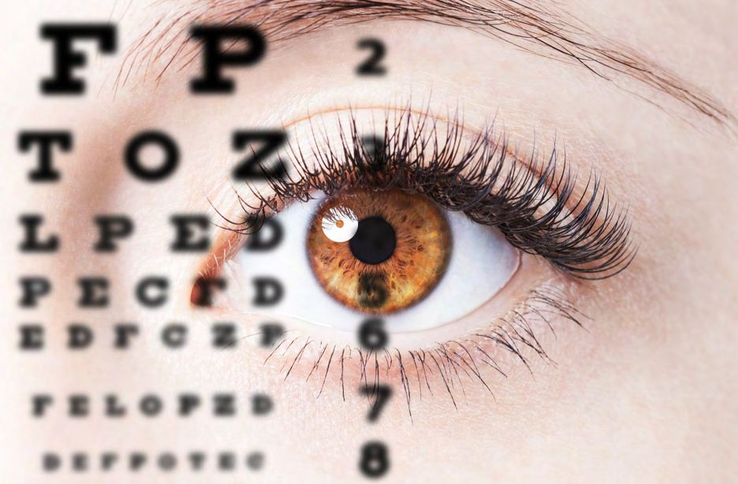
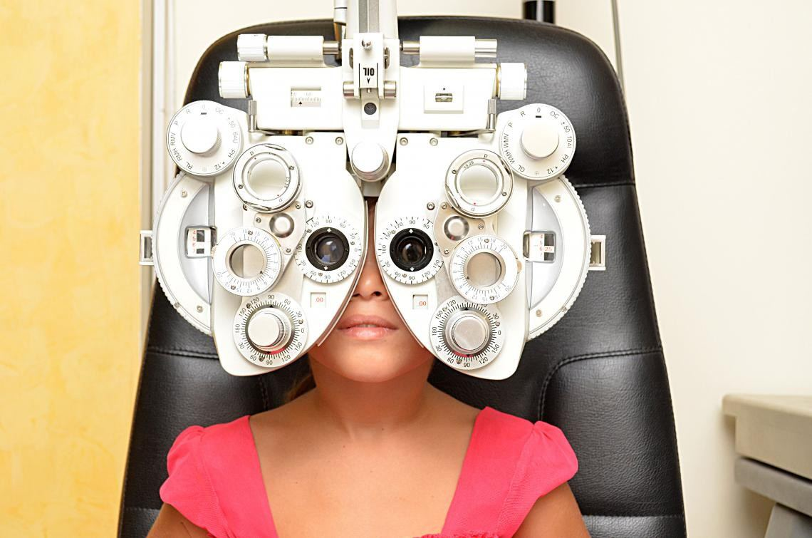

# Optometrist

Source: `Eye Diseases & Conditions-compressed.pdf`, pages 510-515.

## Images

## Extracted text

<!-- Page 510 -->
Optometrist

<!-- Page 511 -->
Overview of an Optometrist
An optometrist is a healthcare professional who specializes in diagnosing, managing, and
treating various conditions related to the eyes and visual system. They are distinct from
ophthalmologists and opticians, as optometrists focus on vision care and eye health, but do not
perform surgery. Optometrists are often the first point of contact for individuals experiencing
vision problems and provide both corrective measures (like glasses or contact lenses) and
medical care for certain eye conditions.
In many regions, optometrists are licensed to prescribe medications for eye conditions, offer
vision therapy, and treat diseases like glaucoma or eye infections. They are highly trained to
detect and manage various visual impairments, including refractive errors (nearsightedness,
farsightedness, and astigmatism), as well as conditions like dry eye syndrome or conjunctivitis.
Symptoms and Causes Requiring an Optometrist’s Care
People visit optometrists for a variety of reasons. Common symptoms or complaints that might
indicate a need for optometric care include:
1. Blurred Vision: Difficulty seeing objects clearly, whether close up (nearsightedness) or
far away (farsightedness).
2. Eye Strain: Feeling tired or discomfort around the eyes, especially after prolonged
periods of reading or using digital devices.

<!-- Page 512 -->
3. Headaches: Persistent headaches may occur due to uncorrected refractive errors or eye
strain.
4. Double Vision: Experiencing diplopia, or double vision, which can be caused by a
variety of factors, including misaligned eyes or certain health conditions.
5. Red or Itchy Eyes: Inflammation, redness, or itching may indicate allergies,
conjunctivitis, or other irritations.
6. Dry Eyes: A sensation of dryness, grittiness, or foreign body sensation in the eyes.
7. Eye Discomfort: Pain, soreness, or sensitivity to light, which may be linked to infections,
eye injury, or more serious conditions.
8. Night Vision Problems: Difficulty seeing well in low-light conditions, which may be
indicative of an underlying refractive error or a condition like cataracts.
The causes of these symptoms can vary from temporary irritations like allergies to more serious
conditions such as glaucoma or macular degeneration, making it important to see an optometrist
for an accurate diagnosis.
Diagnosis and Tests Performed by an Optometrist
Optometrists use a variety of diagnostic tools and tests to assess the health of your eyes and
determine the underlying causes of any symptoms. Some common diagnostic tests include:
1. Visual Acuity Test: The standard eye chart test where the patient reads letters from a
distance to assess sharpness of vision.
2. Refraction Test: This test determines the appropriate prescription for glasses or contact
lenses by using a machine to change lens powers and asking the patient to compare
clarity.
3. Slit-Lamp Examination: A microscope that uses light to look at the front of the eye,
including the cornea, iris, and lens, to identify any abnormalities.
4. Tonometry: A test to measure the pressure inside the eye, which is crucial for detecting
glaucoma.
5. Fundus Examination: This involves the use of eye drops to dilate the pupils so the
optometrist can examine the retina and optic nerve for any signs of damage or disease.
6. Visual Field Test: This test checks for blind spots or areas where vision is impaired,
which can indicate certain conditions like glaucoma or neurological disorders.
7. Color Vision Test: To assess whether the patient has any color vision deficiencies or
color blindness.
8. Pupil Reaction Test: The optometrist checks how the pupils respond to light and
different stimuli, which can provide insight into the health of the optic nerve.
These tests allow optometrists to diagnose a wide range of eye conditions, from refractive errors
to more serious diseases like macular degeneration or diabetic retinopathy.
Management and Treatment Provided by an Optometrist
Optometrists offer a wide range of treatments for vision problems and eye health issues,
including:

<!-- Page 513 -->
1. Prescription Glasses or Contact Lenses: The most common treatment for refractive
errors. Optometrists provide prescriptions for corrective lenses and can fit contact lenses.
2. Vision Therapy: A type of physical therapy for the eyes, designed to improve visual
skills like eye tracking, focusing, and coordination. Vision therapy can be helpful for
conditions like amblyopia (lazy eye) or strabismus (crossed eyes).
3. Medications: Optometrists are licensed to prescribe topical eye medications, such as
antibiotics, anti-inflammatory drops, and lubricating eye drops for conditions like dry
eyes or conjunctivitis.
4. Treatment for Eye Infections: Optometrists can diagnose and treat common eye
infections, including bacterial or viral conjunctivitis, and provide the necessary treatment,
often with medications.
5. Pre- and Post-Surgical Care: While optometrists do not perform surgeries, they play a
key role in evaluating and managing pre- and post-surgical care for eye surgeries like
LASIK, cataract surgery, or corneal transplants.
6. Management of Chronic Conditions: Optometrists are trained to monitor and manage
chronic eye conditions like glaucoma, macular degeneration, and diabetic retinopathy.
They can help slow the progression of these conditions and provide ongoing care.
7. Laser Treatments: In some cases, optometrists may perform certain laser treatments to
correct refractive errors (like LASIK or PRK) or treat certain eye conditions such as
glaucoma.
8. Low Vision Rehabilitation: For patients with significant vision loss, optometrists can
provide tools, devices, and strategies to maximize their remaining vision and improve
quality of life.
Everything an Optometrist Does
Optometrists play a vital role in maintaining eye health and vision. Here’s a more detailed list of
what they do:
1. Vision Correction: Optometrists prescribe corrective lenses (glasses or contacts) based
on an individual's visual needs.
2. Eye Health Exams: They conduct routine eye exams to detect any changes in eye health
or vision, even if the patient is not experiencing symptoms.
3. Eye Disease Management: They detect and help manage conditions like glaucoma,
cataracts, macular degeneration, and diabetic retinopathy.
4. Vision Therapy: They provide therapy for conditions like amblyopia, strabismus, and
certain visual processing disorders.
5. Prevention of Eye Conditions: Through regular exams, optometrists can identify
potential problems early and suggest ways to prevent vision loss or deterioration.
6. Education and Advice: They educate patients on the importance of eye health and offer
advice on things like nutrition, proper eye care, and the importance of wearing protective
eyewear.
7. Collaborative Care: If necessary, optometrists refer patients to ophthalmologists or
other specialists for more complex treatment options or surgeries.

<!-- Page 514 -->
Optometrists are crucial in ensuring good vision health, detecting potential issues early, and
offering appropriate treatments to help patients maintain clear, healthy vision throughout their
lives.
Additional Common Questions (FAQs)
1. What is the difference between an optometrist and an ophthalmologist?
o
Optometrists provide primary vision care, including eye exams, prescribing
glasses and contact lenses, and treating some eye diseases. Ophthalmologists, on
the other hand, are medical doctors who can perform eye surgery and treat more
complex eye conditions.
2. How often should I see an optometrist?
o
It is generally recommended to have an eye exam every two years, but if you have
specific conditions like diabetes or a family history of eye disease, more frequent
exams may be necessary.
3. Can optometrists diagnose serious eye diseases?
o
Yes, optometrists can detect and diagnose a wide range of eye conditions,
including glaucoma, cataracts, macular degeneration, and diabetic retinopathy.
They can also refer patients to an ophthalmologist for further treatment if needed.
4. Are optometrists licensed to prescribe medications?
o
Yes, in many regions, optometrists are licensed to prescribe medications for eye
conditions such as dry eyes, infections, or allergies.
5. Can optometrists perform eye surgery?

<!-- Page 515 -->
o
No, optometrists do not perform surgeries. However, they can offer pre-surgical
consultations and post-surgical care for patients undergoing eye surgeries like
LASIK or cataract surgery.
6. Do I need a referral to see an optometrist?
o
In most cases, you do not need a referral to see an optometrist, but it's always a
good idea to check with your healthcare provider or insurance policy.
