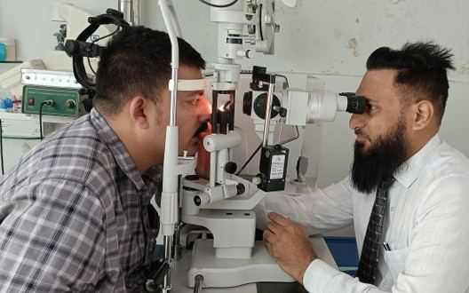
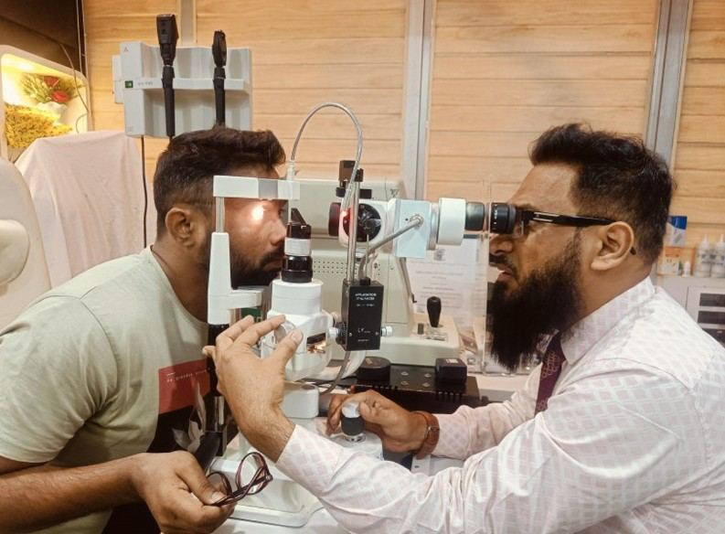

# Ophthalmologist

Source: `Eye Diseases & Conditions-compressed.pdf`, pages 515-521.

## Images

## Extracted text

<!-- Page 515 -->
Ophthalmologist
Overview of an Ophthalmologist
An ophthalmologist is a medical doctor (MD) or doctor of osteopathic medicine (DO) who
specializes in the diagnosis, treatment, and prevention of eye diseases, conditions, and disorders.
Unlike optometrists, ophthalmologists are trained to perform eye surgery and treat a wide range
of vision and eye health issues, from common refractive errors to more serious eye diseases like
glaucoma, cataracts, and retinal disorders.

<!-- Page 516 -->
Ophthalmologists are often involved in more complex cases, particularly when medical
intervention or surgery is needed. Their training includes both medical school and residency,
with some ophthalmologists further specializing in certain subfields like retina, cornea, or
pediatric ophthalmology. Ophthalmologists can also prescribe corrective lenses, but their
primary focus is on surgical and medical eye care.
Symptoms and Causes Requiring an Ophthalmologist's Care
People visit ophthalmologists when they experience symptoms that indicate a need for
specialized care. Some common symptoms include:
1. Blurred Vision: Difficulty seeing clearly, either at a distance (myopia) or up close
(hyperopia), which may require an ophthalmologist’s intervention if glasses or contact
lenses are insufficient.
2. Eye Pain: Persistent or sharp pain in or around the eyes, which could indicate an eye
injury, infection, or more serious condition like glaucoma.
3. Vision Loss or Blind Spots: Sudden or gradual loss of vision, whether partial or total,
which can signal conditions like macular degeneration, diabetic retinopathy, or retinal
detachment.
4. Redness or Inflammation: Chronic redness, swelling, or irritation, often caused by
infections like conjunctivitis or conditions like uveitis.
5. Double Vision (Diplopia): Seeing two images of a single object, which can be caused by
issues with the eye muscles, nerve damage, or more severe conditions.
6. Flashes of Light or Floaters: Seeing flashes of light or dark spots that float in the field
of vision, which can indicate retinal issues.
7. Halos Around Lights: This may occur due to conditions like cataracts or high
intraocular pressure, which can be a sign of glaucoma.
8. Difficulty Seeing at Night: A loss of night vision, which can indicate conditions such as
cataracts or retinitis pigmentosa.
The causes of these symptoms can range from common refractive errors like myopia or
astigmatism to more complex conditions such as glaucoma, diabetic retinopathy, or retinal
detachments, all of which require the expertise of an ophthalmologist.
Diagnosis and Tests Performed by an Ophthalmologist
Ophthalmologists use various diagnostic tests to assess and identify the underlying causes of
eye-related symptoms. These include:
1. Comprehensive Eye Exam: Includes a visual acuity test to assess how clearly you can
see, as well as a refraction test to determine your prescription for glasses or contact
lenses.

<!-- Page 517 -->
2. Slit Lamp Examination: This test uses a microscope with a bright light to examine the
eye’s front structures, such as the cornea, iris, and lens, for any abnormalities.
3. Tonometry: Measures the pressure inside the eye to check for glaucoma. Elevated eye
pressure can be a sign of this potentially sight-threatening condition.
4. Fundus Examination (Retinal Exam): Involves dilating the pupils to get a better view
of the retina, optic nerve, and blood vessels to check for diseases like diabetic
retinopathy, macular degeneration, and glaucoma.
5. Fluorescein Angiography: A diagnostic procedure where a dye is injected into the
bloodstream to highlight blood vessels in the retina. This is particularly helpful in
diagnosing retinal diseases and diabetic eye complications.
6. Optical Coherence Tomography (OCT): A non-invasive imaging test that provides
cross-sectional images of the retina, helping to detect conditions like macular
degeneration, diabetic retinopathy, and glaucoma.
7. Visual Field Test: Measures peripheral vision and detects blind spots, which is crucial in
diagnosing conditions like glaucoma and optic nerve damage.
8. Pupil Reaction Test: Assesses how the pupils react to light and other stimuli, helping to
identify nerve damage or neurological issues that could affect vision.
These tests help ophthalmologists detect and diagnose a wide variety of eye conditions and
diseases, enabling them to create a personalized treatment plan for each patient.
Management and Treatment by Ophthalmologists
Ophthalmologists offer a broad range of treatment options, depending on the type and severity of
the eye condition. Some common management strategies include:
1. Prescription Medications: Ophthalmologists prescribe eye drops or oral medications to
treat conditions such as glaucoma, eye infections, or inflammation. Common examples
include corticosteroids for inflammation or antibiotics for infections.
2. Corrective Lenses: Although ophthalmologists are primarily medical doctors, they can
prescribe glasses or contact lenses to correct refractive errors like myopia, hyperopia, and
astigmatism.
3. Laser Treatment: Laser procedures like LASIK or PRK are used to reshape the cornea
and correct refractive errors. Additionally, laser therapy can be used to treat eye diseases
like diabetic retinopathy, retinal tears, or glaucoma.
4. Surgical Procedures: Ophthalmologists are trained to perform surgeries such as cataract
removal, corneal transplants, retinal detachment repair, and glaucoma surgery (e.g.,
trabeculectomy).
5. Injections: For conditions like macular degeneration, injections of medications such as
anti-VEGF (vascular endothelial growth factor inhibitors) are administered directly into
the eye to slow the progression of the disease.
6. Vision Rehabilitation: For patients with severe vision loss or conditions like low vision,
ophthalmologists may provide rehabilitative services or refer patients to low vision
specialists.

<!-- Page 518 -->
Types of Ophthalmologic Surgeries
Ophthalmologists perform a wide range of surgical procedures depending on the condition.
Some common surgeries include:
1. Cataract Surgery: The removal of a clouded lens and replacement with an artificial
intraocular lens (IOL).
2. Glaucoma Surgery: Procedures like trabeculectomy or the implantation of drainage
devices to reduce intraocular pressure in glaucoma patients.
3. LASIK and PRK: Laser procedures that reshape the cornea to correct refractive errors
like nearsightedness, farsightedness, and astigmatism.
4. Retinal Surgery: This includes surgeries to treat retinal detachment, diabetic retinopathy,
and macular holes.
5. Corneal Transplant: Replacing a damaged or diseased cornea with a healthy donor
cornea.
6. Vitrectomy: A procedure to remove the vitreous gel from the eye, often performed in
cases of retinal detachment, diabetic retinopathy, or vitreous hemorrhage.
Complicated Ophthalmologic Conditions
Some eye conditions may require more specialized care, and ophthalmologists are trained to
handle these complex cases. These include:
1. Retinal Diseases: Conditions like retinal detachment, diabetic retinopathy, and macular
degeneration may require advanced diagnostic imaging and surgical intervention.
2. Glaucoma: Chronic and progressive eye disease that can lead to blindness if not treated.
Ophthalmologists offer advanced treatments like surgical drainage procedures or laser
therapy to manage the condition.
3. Eye Tumors: Although rare, some individuals may develop tumors in or around the eye.
Ophthalmologists work with oncologists to diagnose and manage these conditions.
4. Corneal Diseases: Conditions like corneal dystrophies or severe keratoconus may require
surgical intervention, such as corneal transplants or cross-linking treatments.
Ophthalmologist Care in Adults
Ophthalmologists care for adult patients by diagnosing and managing conditions that are
common in adulthood, including:
Presbyopia: Age-related difficulty in seeing up close, often corrected with reading
glasses or multifocal lenses.

<!-- Page 519 -->
Cataracts: A clouding of the eye’s natural lens, leading to blurred vision. Cataract
surgery is the primary treatment.
Glaucoma: A leading cause of blindness in adults, particularly older adults. Treatment
includes medications, laser therapy, and surgery to reduce intraocular pressure.
Regular eye exams with an ophthalmologist are essential for detecting these conditions early,
particularly in individuals over the age of 40.
Ophthalmologist Care in Children
Pediatric ophthalmologists specialize in diagnosing and treating eye conditions in children. Some
common conditions include:
Strabismus (Crossed Eyes): A condition where the eyes are not properly aligned,
requiring surgical or non-surgical intervention.
Amblyopia (Lazy Eye): A condition in which one eye does not develop normal vision,
often treated with patching or corrective lenses.
Congenital Cataracts: Cataracts present at birth, often requiring surgery to prevent
vision loss.
Retinopathy of Prematurity (ROP): A condition affecting premature infants, which
may require monitoring and treatment to prevent blindness.
Early detection of eye conditions in children is vital for ensuring proper vision development, as
many eye issues can affect a child's learning and quality of life.
Prevention of Eye Diseases
While not all eye conditions can be prevented, many can be managed or their progression slowed
with early intervention. Some preventive measures include:
1. Regular Eye Exams: Preventive eye exams can catch diseases like glaucoma, macular
degeneration, and diabetic retinopathy early, improving treatment outcomes.
2. Wearing Sunglasses: Protecting your eyes from harmful UV rays can prevent cataracts
and macular degeneration.
3. Healthy Diet: Eating a diet rich in antioxidants, vitamins, and minerals can help protect
eye health. Omega-3 fatty acids, vitamin C, and lutein are especially beneficial.
4. Quit Smoking: Smoking increases the risk of cataracts, macular degeneration, and optic
nerve damage.
5. Eye Protection: Wearing protective eyewear during activities like sports or work can
prevent eye injuries.

<!-- Page 520 -->
Outlook / Prognosis
The outlook for patients under the care of an ophthalmologist largely depends on the specific eye
condition and how early it is diagnosed. Early detection and treatment can significantly improve
the chances of preserving vision, especially in conditions like glaucoma, macular degeneration,
and cataracts.
For most refractive conditions, such as nearsightedness or astigmatism, corrective measures like
glasses or LASIK surgery can provide excellent results. However, for more complex conditions
like retinal disease or glaucoma, the focus is on managing the disease to prevent further vision
loss.
Living with Eye Conditions
Living with eye conditions requires ongoing care, lifestyle adjustments, and support. For
individuals with chronic conditions like glaucoma or macular degeneration, regular follow-up
visits with the ophthalmologist are crucial to monitor disease progression and adjust treatments
as needed. Vision aids, such as glasses, contact lenses, or low-vision devices, can greatly
improve quality of life.

<!-- Page 521 -->
Additional Common Questions (FAQs)
1. What is the difference between an ophthalmologist and an optometrist?
o
Ophthalmologists are medical doctors who specialize in diagnosing and treating
eye diseases, performing surgeries, and prescribing medications. Optometrists, on
the other hand, provide primary vision care, including eye exams and prescription
glasses, but do not perform surgery.
2. How often should I see an ophthalmologist?
It’s recommended to see an ophthalmologist for a comprehensive eye exam every two
years, especially after age 40. However, individuals with certain risk factors, such as a
family history of eye disease, may need more frequent visits.
3. What should I expect during an eye exam with an ophthalmologist?
o
During an eye exam, the ophthalmologist will assess your vision, check the health
of your eye structures, and perform tests to detect any underlying eye conditions.
If needed, they will discuss treatment options or recommend further testing.
4. Are eye surgeries safe?
o
Yes, eye surgeries like LASIK, cataract removal, and retinal surgery are generally
safe and effective when performed by a skilled ophthalmologist. However, like
any surgery, there are risks, which your ophthalmologist will discuss before any
procedure.
5. Can an ophthalmologist treat conditions like macular degeneration or glaucoma?
o
Yes, ophthalmologists are trained to diagnose and manage conditions like macular
degeneration, glaucoma, and diabetic retinopathy. They offer treatments to help
slow the progression of these diseases and protect vision.
