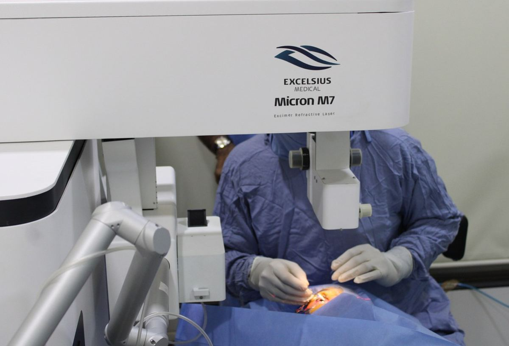
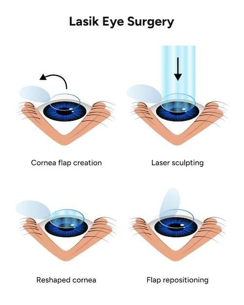

# LASIK (Laser-Assisted in Situ Keratomileusis)

Source: `Eye Diseases & Conditions-compressed.pdf`, pages 521-528.

## Images

## Extracted text

<!-- Page 521 -->
LASIK (Laser-Assisted in Situ Keratomileusis)

<!-- Page 522 -->
Overview of LASIK (Laser-Assisted in Situ Keratomileusis)
LASIK (Laser-Assisted in Situ Keratomileusis) is one of the most popular and effective
refractive eye surgeries used to correct common vision problems like nearsightedness (myopia),
farsightedness (hyperopia), and astigmatism. This surgery uses a specialized laser to reshape the
cornea, the clear outer layer of the eye, to improve the way light enters and focuses on the retina,
resulting in clearer vision.
LASIK is often considered a quick, minimally invasive procedure with a high success rate, and
many patients experience significant improvement in their vision, reducing or eliminating the
need for glasses or contact lenses. The surgery is performed on an outpatient basis and typically
takes only about 15 minutes per eye. The recovery time is usually quick, with most patients
returning to their normal activities within a day or two.
Symptoms and Causes of Refractive Errors Treated by LASIK
LASIK is specifically designed to treat refractive vision problems, which occur when the shape
of the cornea or the lens of the eye prevents light from focusing properly on the retina. The
symptoms and causes of the conditions LASIK addresses include:

<!-- Page 523 -->
1. Nearsightedness (Myopia): When the eye is too long, or the cornea is too steep, light
focuses in front of the retina, causing distant objects to appear blurry.
o
Symptoms: Blurred vision when looking at distant objects, eye strain, headaches.
2. Farsightedness (Hyperopia): When the eye is too short, or the cornea is too flat, light
focuses behind the retina, causing difficulty focusing on nearby objects.
o
Symptoms: Blurred vision for close objects, eye strain, headaches, difficulty
reading.
3. Astigmatism: An irregularly shaped cornea or lens causes light to focus on multiple
points in the eye, resulting in distorted or blurred vision at all distances.
o
Symptoms: Blurred or distorted vision, eyestrain, difficulty seeing at night.
The root causes of these refractive errors are often genetic, though factors like aging, eye
injuries, or certain eye diseases can also contribute.
Diagnosis and Tests for LASIK Candidacy
Before undergoing LASIK, a thorough eye examination is required to determine if a person is a
suitable candidate for the procedure. This includes:
1. Comprehensive Eye Exam: Your ophthalmologist will assess your general eye health
and vision problems.
2. Corneal Mapping: This test uses a specialized instrument to map the curvature of your
cornea, ensuring it is thick and uniform enough for the surgery.
3. Pupil Dilation: To check the health of your retina and optic nerve, your ophthalmologist
will dilate your pupils.
4. Refraction Test: A detailed measurement of your refractive error to determine the degree
of nearsightedness, farsightedness, or astigmatism.
5. Tear Production Test: Since LASIK can affect tear production, this test evaluates
whether your eyes produce enough moisture for a smooth recovery.
6. Wavefront Analysis: A more advanced test that creates a detailed map of how light
travels through your eye, which can help guide the laser for more precise results.
These tests help determine whether your eyes are healthy enough for LASIK and whether the
procedure will effectively improve your vision.
Management and Treatment for LASIK
LASIK is typically considered a one-time procedure for correcting refractive vision problems.
After undergoing LASIK, most patients experience significantly improved vision without the
need for glasses or contact lenses. However, to ensure the best outcome, the following steps are
typically part of the LASIK process:

<!-- Page 524 -->
1. Pre-Surgery Consultation: A thorough evaluation to ensure you're a suitable candidate
for LASIK.
2. Post-Surgery Care: After LASIK, patients will need to follow a specific care regimen,
which may include:
o
Using prescribed eye drops to prevent infection and reduce inflammation.
o
Avoiding rubbing the eyes or exposing them to irritants like dust or wind.
o
Wearing protective eyewear, especially while sleeping, to prevent accidental eye
rubbing.
Most patients report significantly improved vision within a day or two after the surgery, although
complete healing and optimal vision may take several weeks.
Types of LASIK and Surgical Techniques
There are a few variations of LASIK, which differ primarily in the method of creating the
corneal flap:
1. Conventional LASIK: This is the traditional LASIK procedure, where a thin flap of
corneal tissue is cut with a microkeratome (a surgical instrument), which is then lifted to
allow the laser to reshape the cornea.
2. Femtosecond LASIK (Blade-Free LASIK): This advanced technique uses a
femtosecond laser instead of a microkeratome to create the corneal flap. It is considered
more precise and offers improved safety and faster recovery.
3. Wavefront-Guided LASIK: Uses wavefront technology to create a custom map of your
eye’s unique imperfections. This technique is often used for patients with higher-order
aberrations (such as night vision problems) that could result in less-than-perfect results
from conventional LASIK.
4. PRK (Photorefractive Keratectomy): Though not technically a type of LASIK, PRK is
another laser vision correction surgery. PRK is typically used when the cornea is too thin
for LASIK or if the patient has other conditions that make LASIK unsuitable. The main
difference is that in PRK, the outer layer of the cornea is removed, and the laser is
applied directly to the surface.
5. SMILE (Small Incision Lenticule Extraction): A newer technique that involves
removing a small lenticule (a disc-shaped piece of tissue) from the cornea through a small
incision, offering a less invasive alternative to traditional LASIK.
Complicated LASIK Cases
While LASIK is generally a safe and effective procedure, some cases may involve complications
or require special considerations:

<!-- Page 525 -->
1. Dry Eyes: A common temporary side effect of LASIK, dry eyes can occur due to
changes in tear production. In some cases, the symptoms persist and require ongoing
treatment.
2. Under-correction or Over-correction: Sometimes the laser may remove too little or too
much corneal tissue, resulting in continued refractive errors. This can usually be
corrected with an additional surgery or enhancement procedure.
3. Flap Complications: During traditional LASIK, the corneal flap may not heal properly,
or it may shift or wrinkle, which can lead to blurred vision or discomfort. Femtosecond
LASIK is less likely to cause flap issues.
4. Visual Aberrations: Some patients may experience halos, glare, or double vision,
particularly at night. This is often temporary but can be persistent in some individuals.
These complications are rare, and advancements in technology have greatly reduced their
occurrence. Most patients achieve excellent results with proper care and follow-up.
LASIK in Adults
LASIK is most commonly performed on adults between the ages of 18 and 40, as the eyes
typically stabilize by this age. It is a popular choice for adults who want to reduce or eliminate
their dependence on glasses or contact lenses.
1. Candidates: Good candidates are those with stable vision prescriptions (usually for at
least one year), healthy eyes, and no history of eye diseases like glaucoma or cataracts.
2. Considerations: As adults age, the risk of developing presbyopia (difficulty focusing on
close objects) increases. LASIK may not fully address this condition, but alternatives
such as monovision (one eye corrected for near vision and the other for distance) can be
considered.
LASIK in Children
LASIK is generally not recommended for children, as their eyes are still developing and their
prescription may continue to change. However, some cases, such as for teenagers with severe
vision problems, may be evaluated on a case-by-case basis.
1. Age Limit: Most ophthalmologists will not perform LASIK on individuals under the age
of 18, as the vision prescription is still likely to change during adolescence.
2. Alternative Treatments: For children with refractive errors, alternatives like glasses,
contact lenses, or other non-surgical interventions may be recommended.

<!-- Page 526 -->
Prevention of Vision Problems
Although LASIK can correct refractive errors, preventing eye problems before they develop is
always better. Some strategies include:
1. Regular Eye Exams: Early detection of vision problems can prevent worsening
refractive errors.
2. Proper Eyewear: Wear sunglasses to protect against UV light, and always use protective
eyewear when engaging in activities that could cause eye injury.
3. Healthy Diet: Nutrients like vitamin A, omega-3 fatty acids, and antioxidants can
promote healthy eyes and reduce the risk of age-related vision conditions.
Outlook / Prognosis for LASIK Patients
The prognosis after LASIK is typically very good, with most patients experiencing significant
improvement in their vision. Studies show that more than 90% of LASIK patients achieve 20/25
vision or better, which is sufficient for most daily activities.
1. Long-Term Results: LASIK results are usually permanent, but some patients may
experience a slight regression in vision over time. Touch-up procedures (enhancements)
can be performed if necessary.
2. **
Vision Stability**: Post-surgery vision is generally stable, though some people may need reading
glasses as they age due to presbyopia.
Living With LASIK Results
After LASIK, most patients are able to return to their regular activities almost immediately,
though some care and lifestyle adjustments are needed:
1. Follow-Up Care: Regular follow-up visits are essential to monitor healing and ensure the
best outcome.
2. Avoiding Eye Strain: For the first few weeks after surgery, patients should avoid
activities that could strain the eyes, such as prolonged screen time or heavy physical
activity.
3. Vision Aids: Although LASIK eliminates the need for glasses or contact lenses in most
cases, some patients may need reading glasses later in life due to presbyopia.

<!-- Page 527 -->
Additional Common Questions (FAQs)
1. Is LASIK safe?
o
Yes, LASIK is generally considered very safe with a high success rate. However,
as with any surgery, there are risks, including dry eyes, under-correction, or
complications related to the corneal flap.
2. How long does LASIK take?
o
The procedure typically takes around 15 minutes per eye. However, the entire
visit (including preparation and recovery) may take about 1-2 hours.
3. Can LASIK correct presbyopia?

<!-- Page 528 -->
o
LASIK does not correct presbyopia, the age-related loss of near vision. However,
techniques like monovision LASIK or multifocal LASIK can help address near
vision problems in some patients.
4. Will I need glasses after LASIK?
o
Most patients no longer need glasses or contact lenses after LASIK. However,
some individuals may still require reading glasses as they age, due to presbyopia.
5. What is the recovery time for LASIK?
o
Recovery is quick, with most people returning to normal activities within 24-48
hours. However, full healing of the eyes can take a few weeks.
LASIK is a revolutionary procedure that has improved the lives of millions by offering a
permanent solution to common vision problems. For those considering LASIK, it's important to
consult with a skilled ophthalmologist to determine if it's the right option based on individual
needs and eye health.
